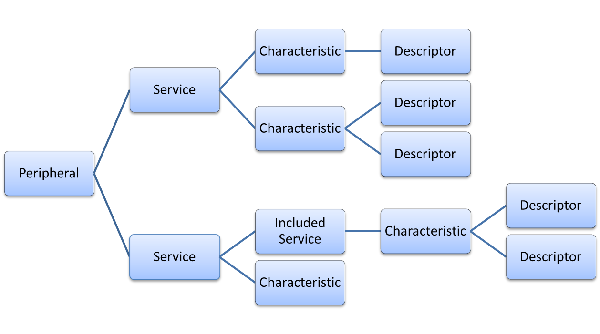

## 低功耗蓝牙概述

Qt 5.4引入了担当中心角色的Qt蓝牙低功耗API。从Qt 5.5开始，API的那部分是最终的，并为将来的发行版提供了兼容性保证。从Qt 5.7开始，作为技术预览版添加了支持外围角色的其他API，并为Linux / BlueZ，iOS和macOS实现了后端。

### 什么是蓝牙低功耗

低功耗蓝牙（Bluetooth Low Energy），也称为蓝牙智能（Bluetooth Smart），是一种无线计算机网络技术，于2011年正式推出。它以与“经典”蓝牙相同的2.4 GHz频率工作。顾名思义，主要区别在于能耗低。它为低功耗蓝牙设备使用纽扣电池工作了数月甚至数年提供了机会。该技术是由蓝牙v4.0引入的。支持该技术的设备称为Bluetooth Smart Ready设备。该技术的主要特点是：

* 超低峰值，平均和空闲模式功耗
* 能够使用标准纽扣电池运行数年
* 低成本
* 多供应商的互操作性
* 增强范围

低功耗蓝牙使用客户端-服务器架构。服务器（也称为外围设备）提供诸如温度或心率之类的服务并进行广告。客户端（称为中央设备）连接到服务器，并读取服务器通告的值。例如，带有蓝牙Smart Ready传感器（例如恒温器，湿度或压力传感器）的公寓。这些传感器是宣传公寓环境价值的外围设备。同时，手机或计算机可能会连接到这些传感器，检索它们的值，并将其作为更大的环境控制应用程序的一部分呈现给用户。

### 基本服务结构

低功耗蓝牙基于两种协议：ATT（属性协议）和GATT（通用属性配置文件）。它们指定每个Bluetooth Smart Ready设备使用的通信层。

#### ATT协议

ATT的基本构建块是一个属性。每个属性包含三个元素：

* 值-有效负载或所需的信息
* UUID-属性类型（由GATT使用）
* 16位句柄-属性的唯一标识符

服务器存储属性，客户端使用ATT协议在服务器上读取和写入值。

#### GATT 总协定

GATT通过将含义应用于预定义的UUID来定义一组属性的分组。下表显示了一个示例服务，该服务在特定日期公开了心率。实际值存储在两个特征中：

| 处理 | UUID | Value | 描述 |
|----|----|----|----|
| 0x0001 | 0x2800 | UUID 0x180D | 开始心率服务 |
| 0x0002 | 0x2803 | UUID 0x2A37，值句柄：0x0003 | 类型心率测量（HRM）的特征 |
| 0x0003| 0x2A37 | 65 bpm | 心率值 |
| 0x0004 | 0x2803 | UUID 0x2A08，值句柄：0x0006 | 日期时间类型的特征 |
| 0x0005 | 0x2A08 | 2014年8月18日11:00 | 测量的日期和时间 |
| 0x0006 | 0x2800 | UUID xxxxxx | 开始下一个服务 |
| ... | ... | ... | ... |

GATT指定上面使用的UUID0x2800标记服务定义的开始。0x2800直到0x2800遇到下一个或结尾之前，后面的每个属性都是服务的一部分。以类似的方式，众所周知的UUID0x2803指出将要找到一个特征，并且每个特征都具有定义值性质的类型。上面的示例使用UUID 0x2A08（日期时间）和0x2A37（心率测量）。以上每个UUID均由蓝牙特殊兴趣小组定义。可以在GATT规范中找到。虽然建议在可用的地方使用预定义的UUID，但完全可以将新的尚未使用的UUID用于特征和服务类型。

通常，每种服务可能包含一个或多个特征。特性包含数据，并且可以由描述符进一步描述，描述符提供了附加信息或操纵特性的手段。所有服务，特征和描述符都可以通过其128位UUID进行识别。最后，可以在服务内部包含服务（请参见下图）。




### 使用Qt蓝牙低功耗API

本节介绍如何使用Qt提供的Bluetooth Low Energy API。在客户端，API允许创建与外围设备的连接，发现它们的服务以及读取和写入存储在该设备上的数据。在服务器端，它允许设置服务，发布服务并在客户端编写特征时得到通知。下面的示例代码摘自Heart Rate Game和Heart Rate Server示例。

#### 建立连接

为了能够读取和写入低功耗蓝牙外围设备的特性，必须找到并连接该设备。这要求外围设备通告其状态和服务。我们借助QBluetoothDeviceDiscoveryAgent类启动设备发现。我们连接到其QBluetoothDeviceDiscoveryAgent :: deviceDiscovered()信号，并使用start()开始搜索：

```c++
m_deviceDiscoveryAgent = new QBluetoothDeviceDiscoveryAgent(this);
m_deviceDiscoveryAgent->setLowEnergyDiscoveryTimeout(5000);

connect(m_deviceDiscoveryAgent, &QBluetoothDeviceDiscoveryAgent::deviceDiscovered, this, &DeviceFinder::addDevice);
connect(m_deviceDiscoveryAgent, static_cast<void (QBluetoothDeviceDiscoveryAgent::*)(QBluetoothDeviceDiscoveryAgent::Error)>(&QBluetoothDeviceDiscoveryAgent::error),
        this, &DeviceFinder::scanError);

connect(m_deviceDiscoveryAgent, &QBluetoothDeviceDiscoveryAgent::finished, this, &DeviceFinder::scanFinished);
connect(m_deviceDiscoveryAgent, &QBluetoothDeviceDiscoveryAgent::canceled, this, &DeviceFinder::scanFinished);
m_deviceDiscoveryAgent->start(QBluetoothDeviceDiscoveryAgent::LowEnergyMethod);
```

由于我们仅对低功耗设备感兴趣，因此我们在接收插槽中过滤了设备类型。可以使用QBluetoothDeviceInfo::coreConfigurations()标志确定设备类型：

```c++
void DeviceFinder::addDevice(const QBluetoothDeviceInfo &device)
{
    //如果设备是低功耗装置，它添加到列表中
    if (device.coreConfigurations() & QBluetoothDeviceInfo::LowEnergyCoreConfiguration) {
        m_devices.append(new DeviceInfo(device));
        setInfo(tr("Low Energy device found. Scanning more..."));
    }
    //...
}
```

一旦外围设备的地址已知，我们就使用QLowEnergyController类。此类是所有蓝牙低功耗开发的切入点。该类的构造函数接受远程设备的QBluetoothAddress。最后，我们设置了常规插槽，并使用connectToDevice()直接连接到设备：

```c++
m_control = QLowEnergyController::createCentral(m_currentDevice->getDevice(), this);
connect(m_control, &QLowEnergyController::serviceDiscovered,
        this, &DeviceHandler::serviceDiscovered);
connect(m_control, &QLowEnergyController::discoveryFinished,
        this, &DeviceHandler::serviceScanDone);

connect(m_control, static_cast<void (QLowEnergyController::*)(QLowEnergyController::Error)>(&QLowEnergyController::error),
        this, [this](QLowEnergyController::Error error) {
    Q_UNUSED(error);
    setError("Cannot connect to remote device.");
});

connect(m_control, &QLowEnergyController::connected, this, [this]() {
    setInfo("Controller connected. Search services...");
    m_control->discoverServices();
});

connect(m_control, &QLowEnergyController::disconnected, this, [this]() {
    setError("LowEnergy controller disconnected");
});

// Connect
m_control->connectToDevice();
```

### 服务搜索

上述代码片段描述了应用程序在连接建立后如何启动服务发现。

以下插槽由 QLowEnergyController::serviceDiscovered() 信号，并提供间歇性进度报告。由于我们谈论的是心脏监听器应用程序，它监控附近的心脏率设备，我们忽略了任何服务，是不是类型的QBluetoothUuid::HeartRate.serviceDiscovered()

```c++
void DeviceHandler::serviceDiscovered(const QBluetoothUuid &gatt)
{
    if (gatt == QBluetoothUuid(QBluetoothUuid::HeartRate)) {
        //发现心率服务。等待服务扫描完成…
        setInfo("Heart Rate service discovered. Waiting for service scan to be done...");
        m_foundHeartRateService = true;
    }
}
```

最终，发出QLowEnergyController::discoveryFinished()信号，指示服务发现已成功完成。如果找到了HeartRate服务，则会创建一个QLowEnergyService实例来表示该服务。返回的服务对象提供更新通知所需的信号，并使用QLowEnergyService::discoverDetails()触发服务详细信息的发现：


```c++
// If heartRateService found, create new service
if (m_foundHeartRateService)
    m_service = m_control->createServiceObject(QBluetoothUuid(QBluetoothUuid::HeartRate), this);

if (m_service) {
    connect(m_service, &QLowEnergyService::stateChanged, this, &DeviceHandler::serviceStateChanged);
    connect(m_service, &QLowEnergyService::characteristicChanged, this, &DeviceHandler::updateHeartRateValue);
    connect(m_service, &QLowEnergyService::descriptorWritten, this, &DeviceHandler::confirmedDescriptorWrite);
    m_service->discoverDetails();
} else {
    setError("Heart Rate Service not found.");
}
```

在详细信息搜索期间，服务的state()从DiscoveryRequired转换为DiscoveringServices,最终以ServiceDiscovered结尾：

```c++
void DeviceHandler::serviceStateChanged(QLowEnergyService::ServiceState s)
{
    switch (s) {
    case QLowEnergyService::DiscoveringServices:
        setInfo(tr("Discovering services..."));
        break;
    case QLowEnergyService::ServiceDiscovered:
    {
        setInfo(tr("Service discovered."));

        const QLowEnergyCharacteristic hrChar = m_service->characteristic(QBluetoothUuid(QBluetoothUuid::HeartRateMeasurement));
        if (!hrChar.isValid()) {
            setError("HR Data not found.");
            break;
        }

        m_notificationDesc = hrChar.descriptor(QBluetoothUuid::ClientCharacteristicConfiguration);
        if (m_notificationDesc.isValid())
            m_service->writeDescriptor(m_notificationDesc, QByteArray::fromHex("0100"));

        break;
    }
    
    default:
        //nothing for now(什么现在)
        break;
    }

    emit aliveChanged();
}
```

### 与外围设备的交互

在上面的代码示例中，所需的特性为HeartRateMeasurement类型。由于该应用程序测量心率变化，因此必须启用该特性的变化通知。请注意，并非所有特征都提供更改通知。由于HeartRate特性已经标准化，因此可以假定可以接收通知。最终，QLowEnergyCharacteristic::properties()必须设置QLowEnergyCharacteristic::Notify标志，并且必须存在类型为QBluetoothUuid::ClientCharacteristicConfiguration的描述符以确认适当通知的可用性。

最后，我们根据蓝牙低功耗标准处理HeartRate特性的值:

```c++
void DeviceHandler::updateHeartRateValue(const QLowEnergyCharacteristic &c, const QByteArray &value)
{
    // ignore any other characteristic change -> shouldn't really happen though(忽略任何其他特性变化->不应该真的会发生，虽然)
    if (c.uuid() != QBluetoothUuid(QBluetoothUuid::HeartRateMeasurement))
        return;

    auto data = reinterpret_cast<const quint8 *>(value.constData());
    quint8 flags = *data;

    //Heart Rate(心率)
    int hrvalue = 0;
    if (flags & 0x1) // HR 16 bit? otherwise 8 bit
        hrvalue = static_cast<int>(qFromLittleEndian<quint16>(data[1]));
    else
        hrvalue = static_cast<int>(data[1]);

    addMeasurement(hrvalue);
}
```

通常，特征值是一系列字节。这些字节的精确解释取决于特征类型和值结构。蓝牙SIG已标准化了大量的标准，而其他标准可能遵循了自定义协议。上面的代码段演示了如何读取标准化的HeartRate值。

### 广告服务

如果我们要在外围设备上实现GATT服务器应用程序，则需要定义要提供给中央设备的服务并进行广告发布:

```c++
QLowEnergyAdvertisingData advertisingData;
advertisingData.setDiscoverability(QLowEnergyAdvertisingData::DiscoverabilityGeneral);
advertisingData.setIncludePowerLevel(true);
advertisingData.setLocalName("HeartRateServer");
advertisingData.setServices(QList<QBluetoothUuid>() << QBluetoothUuid::HeartRate);
const QScopedPointer<QLowEnergyController> leController(QLowEnergyController::createPeripheral());
QScopedPointer<QLowEnergyService> service(leController->addService(serviceData));
leController->startAdvertising(QLowEnergyAdvertisingParameters(), advertisingData,
                                advertisingData);
```

现在，潜在的客户可以连接到我们的设备，发现提供的服务并注册自己，以获取有关特征值更改的通知。以上部分已经介绍了API的这一部分。

### 在外围设备上实施服务

第一步是定义服务，其特征和描述符。这可以使用QLowEnergyServiceData，QLowEnergyCharacteristicData和QLowEnergyDescriptorData类来实现。这些类充当基本信息的容器或构建块，这些基本信息包括待定义的Bluetooth Low Energy服务。下面的代码段定义了一个简单的HeartRate服务，该服务会发布每分钟测得的心跳。可以使用此类服务​​的示例是手表。

```c++
QLowEnergyCharacteristicData charData;
charData.setUuid(QBluetoothUuid::HeartRateMeasurement);
charData.setValue(QByteArray(2, 0));
charData.setProperties(QLowEnergyCharacteristic::Notify);
const QLowEnergyDescriptorData clientConfig(QBluetoothUuid::ClientCharacteristicConfiguration,
                                            QByteArray(2, 0));
charData.addDescriptor(clientConfig);

QLowEnergyServiceData serviceData;
serviceData.setType(QLowEnergyServiceData::ServiceTypePrimary);
serviceData.setUuid(QBluetoothUuid::HeartRate);
serviceData.addCharacteristic(charData);
```

serviceData可以按照上面“广告服务”部分中的描述发布结果对象。尽管QLowEnergyServiceData和QLowEnergyAdvertisingData包装的信息之间存在部分信息重叠，但这两个类提供了两个非常不同的任务。广告数据被发布到附近的设备，并且由于其29字节的大小限制，其范围通常受到限制。因此，它们并不总是100％完成的。通过比较，包含在QLowEnergyServiceData内部的服务数据提供了完整的服务数据集，并且仅在执行与活动服务发现的连接时才对连接的客户端可见。

下一节将演示服务如何更新心率值。根据服务的性质，可能必须遵守https://www.bluetooth.org上定义的官方服务定义。其他服务可能是完全定制的。采用了心率服务，其规范可以在https://www.bluetooth.com/specifications/adopted-specifications下找到。

```c++
QTimer heartbeatTimer;
quint8 currentHeartRate = 60;
enum ValueChange { ValueUp, ValueDown } valueChange = ValueUp;
const auto heartbeatProvider = [&service, &currentHeartRate, &valueChange]() {
    QByteArray value;
    value.append(char(0)); // Flags that specify the format of the value.(指定值格式的标志)
    value.append(char(currentHeartRate)); // Actual value.(实际价值)
    QLowEnergyCharacteristic characteristic
            = service->characteristic(QBluetoothUuid::HeartRateMeasurement);
    Q_ASSERT(characteristic.isValid());
    service->writeCharacteristic(characteristic, value); // Potentially causes notification.(可能导致通知)
    if (currentHeartRate == 60)
        valueChange = ValueUp;
    else if (currentHeartRate == 100)
        valueChange = ValueDown;
    if (valueChange == ValueUp)
        ++currentHeartRate;
    else
        --currentHeartRate;
};
QObject::connect(&heartbeatTimer, &QTimer::timeout, heartbeatProvider);
heartbeatTimer.start(1000);
```

通常，外围设备上的特征和描述符值更新使用与连接低功耗蓝牙设备相同的方法。
