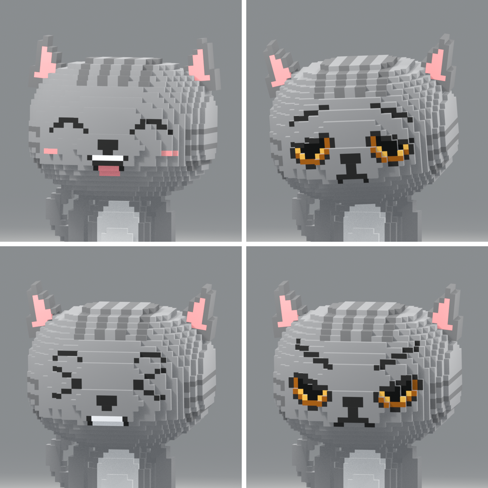

# CatGray IP · 体素骨骼与表情动画 v3

中等颗粒 Voxel 角色，包含 **18 根骨骼、17 个刚性身体部件、1 个表情网格和 12 个独立动作**。保留灰色大头、金色眼睛、粉色内耳、花纹、白肚皮和弯尾巴。

新增独立点头、摇头、转头、眨眼、嘴型演示，以及喜悦、悲伤、痛苦、生气四种情绪。



## 打开与播放

打开 [CatGray_Voxel.blend](CatGray_Voxel.blend)，按空格播放。时间轴为 **1–852 帧、24 FPS，共 35.5 秒**。

| 时间轴 | 内容 | 视频 |
| --- | --- | --- |
| 1–96 | 走动，3 个循环 | [走动](animations/Walk_InPlace.mp4) |
| 97–192 | 跑动，6 个循环 | [跑动](animations/Run_InPlace.mp4) |
| 193–288 | 跳跃，演示两次 | [跳跃](animations/Jump.mp4) |
| 289–336 | 连续点头后回正 | [点头](animations/Head_Nod.mp4) |
| 337–384 | 左右摇头后回正 | [摇头](animations/Head_Shake.mp4) |
| 385–456 | 向两侧转头、停留后回正 | [转头](animations/Head_Turn.mp4) |
| 457–492 | 两次眨眼，包含半闭过渡 | [眨眼](animations/Blink.mp4) |
| 493–564 | 闭口及 A／E／O 嘴型开合 | [嘴型](animations/Mouth_Talk.mp4) |
| 565–636 | 弯眼、笑嘴、脸颊红晕，轻微歪头 | [喜悦](animations/Emotion_Joy.mp4) |
| 637–708 | 下垂眼形、皱眉、抿嘴，低头 | [悲伤](animations/Emotion_Sad.mp4) |
| 709–780 | 挤眼、咬牙，头部轻微颤动 | [痛苦](animations/Emotion_Pain.mp4) |
| 781–852 | 压眉、斜眼、紧绷嘴形 | [生气](animations/Emotion_Angry.mp4) |

[播放完整预览](animations/CatGray_Voxel_Animation_Preview.mp4)。13 个视频均为 720 × 720、24 FPS、H.264 MP4，无音轨。身体动作视频各 4 秒；新增动作视频各播放一次，头部与表情采用近景。

## 独立动作与引擎使用

[CatGray_Voxel.glb](CatGray_Voxel.glb) 包含骨骼、颜色、16 个表情形态键和全部 12 个动作，无需外部贴图。播放端需要支持 **骨骼动画和 glTF morph target 权重动画**。

| Action | 原生关键帧范围 | 单次时长 | 控制范围 |
| --- | --- | --- | --- |
| `Walk_InPlace` | 1–33 | 1⅓ 秒 | 全身，原地走动，可循环 |
| `Run_InPlace` | 1–17 | ⅔ 秒 | 全身，原地跑动，可循环 |
| `Jump` | 1–49 | 2 秒 | 全身，蓄力、腾空、落地缓冲 |
| `Head_Nod` | 1–49 | 2 秒 | 头部和耳朵骨骼通道 |
| `Head_Shake` | 1–49 | 2 秒 | 头部和耳朵骨骼通道 |
| `Head_Turn` | 1–73 | 3 秒 | 头部和耳朵骨骼通道 |
| `Blink` | 1–37 | 1.5 秒 | 面部形态键 |
| `Mouth_Talk` | 1–73 | 3 秒 | 面部形态键 |
| `Emotion_Joy` | 1–73 | 3 秒 | 面部、头部和耳朵 |
| `Emotion_Sad` | 1–73 | 3 秒 | 面部、头部和耳朵 |
| `Emotion_Pain` | 1–73 | 3 秒 | 面部、头部和耳朵 |
| `Emotion_Angry` | 1–73 | 3 秒 | 面部、头部和耳朵 |

所有 GLB 片段均从 **0 秒**开始，末端回到中性姿势。关键帧包含闭合用的末端帧，视频不重复显示末端帧。

头部动作没有根骨骼、躯干或四肢关键帧；眨眼和嘴型动作没有骨骼关键帧。与走跑组合时，在引擎动画层中按通道覆盖或混合头部动作，并独立控制面部权重。

嘴型为闭口、A／E／O 式开合演示，尚未对应具体语音或音素时间轴。`Mouth_Talk` 还包含一次眨眼。所有带面部动画的片段均写入眼睛和嘴巴的完整状态；需要同时讲话和保持情绪时，分别对 `Eyes_*`、`Mouth_*` 通道分组控制。

走动、跑动由引擎负责前进位移。默认步幅下，参考移动速度分别约为 **0.4355 / 2.0625 Blender 单位每秒**；缩放角色或改变播放速度时同步调整速度。`Jump` 的 `CTRL_Root` 含最高约 0.85 单位的竖直位移，收腿后脚底净高度约 0.95 单位。接入时由动画或角色控制器之一负责跳跃高度，避免重复叠加。

## 骨骼与表情编辑

选择 `CATGRAY_VOXEL_RIG`，进入姿态模式。骨架默认不置顶，需要透视时启用 **In Front**。

| 控制骨骼 | 用途 |
| --- | --- |
| `CTRL_Root` | 整个角色移动；跳跃竖直位移 |
| `Body` / `Head` | 躯干、头部；表情网格跟随头部 |
| `UpperArm.L/R` / `Forearm.L/R` | 肩部和肘部 |
| `Thigh.L/R` / `Shin.L/R` / `Foot.L/R` | 大腿、小腿、脚掌 |
| `Ear.L/R` | 耳朵 |
| `Tail.01–03` | 尾巴三个分段 |

每个身体部件只受一根骨骼影响，权重为 1，运动中保持方块形状。关节有封口，转动时可见分块缝隙。腿部轨迹在生成时通过几何求解确定，交付动作不依赖 IK 约束或驱动器。

选择 `Voxel_Face`，在网格数据的形态键中编辑眼睛和嘴巴：

| 组 | 形态键 |
| --- | --- |
| 眼睛 | `Eyes_Open`、`Eyes_Half`、`Eyes_Closed`、`Eyes_Joy`、`Eyes_Sad`、`Eyes_Pain`、`Eyes_Angry` |
| 嘴巴 | `Mouth_Neutral`、`Mouth_Closed`、`Mouth_A`、`Mouth_E`、`Mouth_O`、`Mouth_Joy`、`Mouth_Sad`、`Mouth_Pain`、`Mouth_Angry` |

每组同时启用一个形态键，权重设为 **1**，该组其余键设为 **0**。默认启用 `Eyes_Open` 和 `Mouth_Neutral`。形态键以 **STEP / 常量插值**切换像素图案；中间权重会使像素片穿过头部，编辑时应保持离散状态。未使用的像素片收在头部内部，所有面均保留面积，避免零面积面。

编辑单个 Action 前，关闭骨架与表情形态键的 `播放预览 • 身体 / 头部 / 表情` NLA 轨道。Action 的 `OBJECT` 插槽负责骨骼，`KEY` 插槽负责形态键；在两个数据块上选择对应 Action 与插槽，才能一起预览情绪。三个头部 Action 仅含骨骼插槽。各动作存档轨道默认静音。

原始身体占用仍为每格 0.1 单位、36 × 29 × 47 格、18,889 个体素、11 色色板。身体拆分及封口后为 14,468 个三角面；表情网格增加 7,800 个三角面。成品共 **22,268 个三角面、12,468 个原生网格顶点**。平面着色会使 GLB 在部分边缘拆分顶点。

## 文件与制作源

| 文件 / 目录 | 用途 |
| --- | --- |
| `CatGray_Voxel.blend` | 可编辑骨骼、身体部件、表情形态键、12 个 Action、NLA 和摄影棚 |
| `CatGray_Voxel.glb` | 仅角色，含全部骨骼、表情形态键和 12 个动作 |
| [CatGray_Voxel.vox](CatGray_Voxel.vox) | 原始静态体素、默认五官与色板，不含骨骼、表情变化或动画 |
| `model_info.json` / `source/settings.json` | 网格、骨骼、表情、动作元数据，以及颗粒大小与色板 |
| `scripts/voxel_model.py` | 原始体素造型与 VOX 文件 |
| `scripts/rig_voxel.py` | 身体分块、骨骼、足部轨迹、头部动作和 NLA |
| `scripts/facial_voxel.py` | 像素眼形、嘴形、形态键和表情时间序列 |
| `scripts/blender_model.py` | 构建、场景、静态预览和 GLB 导出 |
| `scripts/animation_media.py` | 姿势图、视频渲染、编码与解码检查 |
| `scripts/verify_animation.py` | 权重、接地、独立通道、形态键和 GLB 重新导入验证 |
| `previews/` / `animations/` | 外形图、动作与表情姿势、视频封面，以及 13 个视频 |
| `qa/` | 验证报告、GLB 导入后截图、视频解码对照图 |

## 重建与维护

验证环境为 **Linux / Blender 5.2.1 LTS**。动画预览使用 Eevee，静态五视图使用 Cycles CPU。启动器仅需 Python 3.9+ 标准库，其他模块由 Blender 自带。

在本目录执行：

```sh
python3 manage.py rebuild
python3 manage.py pose-preview
python3 manage.py verify-rig
python3 manage.py render
python3 manage.py verify
```

| 命令 | 输入与输出 |
| --- | --- |
| `rebuild` | 源码 → `.blend`、`.glb`、`.vox`、`model_info.json` |
| `preview` | 当前工程的中性姿势 → 五个静态视角；`--quick` 为 640px |
| `pose-preview` | 当前工程 → 身体、头部、表情和嘴型关键姿势图及四表情总览 |
| `render` | 660 张独立动作帧 → 12 个动作视频、35.5 秒完整预览和封面 |
| `encode` | 使用失败后保留的完整帧序列重试编码 |
| `export` | 当前 `.blend` → 含 12 个动作和面部动画的 `.glb` |
| `verify-rig` | 检查模型、每四分之一帧的动作与表情、GLB 重新导入 |
| `verify` | 上述检查，以及 13 个视频的帧数与解码画面对照 |

**`rebuild` 会覆盖手工修改。** 手工编辑 `.blend` 后使用 `export`、`pose-preview`、`render` 更新交付文件。验证器按约定的骨骼、部件、动作和源码设计，结构变化时应同步源码与元数据。

`render` 只渲染一次各动作的独立帧，编码时复用帧序列。视频检查通过后自动清理临时帧；失败时保留 `qa/animation_frames`，可用 `encode` 重试。启动器将日志写入 `qa/logs/`。

通过 `PATH`、`BLENDER_BIN` 或 `--blender` 指定 Blender；`--threads` 控制线程数：

```sh
python3 manage.py --blender /path/to/blender --threads 6 render
```

Blender 坐标为 **Z 向上、正面朝 -Y**，GLB 使用标准 glTF 的 Y 向上坐标。模型没有对应现实单位。VOX 是独立的静态编辑副本，其中的修改不会自动同步到骨骼工程。
