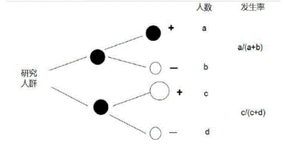
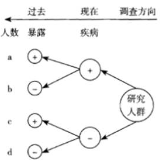

### 流行病学的基本概念及常用指标。

#### 流行病学的概念

流行病学是研究疾病与健康状况和事件在人群中的分布及其影响和决定因素，用以预防和控制疾病，促进健康的学科。流行病学概念的基本内涵
1. 它的研究对象是人群，是研究所关注的具有某种特征的人群；
2. 它不仅研究各种疾病，而且研究健康状态和事件；
3. 它的重点是研究疾病、健康状态和事件的分布、影响和决定因素；
4. 最重要的是，它的落脚点是为预防和控制疾病，促进健康提供科学的决策依据。

#### 流行病学的任务

1. 第一阶段：揭示现象，即揭示流行（主要是传染病）或分布（其他疾病、伤害与健康）的现象
2. 第二阶段：找出原因、影响或决定因素，即从分析现象入手找出流行与分布的规律、原因或影响因素
3. 第三阶段：提供措施。即合理利用前两阶段的结果，找出预防或干预的策略与措施。第一、二和三阶段的任务对应的就是“健康信息收集”、“健康风险评估”、“健康指导和健康危险因素干预”。

#### 流行病学的基本方法

常见的流行病学方法及分类见下图。

### 流行病学常用指标。

1. 率和比
	1. 比例
		同一事物局部与总体之间数量上的比值。分子和分母的单位相同，而且分子包含于分母之中。常用P=al(a+b)表示。比例有两类：
		1. 一类是反映事物静止状态内部构成成分占全体的比重，通常也称构成比例，它是可以反映某种概率的数值。
		2. 另一类为发生频率比例，它与动态的发生变化概率密切相关，反映一定时间内，发生某种变化者占全体的比例。
2. 率
	1. 表示在一定的条件下，某现象实际发生的例数与可能发生该现象的总例数之比，来说明单位时间内某现象发生的频率或强度，一般用百分率、千分率、万分率、十万分率来表示。
	2. 率=（某现象实际发生的例数/可能发生该现象的受累总人数）×K。(K=100%,10001千，10000/万，100000/10万)
	3. 率必须包括受累人群数量，被观察到的受累人群所处的总体数量和规定的时间三个方面内容才能构成“率”
2. 发病指标：发病率、患病率
3. 死亡指标：死亡率、病死率、生存率；
4. 相对危险度：相对危险度RR、比值比OR;
5. 归因危险度：归因危险度、归因危险度百分比、人群归因危险度百分比。

### 流行病学常用指标-发病指标。

#### 发病率
1. 定义：是指一定时期内特定人群中某病新病例出现的频率。
	1. 发病率=（一定时期某人群中某病新病例数同期暴露人口数）*K。式中，K=100%、1000%、10000/万、100000/10万
	2. 计算发病率时，可根据研究的病种及研究的问题特点来选择时间单位。一般多以年为时间单位，常用10万分率来表示。
2. 暴露人口数
	1. 发病率的分子：新病例，观察期间发生某病的患者（动态，从健康到疾病的过程）
	2. 发病率的分母：暴露人口数，易感人群数，也称危险人口数，由于在实际工作中暴露人口数不易获得，一般使用年平均人口数代替。观察时间：多为“年”，通常为一年。
	3. 发病率=（一定时期某人群中某病新病例数同期暴露人口数）K。
3. 发病率用途。
	发病率是一个重要和常用指标，对于传染病以及死亡率极低或不致死的疾病尤为重要，反映患该病的风险。常用来描述疾病的分布，探讨发病因素，提出病因假设和评价防治措施的效果。
4. 注意事项
	发病率的准确性受很多因素的影响，在比较不同地区，人群的发病率时，应考虑年龄、性别构成不同，即进行发病率的标化
#### 患病率
1. 定义：
	1. 患病率亦称现患率、流行率。指在特定时间点一定人群中某病新病例和旧病例的人数总共所占的比例。
	2. 患病率=（特定时间点某人群中某病新旧病例数/同期观察人口）×K
2. 影响因素
	主要受发病率和病程的影响，患病率=发病率*病程，因而可以根据患病率和发病率计算出平均病程。
3. 患病率用途
	1. 患病率对于病程短的疾病价值不大，而对于病程长的一些慢性病的流行状况能提供有价值的信息，可反映某地区人群疾病的分布以及某疾病的疾病负担程度。
2. 可依据患病率来合理地计划卫生设施、人力物力及卫生资源的需要，
3. 研究疾病流行因素
4. 监测慢性病的控制效果。
4. 患病率与发病率的区别
1. 患病率的分子为特定时间点所调查人群中某病新旧病例数，而不管这些病例的发病时间；发病率的分子为一定时期暴露人群中新发生的病例数；
2. 患病率是由横断面调查获得的疾病频率，衡量疾病的存在或流行情况，是一种静态指标，其本质上是一种比例，不是一种真正的率。而发病率：由发病报告或队列研究获得的单位时间内的疾病频率和强度，为动态指标，是一种真正的率。

### 流行病学常用指标-死亡指标。

#### 死亡率

某人群在单位时间内死于所有原因的人数，在该人群中所占的比例。它是测量死亡危险最常用的指标。
1. 计算公式：死亡率=（某人群某年总死亡人数/该人群同年平均人口数）×K。死亡率计算时，分母为平均人口数。包括了所研究疾病的患者和非患者，而病死率的计算只与所研究疾病的患者有关。
2. 粗死亡率：死于所有原因的死亡率，未经过调整的死亡率
3. 死亡专率：按疾病的种类、年龄、性别、职业、种族分类计算的死亡率。
#### 病死率

一定时期内患某病的全部患者中，因该病而死亡的比例。病死率=（某时期内因某病死亡人数/同期确诊的某病病例数)*100%。
1. 病死率通常用于病程短的急性病，如各种急性传染病、脑卒中、心肌梗死及肿瘤等，以衡量疾病对人生命威胁的程度。
2. 可反映疾病的严重程度，（例如：狂犬病的病死率100%）
3. 与受疾病严重程度、医疗水平、能否被早期诊断，诊断水平及病原体毒力有关。
#### 生存率

1. 患某种病的人（或接受某种治疗措施的患者）经N年的随访，到随访结束时仍存活的病例数占观察病例的比例，又称“存活率"。生存率常用来评价某些慢性病如恶性肿瘤心、血管病等病程长，病情较重致死性较强的疾病的远期疗效。
2. N年生存率=（随访n年的某病存活病例数/随访满N年的该病病例数）x100%。
3. 应用该指标时，应确定随访开始日期和截止时间。开始日期一般为确诊日期、出院日期或手术日期；截止时间可以是1年、3年、5年、10年，即计算1年、3年、5年或10年的生存率。

### 流行病学常用指标-相对、归因危险度。

#### 相对危险度
1. 相对危险度相关概念
	1. 定义：指暴露组发病率（$l_e$）与非暴露组发病率($l_o$)之比，它反映了暴露与疾病的关联强度。
	2. 公式：$RR=l_e/l_o$
	3. 意义：说明暴露组发病或死亡的风险是对照组的多少倍。
	4. 关联强度：相对危险度(RR)无单位，比值范围在0至∞之间。
		1. RR=1暴露与疾病没关系（暴露与疾病无关）
		2. RR>1暴露与疾病存在正联系（暴露是危险因子）
		3. RR<1暴露与疾病存在负联系（暴露是保护因子）
2. 比值比(OR)
	1. 比值比又称优势比、交叉乘积比。指病例组中暴露人数与非暴露人数的比值除以对照组中暴露人数与非暴露人数的比值。
	2. OR,表示疾病与暴露事件关联强度的指标。不能计算发病率，反应关联强度的指标与RR相同，OR反映暴露者患某种疾病的危险性较无暴露者高的程度。若能满足以下两个条件,则OR值接近甚至等于RR值：
		1. 所研究疾病的发病率（死亡率）很低。
		2. 所选择的研究对象代表性好。

#### 归因危险度（人群公众卫生意义）

1. 归因危险度
	1. 定义：归因危险度或率差是指暴露组发病率与非暴露组发病率之差，它反映发病归因于暴露因素的程度。
	2. 计算公式：$AR=l_e-l_o=l_o(RR-l)$
	3. AR的意义：表示暴露者中完全由某暴露因素所致的发病率或死亡率。
2. 归因危险度百分比
	1. 定义：是指暴露人群中由暴露因素引起的发病率在所有发病中所占的百分比。
	2. 公式：AR%=(暴露组发病率一非暴露组发病率)/暴露组发病率]x100%
3. 人群归因危险度百分比
	人群归因危险度百分比(PAR%)表示全人群中由暴露引起的发病占全部发病中的比例。

### 常用的研究方法-现况调查。

描述性流行病学研究是指利用已有的资料或特殊调查的资料（包括实验室检查结果），描述疾病或健康状况在不同时间、地点和人群中的分布特征，为进一步开展分析流行病学研究提供病因或流行因素的线索。它包括暴发调查、病例及病例组分析、筛检、生态学研究和现况调查等研究方法。现况调查属于描述性流行病学研究方法之一。

#### 现况调查概念

现况调查是指在一人群中应用普查和抽样调查等方法，收集特定时间内有关变量疾病和健康资料，以描述目前疾病或健康状况的分布，以及某因素与疾病的联；从时间上说，现况调查是在特定时间点进行的，即在某一时点或在短时间内完成，这个时间点犹如一个断面，故又称之为横断面研究。

#### 现况调查的目的

1. 描述疾病或健康状况的分布。
2. 发现病因线索，提出病因假设，以进一步分析研究。
3. 适用于疾病的二级预防：三早
4. 评价疾病的防治效果，
5. 有利于实施疾病监督
6. 为卫生行政部门提供科学依据

#### 现况调查的方法及种类

1. 普查
	即全面调查，在特定时点和时期，特定范围内的全部人群总体都是研究对象的调查。如高血压普查，结核病普查，江苏省麻风病的普查。普查的优点是不存在抽样误差，但不适用患病率低且无简便易行的诊断手段的疾病。
2. 抽样调查
	1. 定义：是通过抽样的方法，对特定时点、特定范围内的人群的一个代表性样本进行调查，以样本的统计量来估计总体参数所在范围。抽样的优点是节省时间、人力和物力资源，但设计实施复杂，且不适用于变异较大的研究对象或需要普查普治的疾病。
	2. 分类：抽样可以分为非随机抽祥和随机抽样（单纯随机抽样、系统抽样、分层抽样、整群抽样和多阶段抽样)

#### 现况调查的优缺点
1. 优点：
	1. 常用随机抽样调查，结果有较强推广意义
	2. 有来自同一群体的自然形成的同期对照组，结果具有可比性
	3. 可同时观察多种因素，是病因探索的基础性工作
2. 局限性：
	1. 疾病与暴露同时存在，不能确定因果关系
	2. 不能获得发病率信息
	3. 疾病潜伏期或临床前期，容易低估群体的患病水平

### 常用的研究方法-队列研究。

探讨疾病的病因是医学研究的重要任务之一，前述的现况研究由于其因与果同时存在，故其在病因研究中的作用有限。而分析性流行病学方法则更常用于验证病因假设，其最常见的两类为队列研究和病例对照。

#### 队列研究概念
队列研究是将特定的人群按其是否暴露于某因素或按不同暴露水平分为个群组或队列，追踪观察一定时间，比较两组或各组发病率或死亡率的差异，以检验该因素与某疾病有无因果联系及联系强度大小的一种观察性研究方法。可用于检验病因假设、评价预防效果和研究疾病自然史。

#### 队列研究类型

1. 前瞻性队列研究：研究对象的确定与分组由研究开始时是否暴露一来决定，研究结局需随访观察一段时间才能得到。
2. 历史性队列研究：研究工作现在开始，而研究对象是过去某个时间进入队列的。特点是追溯到过去某时期决定人群对某因素的暴露史，然后追踪至现在的发病或死亡情况。
3. 双向性队列研究：该方法是以上两个方法的结合。根据历史档案确定暴露与否，随访至将来的某个时间确定结局，故又称混合性队列研究。
#### 队列研究特点
1. 时序上由前向后，在疾病开始前进行，属于前瞻性研究。
2. 观察性对比研究，暴露与否是自然存在于研究人群，而不是人为给予的。
3. 研究对象根据暴露与否分组，这与实验性研究的随机分型不同。
4. 从“因”到“果”的研究。
5. 追踪观察的是两组间的发病率与死亡率差异。如$RR=[a/(a+b]/[c/(c十d)]$

#### 队列研究优缺点
1. 优点
	1. 在疾病发生前按是否暴露于某因素分组，所获资料完整，无回忆偏倚
	2. 可测量两组之间发病率，特异危险度和相对危险度
	3. 可进行一因多果研究，并能了解疾病自然史
2. 局限性
	1. 观察时间长、费人力、花费高，不能在较短时间内得到结果
	2. 准备工作繁重，实施的科学性高，实施难度大
	3. 不适用于罕见病的研究

### 常用的研究方法-病例对照研究、实验性研究。

#### 病例对照研究
病例对照研究省时、省力，故应用比队列研究更为广泛。
1. 病例对照研究概念
	选择一组患所研究疾病的患者与一组无此病的对照组，调查其发病前对某个因素的暴露状况，比较两组中暴露率和暴露水平的差异，研究该疾病与这些因素的关系。
2. 病例对照研究方法。

3. 病例对照的特点
	1. 在疾病发生后进行，研究开始时已有一批可供选择的病例
	2. 设立病例组与对照组。
	3. 暴露状况是通过回顾获得或信息收集获得的。
	4. 若按因果关系进行分析，疾病已发生，是由果及因的推断顺序。
	5. 经两组暴露率或暴露水平的比较，分析暴露与疾病的联系
4. 病例对照的优缺点
	1. 优点
		1. 所需样本量小，病例易获取，工作量小，人力物力较少，易于进行，出结果快。
		2. 可以同时对一种疾病的多种病因进行研究
		3. 适用于对病因复杂，发病率低，潜伏期长的疾病进行研究。
		4. 在某些情况下，可以对治疗措施的疗效与副作用做初步评定
	2. 局限性
		1. 由于受回忆偏倚的影响，选择合理的对照又较困难，因此结果的可靠性不如队列研究。
		2. 不能计算暴露与无暴露人群的发病率及相对危险度，只能计算比值比。
#### 实验性研究
实验性研究的基本性质是研究者在一定程度上掌握着实验的条件，主动给予研究对象某种干预措施，又称干预研究。
1. 基本特点
	1. 属于前瞻性研究（干预在前，效应在后）。
	2. 随机分组
	3. 设立对照组
	4. 有干预措施
2. 主要研究类型
	1. 临床试验
			流行病临床试验研究是临床上评价新药、新疗法的一种试验，目的是观察和论证某个或某些研究因素对研究对象产生的效应和影响。常用于临床上评价新药新疗法疗效。
	2. 社区试验
			以尚未所研究疾病的人群作为整体进行试验观察。常用于对某种预防措施和方法进行考核或评价。如果某种疾病的危险因素分布广泛不易确定高危人群时，也需采用社区试验。
	3. 现场试验
	4. 类实验
### 常用的研究方法-诊断试验的相关概念。

#### 定义
对疾病进行诊断的试验方法。包括各种实验室检查。病史体检所获得的临床资料，X线、超声诊断等各种公认的诊断标准，并且利用这些资料和技术、标准对疾病和健康状况得出确切的结论。
#### 诊断指标
1. 客观指标：用客观仪器测定的指标，很少依赖诊断者的主观判断和被诊断者的主诉，如体温计测量、X片观察肺部及骨骼病变等。
2. 主观指标：即完全根据被诊断者的主诉来决定，如疼痛、乏力，食欲缺乏，头晕等。
3. 半客观指标：根据诊断者的主观感知进行判断（肿物的硬度大小等）
#### 诊断标准
在选择诊断标准时一般要遵循以下原则：
1. 对于一些严重疾病，如能早期诊断则可获得较好的治疗效果，而漏掉一个可能的病例侧其后果严重，此时应尽可能保证所有的患者都被诊断出来，即选择敏感度较高的指标；
2. 对于治疗效果不理想的疾病，且确诊及治疗费用又较昂贵时，或者误诊一个非患者为患者时后果严重，造成严重的精神负担，则可选择特异度较高的诊断标准；
3. 当假阳性和假阴性的重要性相等时，一般以正确指数最大时所对应的临界点为最佳诊断界值。

### 常用的研究方法-诊断试验的评价指标。

#### 真实性
又称有效性，是指筛检试验或诊断试验所获得的测量值与实际情况的符合程度。评价真实性的指标有：灵敏度、特异度、假阴性率、假阳性率、正确诊断指数。
1. 灵敏度：也称真阳性率，即实际有病且按该诊断试验被正确地判为有病的概率。灵敏度只与病例组有关，理想的试验灵敏度应100%
2. 特异度：也称真阴性率，即实际无病按该诊断试验被正确地判为无病的概率。特异度只与非病例组有关，理想的试验特异度为100%，
3. 假阴性：也称漏诊率或第二类错误(β)，即实际有病但根据该诊断试验被定为非病者的概率。灵敏度越高，漏诊越少，理想的试验假阴性率应为0。
4. 假阳性率：也称误诊率或第一类错误(α)，即实际无病但根据该诊断试验被定为有病的概率。特异度越高，误诊越少，理想的试验假阳性率应为0。
5. 正确诊断指数：系指灵敏度和特异度之和减去1，正确诊断指数可用于两个诊断方法的比较，理想的正确诊断指数为100%

#### 可靠性
又称信度，指相同条件下同一试验对相同人群重复试验获得相同结果的稳定度。
可靠性高，说明实验结果受随机误差的影响不大。评价指标有：
1. 变异系数
	当某试验是做定量测定时，可用变异系数来表示可靠性。即所测平均数的标准差与测定的均数之比；比值越小，可靠性越好。
2. 符合率
	又称准确度，当某试验做定性测定时，同一批研究对象两次诊断结果均为阳性与均为阴性的人数之和占所有进行诊断试验人数的比率。
3. 诊断试验的一致性分析
	若要衡量临床医生的诊断水平如何，他们之间对同一人群的诊断结果是否存在差异,可采用Kappa分析。Kappa分析所得值，是评价不同地点或不同操作者对同一试验结果一致性的指标，该值考虑了机遇因素对一致性的影响并加以校正，从而提高了判断的有效性。

#### 收益
诊断试验的收益评价可通过计算预测值指标来完成，它反应试验结果与实际符合的概率，包括阳性预测值(+PV)和阴性预测值(PV)。
1. 阳性预测值是指试验阳性结果中真正患病的比例。患病率相同时，特异度越高，阳性预测值越好，临床医生越有理由判断阳性结果为患者。“阳性中真得病”特高阳好。阳性预测值=真阳性所有阳性（真阳性+假阳性）
2. 阴性预测值是指试验阴性结果中，真正未患病的比例。患病率相同时，灵敏度越高，阴性预测值越好，临床医生更有把握判断阴性结果为非患者。“阴性中真未病"灵高阴好。阴性预测值=真阴性÷所有阴性（真阴性+假阴性）

### 常用的研究方法-诊断试验的评价标准及提高诊断质量的方法。

#### 诊断试验的评价标准
1. 同金标准诊断方法进行同步盲法比较
2. 研究对象的代表性
3. 要有足够的样本量。
4. 诊断界值的确定要合理
5. 不仅评价真实性，也可评价可靠性
6. 试验的方法和步骤要具体，有可操作性
#### 提高诊断质量的方法
1. 联合试验
	应用多个试验对同一级兵作出诊断，通常采用两个或两个以上，根据每个试验的结果来综合判断最后的结果。
	1. 平行实验（并联）：只要有一个试验呈现阳性即诊断。优点是灵敏度高，漏诊率降低，但同时特异度降低，误诊率增高。“一阴即阴，全阳才阳”
	2. 系列实验（串联）：有一个阴性即诊断为阴性，全部阳性才能判为阳性，“一阳即阳
2. 选择患病率高的人群
	一方面可使新发现的病例数增加；另一方面可以使阳性预测值升高，试验成本下降，其结果使试验的效率增高。

### 常用的研究方法-筛检试验的评价研究。

#### 筛检试验的相关概念
1. 概念：筛检试验通过快速的检验、检查或其他措施，将可能有病但表面上健康的人，同那些可能无病的人区分开来。
2. 筛检试验和诊断试验的区别：筛检试验不是诊断试验，仅是一种初步检查，对筛检试验阳性者或可疑者，必须进一步诊断试验确诊。与诊断试验不一样，筛检试验是把患者及可疑有该病人与健康人区分开来，而诊断试验是深入把患者与可疑有病但实际无病者区分开来。所以，筛检是第一步，诊疗是第二步，治疗是第三步。

#### 主要用途
1. 早发现、早诊断、早治疗：临床前期或临床初期的可疑患者。如检查空腹血糖筛检糖尿病，对空腹血糖升高者进一步确诊检查，达到早诊断、早治疗糖尿病的目的。
2. 发现某些疾病的高危个体，预防疾病。如筛检高血压以预防脑卒中，筛检高胆固醇血症以预防冠心病等。
3. 开展流行病学监测，了解疾病的患病率及其趋势，为公共卫生决策提供科学依据，
4. 了解疾病的自然史

#### 筛检试验的评价指标
筛检试验真实性评价指标是灵敏度和特异度，计算方法与诊疗试验评价指标相同。

#### 筛检试验的类型和方法
1. 筛检类型：群体筛检和选择性筛检。如40岁以上超重肥胖人群中筛检糖尿病。
2. 筛检方法：单项筛检、多项筛检

#### 筛检的应用原则
1. 合适的疾病
2. 合适的筛检试验
3. 合适的筛检计划