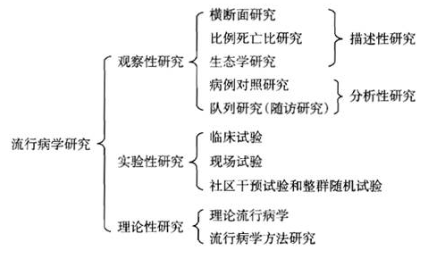

### 流行病学的基本概念及常用指标。

#### 流行病学的概念

流行病学是研究疾病与健康状况和事件在人群中的分布及其影响和决定因素，用以预防和控制疾病，促进健康的学科。流行病学概念的基本内涵
1. 它的研究对象是人群，是研究所关注的具有某种特征的人群；
2. 它不仅研究各种疾病，而且研究健康状态和事件；
3. 它的重点是研究疾病、健康状态和事件的分布、影响和决定因素；
4. 最重要的是，它的落脚点是为预防和控制疾病，促进健康提供科学的决策依据。

#### 流行病学的任务

1. 第一阶段：揭示现象，即揭示流行（主要是传染病）或分布（其他疾病、伤害与健康）的现象
2. 第二阶段：找出原因、影响或决定因素，即从分析现象入手找出流行与分布的规律、原因或影响因素
3. 第三阶段：提供措施。即合理利用前两阶段的结果，找出预防或干预的策略与措施。第一、二和三阶段的任务对应的就是“健康信息收集”、“健康风险评估”、“健康指导和健康危险因素干预”。

#### 流行病学的基本方法

常见的流行病学方法及分类见下图。

### 流行病学常用指标。

1. 率和比
	1. 比例
		同一事物局部与总体之间数量上的比值。分子和分母的单位相同，而且分子包含于分母之中。常用P=al(a+b)表示。比例有两类：
		1. 一类是反映事物静止状态内部构成成分占全体的比重，通常也称构成比例，它是可以反映某种概率的数值。
		2. 另一类为发生频率比例，它与动态的发生变化概率密切相关，反映一定时间内，发生某种变化者占全体的比例。
2. 率
	1. 表示在一定的条件下，某现象实际发生的例数与可能发生该现象的总例数之比，来说明单位时间内某现象发生的频率或强度，一般用百分率、千分率、万分率、十万分率来表示。
	2. 率=（某现象实际发生的例数/可能发生该现象的受累总人数）×K。(K=100%,10001千，10000/万，100000/10万)
	3. 率必须包括受累人群数量，被观察到的受累人群所处的总体数量和规定的时间三个方面内容才能构成“率”
2. 发病指标：发病率、患病率
3. 死亡指标：死亡率、病死率、生存率；
4. 相对危险度：相对危险度RR、比值比OR;
5. 归因危险度：归因危险度、归因危险度百分比、人群归因危险度百分比。

### 流行病学常用指标-发病指标。

#### 发病率
1. 定义：是指一定时期内特定人群中某病新病例出现的频率。
	1. 发病率=（一定时期某人群中某病新病例数同期暴露人口数）*K。式中，K=100%、1000%、10000/万、100000/10万
	2. 计算发病率时，可根据研究的病种及研究的问题特点来选择时间单位。一般多以年为时间单位，常用10万分率来表示。
2. 暴露人口数
	1. 发病率的分子：新病例，观察期间发生某病的患者（动态，从健康到疾病的过程）
	2. 发病率的分母：暴露人口数，易感人群数，也称危险人口数，由于在实际工作中暴露人口数不易获得，一般使用年平均人口数代替。观察时间：多为“年”，通常为一年。
	3. 发病率=（一定时期某人群中某病新病例数同期暴露人口数）K。
3. 发病率用途。
	发病率是一个重要和常用指标，对于传染病以及死亡率极低或不致死的疾病尤为重要，反映患该病的风险。常用来描述疾病的分布，探讨发病因素，提出病因假设和评价防治措施的效果。
4. 注意事项
	发病率的准确性受很多因素的影响，在比较不同地区，人群的发病率时，应考虑年龄、性别构成不同，即进行发病率的标化
#### 患病率
1. 定义：
	1. 患病率亦称现患率、流行率。指在特定时间点一定人群中某病新病例和旧病例的人数总共所占的比例。
	2. 患病率=（特定时间点某人群中某病新旧病例数/同期观察人口）×K
2. 影响因素
	主要受发病率和病程的影响，患病率=发病率*病程，因而可以根据患病率和发病率计算出平均病程。
3. 患病率用途
	1. 患病率对于病程短的疾病价值不大，而对于病程长的一些慢性病的流行状况能提供有价值的信息，可反映某地区人群疾病的分布以及某疾病的疾病负担程度。
2. 可依据患病率来合理地计划卫生设施、人力物力及卫生资源的需要，
3. 研究疾病流行因素
4. 监测慢性病的控制效果。
4. 患病率与发病率的区别
1. 患病率的分子为特定时间点所调查人群中某病新旧病例数，而不管这些病例的发病时间；发病率的分子为一定时期暴露人群中新发生的病例数；
2. 患病率是由横断面调查获得的疾病频率，衡量疾病的存在或流行情况，是一种静态指标，其本质上是一种比例，不是一种真正的率。而发病率：由发病报告或队列研究获得的单位时间内的疾病频率和强度，为动态指标，是一种真正的率。

### 流行病学常用指标-死亡指标。

#### 死亡率

某人群在单位时间内死于所有原因的人数，在该人群中所占的比例。它是测量死亡危险最常用的指标。
1. 计算公式：死亡率=（某人群某年总死亡人数/该人群同年平均人口数）×K。死亡率计算时，分母为平均人口数。包括了所研究疾病的患者和非患者，而病死率的计算只与所研究疾病的患者有关。
2. 粗死亡率：死于所有原因的死亡率，未经过调整的死亡率
3. 死亡专率：按疾病的种类、年龄、性别、职业、种族分类计算的死亡率。
#### 病死率

一定时期内患某病的全部患者中，因该病而死亡的比例。病死率=（某时期内因某病死亡人数/同期确诊的某病病例数)*100%。
1. 病死率通常用于病程短的急性病，如各种急性传染病、脑卒中、心肌梗死及肿瘤等，以衡量疾病对人生命威胁的程度。
2. 可反映疾病的严重程度，（例如：狂犬病的病死率100%）
3. 与受疾病严重程度、医疗水平、能否被早期诊断，诊断水平及病原体毒力有关。
#### 生存率

1. 患某种病的人（或接受某种治疗措施的患者）经N年的随访，到随访结束时仍存活的病例数占观察病例的比例，又称“存活率"。生存率常用来评价某些慢性病如恶性肿瘤心、血管病等病程长，病情较重致死性较强的疾病的远期疗效。
2. N年生存率=（随访n年的某病存活病例数/随访满N年的该病病例数）x100%。
3. 应用该指标时，应确定随访开始日期和截止时间。开始日期一般为确诊日期、出院日期或手术日期；截止时间可以是1年、3年、5年、10年，即计算1年、3年、5年或10年的生存率。

### 流行病学常用指标-相对、归因危险度。

#### 相对危险度
1. 相对危险度相关概念
	1. 定义：指暴露组发病率（$l_e$）与非暴露组发病率($l_o$)之比，它反映了暴露与疾病的关联强度。
	2. 公式：$RR=l_e/l_o$
	3. 意义：说明暴露组发病或死亡的风险是对照组的多少倍。
	4. 关联强度：相对危险度(RR)无单位，比值范围在0至∞之间。
		1. RR=1暴露与疾病没关系（暴露与疾病无关）
		2. RR>1暴露与疾病存在正联系（暴露是危险因子）
		3. RR<1暴露与疾病存在负联系（暴露是保护因子）
2. 比值比(OR)
	1. 比值比又称优势比、交叉乘积比。指病例组中暴露人数与非暴露人数的比值除以对照组中暴露人数与非暴露人数的比值。
	2. OR,表示疾病与暴露事件关联强度的指标。不能计算发病率，反应关联强度的指标与RR相同，OR反映暴露者患某种疾病的危险性较无暴露者高的程度。若能满足以下两个条件,则OR值接近甚至等于RR值：
		1. 所研究疾病的发病率（死亡率）很低。
		2. 所选择的研究对象代表性好。

#### 归因危险度（人群公众卫生意义）

1. 归因危险度
	1. 定义：归因危险度或率差是指暴露组发病率与非暴露组发病率之差，它反映发病归因于暴露因素的程度。
	2. 计算公式：$AR=l_e-l_o=l_o(RR-l)$
	3. AR的意义：表示暴露者中完全由某暴露因素所致的发病率或死亡率。
2. 归因危险度百分比
	1. 定义：是指暴露人群中由暴露因素引起的发病率在所有发病中所占的百分比。
	2. 公式：AR%=(暴露组发病率一非暴露组发病率)/暴露组发病率]x100%
3. 人群归因危险度百分比
	人群归因危险度百分比(PAR%)表示全人群中由暴露引起的发病占全部发病中的比例。

### 常用的研究方法-现况调查。

### 常用的研究方法-队列研究。

### 常用的研究方法-病例对照研究、实验性研究。

### 常用的研究方法-诊断试验的相关概念。

### 常用的研究方法-诊断试验的评价指标。

### 常用的研究方法-诊断试验的评价标准及提高诊断质量的方法。

### 常用的研究方法-筛检试验的评价研究。