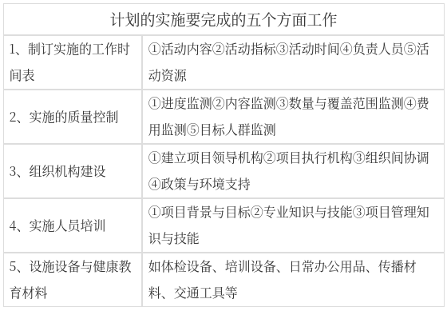

### 计划设计步骤-需求评估。

计划设计步骤有需求评估、确定健康教育目标、制定干预策略、制定实施和评价方案。健康教育需求评估又称为健康教育诊断，根据PRECEDE-PROCEED模式，健康教育诊断包括如下内容：社会诊断、流行病学诊断、行为与环境诊断、教育与组织诊断及管理与政策诊断。

#### 社会诊断
评估目标社区或人群的生活质量，并确定影响生活质量的主要健康问题；了解目标社区或人群的社会、经济、文化环境，与健康问题相关的政策，以及社区资源。
#### 流行病学诊断
进一步明确健康问题的严重性与危害，从而明确社区主要健康问题及主要危险因素；优先干预哪个健康问题的分析过程。

#### 行为与环境诊断
确定影响健康状况的行为与环境因素，以及优先干预的行为生活方式以及环境因素。环境因素包括社会因素和物质条件因素。行为诊断分析应遵循以下几个程序：
1. 区分引起健康问题的行为与非行为因素
以高血压为例，过量饮酒、高盐饮食是行为因素，而遗传倾向、年龄等是非行为因素。
2. 区别重要行为与不重要行为
	1. 行为与健康问题密切相关，两者有明确的因果关系；
	2. 经常发生的行为。
如果行为与健康的关系不甚密切或者它们的关系仅仅是间接的，而且行为也很少出现，即可认为是不重要的行为。
3. 区别高可变性行为与低可变性行为
高可变性行为：
1. 正处在发展时期或刚刚形成的行为
2. 与文化传统和传统的生活方式关系不大
3. 在其他计划中已有成功改变了的实证
4. 社会不赞成的行为
低可变性行为：
1. 形成时间已久
2. 深深地植根于文化传统的生活方式之中
3. 既往没有成功改变的实例

#### 教育与组织诊断
任务是分析影响健康相关行为和环境的因素，从而为制订健康教育干预策略提供依据。分为三大类：
倾向因素、促成因素、强化因素。

|因素分类|别名|定义|举例|
|---|---|---|---|
|倾向因素|动因因素或前置因素|是产生某种行为的动机、愿望或是诱发某行为的因素|知识、态度、信念、价值观、行为动机、意向、个人技能|
|促成因素|实现因素|促使某种行为动机或愿望得以实现的因素|保健设施、医务人员、诊所、交通工具、保健技术、行政的重视与支持，法律政策|
|强化因素|加强因素|是激励行为持续、发展或减弱的因素|正向强化：朋友对健康行为的肯定，负向强化：对不健康行为的批评|

#### 管理与政策诊断
1. 核心：评估资源与环境，包括组织资源、外部量以及政策环境正向强化明发对健
2. 管理诊断：
	1. 组织内分析：人力资源情况，工作经验、设备、技术力量
	2. 组织间分析：如本地区是否有开展类似工作的组织机构
	3. 政策诊断：主要分析项目与当地卫生规划的关系，地方政府、卫生部门对健康教育工作的重视程度以及投入的资源等。
#### 确定优先项目
需要在众多的需求中，确定优先解决的健康问题，优先干预的行为，并以此优先的健康教育项目。

### 计划设计步骤-确定健康教育目标。

#### 计划的总体目标
又称计划的目的，指计划执行后预期达到的最终结果。总目标是宏观的、长远的，描述项目总体上的努力方向。例如，在全人群控烟健康教育计划中，其总目标可以提出：“减少由于吸烟造成的呼吸道疾病的患病率”。

#### 计划的具体目标

又称计划的目标，是对总体目标更加具体的描述，用以解释和说明计划总目标的具体内涵。因此，健康教育计划的具体目标需要包含具体的、量化的、可测量的指标，应该能够对以下问题做出回答：
1. Who-对谁
2. What-实现什么变化？（知识、信念、行为、发病率等）
3. When-在多长时间内实现这些变化。
4. Where-在什么范围内实现这些变化。
5. How.much一变化程度有多大。

根据预期的健康教育项目效果，可以将具体目标分为：教育目标（认知目标）、行为目标、健康目标三类。

>【例】某社区经过健康教育诊断后，确定心脑血管病是影响社区居民生活质量的主要健康问题，重点干预的行为包括改变高盐、高脂饮食，定期测量血压、血脂，以及高血压患者遵从医嘱服药。其
具体目标可以包括：
	1. 教育目标：在项目执行三年后。
		1. 使项目地区85%的成年人了解正常的血压水平和血脂水平。
		2. 使项目地区80%的成年人掌握测量血压的技术。
	2. 行为目标：在项目执行三年后
		1. 使项目地区75%的成年人能做到每年测量一次血压。
		2. 使项目地区90%的高血压患者能遵从医嘱服药。；
	3. 健康目标：在项目执行三年后，使项目地区成人高血压患者的血压控制率达到80%。
### 计划设计步骤-制定干预策略、实施和评价方案。

#### 制定干预策略
1. 教育策略
	核心：教育人们形成有益健康的认知和技能
	1. 大众传媒活动如电视节目；
	2. 通过印刷媒介开展的活动，如分发小册子
	3. 人际传播活动，如入户指导；
	4. 因地制宜的社区活动，如义诊；
	5. 民俗、文体活动：如庙会、赶集等。
2. 环境策略
	作用对象是影响行为的促成因素，即物质环境、条件，从而使人们采纳健康行为的意愿得以实现。如食堂提供低脂低盐的食物，在工作场所为职工提供一些锻炼设施。
3. 政策策略（不准室内吸烟、工间操制度、轮班制度）
	1. 政策直接支持并促使健康行为得以实现；
	2. 政策策略还可以通过影响资源配置、环境改善从而促进健康行为乃至健康。

#### 制定实施和评价方案
1. 健康教育策略和活动执行的质量如何，是否能按照项目的时间要求完成各项活动，直接关系到项目的成败。
2. 健康教育的计划要包含实施和评价方案。

### 计划的实施与评价。

#### 计划的实施
健康教育计划的实施是将科学的计划落实为具体操作的过程，是健康教育项目耗费时间最长、动用经费和人力最多的环节，是健康教育项目实现其目标的关键。包含

五个方面的工作：

#### 计划的评价
1. 评价的内容与指标
	1. 过程评价
		1. 定义：指对健康教育/健康促进计划实施过程的评价
		2. 时间：起始于计划实施开始之时，贯穿计划实施的全过程
		3. 着重关注：项目是否按计划的数量和质量执行，包括项目计划执行涉及的各个方面。
		4. 功能：修正项目计划，使之更符合实际情况的功能
	2. 评价内容
		针对目标人群的参与情况、活动的组织情况，要进行下述内容的评价：
		1. 哪些个体参与了活动
		2. 在干预中运用了哪些策略和活动
		3. 这些活动是否在按计划进行？计划是否做过调整？为什么调整？是如何调整。
		4. 目标人群对干预活动的反应如何？是否满意并接受这些活动。
		5. 目标人群对各项干预活动的参与情况如何。
		评价指标：项目活动执行率、干预活动覆盖率、目标人群参与率、有效指数、目标人群的满意度
	3. 效应评价
		项目实施后目标人群健康相关行为及其影响因素的变化，近中期效果评价。效应评价常用指标包括：卫生知识均分、卫生知识知晓率、健康信念持有率、行为流行率、行为改变率。
	4. 结局评价
		在健康教育中，结局评价着眼于评价健康教育与健康促进项目实施后导致的目标人群健康状况乃至生活质量的变化。常被称为远期效果评价。
		1. 生理、心理健康指标。如身高、体重、体质指数、血压、血脂、血糖等生理指标；心理健康指标如人格、抑郁等方面的变化。
		2. 生活质量指标。生活质量的变化需要运用一些专门的工具来反映，如日常活动量表等。
		3. 管理前后健康风险的变化。
2. 效果评价方案
	健康教育常用评价方案有4种：
	1. 不设对照组的前后测试（干预组自身前后比较）
	2. 非等同比较组设计
	3. 简单时间系列设计
	4. 复合时间系列设计
	2、4两种由于设立对照组，因此说服力强，科学研究色彩浓。