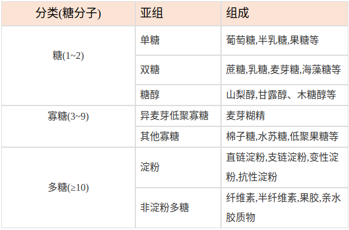

### 能量和宏量营养素-碳水化合物。

碳水化合物、蛋白质和脂类的主要作用是提供能量来满足人体的需要，也被称为“产能营养素”。
#### 能量系数
每克产能营养素在体内氧化所产生的能量值。每克脂防可以释放9kcl,蛋白质和碳水化合物产生4kcal,每克酒精产生7kcl,(但酒精不是营养素)，每克膳食纤维产生2kcal。换算：1kcal=4.184KJ;1kJ=0.239kcal

#### 碳水化合物
1. 作用：人体的主要能量来源
2. 分类：

3. 血糖生成指数：指分别摄入某种事物与等量葡萄糖2小时后血浆葡萄糖曲线下面积比。
	1. GI=(某食物在食后2小时血糖曲线下面积/相当含量葡萄糖在食后2小时血糖曲线下面积) * 100
	2. GI是衡量某种食物或某种膳食组成对血糖浓度影响的一个指标。
	3. GI高的食物或膳食，表示进入胃肠后消化快、吸收完全，葡萄糖迅速进入血液，血糖浓度波动大；反之则表示在胃肠内停留时间长，释放缓慢，葡萄糖进入血液后峰值低，下降速度慢，血糖浓度波动小。
4. 参考摄入量：占总热量的50-65%。
5. 食物来源：应包括复合碳水化合物淀粉、不消化的抗性淀粉、非淀粉多糖和低聚糖等，限制纯能量食物如糖的摄入量。
	1. 膳食中淀粉的主要来源是：粮谷类食物和薯类食物；(粮谷类食物一般含碳水化合物60%~80%，薯类含量为15%~30%，豆类为40%~60%。)
	2. 单糖和双糖的主要来源是：蔗糖、糖果、甜食、糕点、甜味水果、含糖饮料和蜂蜜等

### 脂类的组成和分类。

#### 脂肪

热能的“金库”，指中性脂肪，由一分子甘油和三分子脂肪酸构成，故称为"甘油三酯"。

#### 脂肪酸

1. 根据所含碳链长度，将脂肪酸分为：
	1. 长链脂肪酸：含14-24个碳原子
	2. 中链脂肪酸：含8-12个碳原子
	3. 短链脂防酸：含2-6个碳原子
2. 根据脂肪酸饱和程度，可以将脂防酸分为：
	1. 饱和脂防酸：碳链中不含双键：动物油
	2. 单不饱和脂肪酸：碳链中只有一个双键：橄榄油、茶油
	3. 多不饱和脂防酸：碳链中含有两个或两个以上双键：植物油
3. 按照不饱和脂防酸第一个双键的位置分为：
	可分为n-三、n-六、n-9等系列脂防酸。不饱和脂肪酸的第一个不饱和双键所在碳原子的序号是3，则为n-3系脂肪酸，依次类推。
4. 根据脂防酸空间结构，将脂肪酸分为：
	1. 顺式脂肪酸：液态，熔点较低，植物油；
	2. 反式脂防酸：固体、半固体，多见人造脂肪酸。熔点较高，存在于动物脂防中、乳和乳制品，黄油面包、人造奶油。
		1. 长期摄入反式脂防酸，反式脂肪酸可以使血清低密度脂蛋白胆固醇升高，从而使高密度脂蛋白胆固醇降低。，增加患动脉粥样硬化和冠心病的风险，另外影响儿童生长发育和神经系统的健康。
		2. 避免常吃含反式脂防酸的食物，看标签，尤其是小孩，每天摄入量不能高于2.2克，相当于130克的面包，一个“派”，或半杯奶茶，或2-3个小包咖啡伴侣的量，正常的脂防代谢需要7天，而反式脂肪酸的代谢需要51天。

#### 类脂

1. 磷脂：是含有磷酸根、脂肪酸、甘油和氮的化合物。体内除甘油三酯外，磷脂是最多的脂类。主要形式有甘油磷脂、卵磷脂、神经鞘磷脂等。甘油磷脂存在于各种组织、血浆，并有小量储在于体脂库中，它是构成细胞膜的物质并与机体的脂肪运输有关。卵磷脂又称为磷脂酰胆碱，存在于血浆中。神经鞘磷脂存在于神经鞘。
2. 糖脂：包括脑苷酯类和神经苷脂。糖脂也是构成细胞膜所必需的。
3. 类固醇及固醇：类固醇是含有环戊烷多氢菲的化合物。类固醇中含有自由羟基者视为高分子醇，称为固醇。常见的固醇有动物组织中的胆固醇和植物组织中的谷固醇。
	类脂在体内的含量较恒定、即使在肥胖患者含量也不增多：反之、在饥饿状态也不减少、故有“固定脂”或“不动脂”之称。

### 脂类及必需脂肪酸的生理功能。

#### 脂类的生理功能

1. 供给能量：脂防是人体能量的重要来源，1克脂肪在体内可供给能量37.67kJ(9kcal)。
2. 促进脂溶性维生素吸收：脂防是脂溶性维生素的溶媒
3. 维持体温、保护脏器：脂防是热的不良导体，皮下可阻止体热散失。在器官周围的脂肪，有缓冲机械冲击的作用
4. 增加饱腹感：脂肪在胃内停留时间较长
5. 提高膳食感官性状：脂防可使膳食增味添香。
6. 构成身体组织和一些重要的生理活性物质

#### 必需脂肪酸
1. 概念：是人体不能缺少而自身又不能合成的，必须通过食物供给的脂肪酸。包括：
	1. 亚油酸(n-6):花生四烯酸(ARA)
	2. a-亚麻酸(n-3)：二十二碳六烯酸(DHA)、二十碳五烯酸(EPA)
2. 必需脂肪酸的生理功能
	1. 线粒体和细胞膜的主要成分：缺乏会得皮肤湿疹
	2. 参与胆固醇运输与代谢：深海鱼油含EPA和DHA
	3. 合成前列腺素的前体；
	4. 参与精子形成：缺乏会不孕不育
	5. 维护视力：DHA是合成视网膜感光器的所需物质

#### 脂类的供给量与食物来源

脂防适宜摄入量：脂肪能量占总能量百分比：20~30%（饱和脂肪酸小于10% ，单不饱和脂防酸10%，多不饱和脂肪酸10%