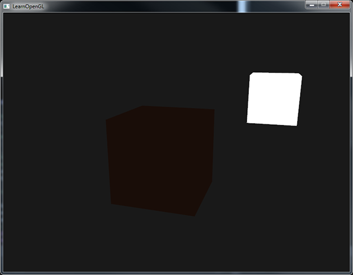
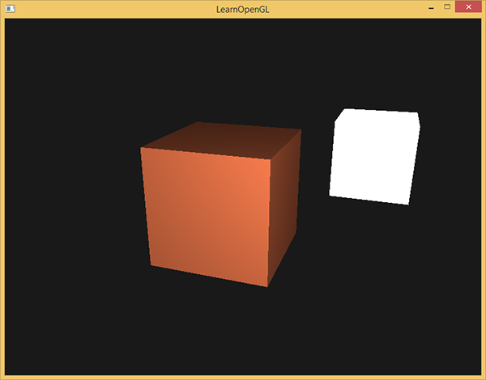

现实世界的光照是极其复杂的，而且会受到诸多因素的影响，这是我们有限的计算能力所无法模拟的。因此OpenGL的光照使用的是简化的模型，对现实的情况进行近似，这样处理起来会更容易一些，而且看起来也差不多一样。这些光照模型都是基于我们对光的物理特性的理解。其中一个模型被称为风氏光照模型(Phong Lighting Model)。风氏光照模型的主要结构由3个分量组成：环境(Ambient)、漫反射(Diffuse)和镜面(Specular)光照。下面这张图展示了这些光照分量看起来的样子：


- 环境光照(Ambient Lighting)：即使在黑暗的情况下，世界上通常也仍然有一些光亮（月亮、远处的光），所以物体几乎永远不会是完全黑暗的。为了模拟这个，我们会使用一个环境光照常量，它永远会给物体一些颜色。
- 漫反射光照(Diffuse Lighting)：模拟光源对物体的方向性影响(Directional Impact)。它是风氏光照模型中视觉上最显著的分量。物体的某一部分越是正对着光源，它就会越亮。
- 镜面光照(Specular Lighting)：模拟有光泽物体上面出现的亮点。镜面光照的颜色相比于物体的颜色会更倾向于光的颜色。

为了创建有趣的视觉场景，我们希望模拟至少这三种光照分量。我们将以最简单的一个开始：**环境光照**。

## 环境光照

光通常都不是来自于同一个光源，而是来自于我们周围分散的很多光源，即使它们可能并不是那么显而易见。光的一个属性是，它可以向很多方向发散并反弹，从而能够到达不是非常直接临近的点。所以，光能够在其它的表面上**反射**，对一个物体产生间接的影响。考虑到这种情况的算法叫做全局照明(Global Illumination)算法，但是这种算法既开销高昂又极其复杂。

由于我们现在对那种又复杂又开销高昂的算法不是很感兴趣，所以我们将会先使用一个简化的全局照明模型，即环境光照。正如你在上一节所学到的，我们使用一个很小的常量（光照）颜色，添加到物体片段的最终颜色中，这样子的话即便场景中没有直接的光源也能看起来存在有一些发散的光。

把环境光照添加到场景里非常简单。我们用光的颜色乘以一个很小的常量环境因子，再乘以物体的颜色，然后将最终结果作为片段的颜色：

```c++
void main()
{
	float ambientStrength = 0.1;
	vec3 anbient = ambientStrength * lightColor;
	
	vec3 result = ambient * objectColor;
	FragColor = vec4(result, 1.0);
}
```

如果你现在运行你的程序，你会注意到风氏光照的第一个阶段已经应用到你的物体上了。这个物体非常暗，但由于应用了环境光照（注意光源立方体没受影响是因为我们对它使用了另一个着色器），也不是完全黑的。它看起来应该像这样：



## 漫反射光照

环境光照本身不能提供最有趣的结果，但是漫反射光照就能开始对物体产生显著的视觉影响了。漫反射光照使物体上与光线方向越接近的片段能从光源处获得更多的亮度。为了能够更好的理解漫反射光照，请看下图：


图左上方有一个光源，它所发出的光线落在物体的一个片段上。我们需要测量这个光线是以什么角度接触到这个片段的。如果光线垂直于物体表面，这束光对物体的影响会最大化（译注：更亮）。为了测量光线和片段的角度，我们使用一个叫做法向量(Normal Vector)的东西，它是垂直于片段表面的一个向量（这里以黄色箭头表示），我们在后面再讲这个东西。这两个向量之间的角度很容易就能够通过点乘计算出来。

你可能记得在[变换](../1.opengl基础/6.%20变换.md)那一节教程里，我们知道两个单位向量的夹角越小，它们点乘的结果越倾向于1。当两个向量的夹角为90度的时候，点乘会变为0。这同样适用于θ，θ越大，光对片段颜色的影响就应该越小。

>注意，为了（只）得到两个向量夹角的余弦值，我们使用的是单位向量（长度为1的向量），所以我们需要确保所有的向量都是标准化的，否则点乘返回的就不仅仅是余弦值了（见[变换](../1.opengl基础/6.%20变换.md)）。

点乘返回一个标量，我们可以用它计算光线对片段颜色的影响。不同片段朝向光源的方向的不同，这些片段被照亮的情况也不同。

所以，计算漫反射光照需要什么？

- 法向量：一个垂直于顶点表面的向量。
- 定向的光线：作为光源的位置与片段的位置之间向量差的方向向量。为了计算这个光线，我们需要光的位置向量和片段的位置向量。
### 法向量

法向量是一个垂直于顶点表面的（单位）向量。由于顶点本身并没有表面（它只是空间中一个独立的点），我们利用它周围的顶点来计算出这个顶点的表面。我们能够使用一个小技巧，使用叉乘对立方体所有的顶点计算法向量，但是由于3D立方体不是一个复杂的形状，所以我们可以简单地把法线数据手工添加到顶点数据中。更新后的顶点数据数组可以在[这里](https://learnopengl.com/code_viewer.php?code=lighting/basic_lighting_vertex_data)找到。试着去想象一下，这些法向量真的是垂直于立方体各个平面的表面的（一个立方体由6个平面组成）。

由于我们向顶点数组添加了额外的数据，所以我们应该更新光照的顶点着色器：

```c++
#version 330 core
layout (location = 0) in vec3 aPos;
layout (location = 1) in vec3 aNormal;
...
```


现在我们已经向每个顶点添加了一个法向量并更新了顶点着色器，我们还要更新顶点属性指针。注意，灯使用同样的顶点数组作为它的顶点数据，然而灯的着色器并没有使用新添加的法向量。我们不需要更新灯的着色器或者是属性的配置，但是我们必须至少修改一下顶点属性指针来适应新的顶点数组的大小：

```c++
glVertexAttribPointer(0, 3, GL_FLOAT, GL_FALSE, 6 * sizeof(float), (void*)0);
glEnableVertexAttribArray(0);
```

我们只想使用每个顶点的前三个float，并且忽略后三个float，所以我们只需要把**步长**参数改成`float`大小的6倍就行了。

虽然对灯的着色器使用不能完全利用的顶点数据看起来不是那么高效，但这些顶点数据已经从箱子对象载入后开始就储存在GPU的内存里了，所以我们并不需要储存新数据到GPU内存中。这实际上比给灯专门分配一个新的VBO更高效了。

所有光照的计算都是在片段着色器里进行，所以我们需要将法向量由顶点着色器传递到片段着色器。我们这么做：

```c++
out vec3 Normal;

void main()
{
    gl_Position = projection * view * model * vec4(aPos, 1.0);
    Normal = aNormal;
}
```

接下来，在片段着色器中定义相应的输入变量：

```c++
in vec3 Normal;
```

### 计算漫反射光照

我们现在对每个顶点都有了法向量，但是我们仍然需要光源的位置向量和片段的位置向量。由于光源的位置是一个静态变量，我们可以简单地在片段着色器中把它声明为uniform：

```c++
uniform vec3 lightPos;
```

然后在渲染循环中（渲染循环的外面也可以，因为它不会改变）更新uniform。我们使用在前面声明的lightPos向量作为光源位置：

```c++
lightingShader.setVec3("lightPos", lightPos);
```

最后，我们还需要片段的位置。我们会在世界空间中进行所有的光照计算，因此我们需要一个在世界空间中的顶点位置。我们可以通过把顶点位置属性乘以模型矩阵（不是观察和投影矩阵）来把它变换到世界空间坐标。这个在顶点着色器中很容易完成，所以我们声明一个输出变量，并计算它的世界空间坐标：

```c++
out vec3 FragPos;  
out vec3 Normal;

void main()
{
    gl_Position = projection * view * model * vec4(aPos, 1.0);
    FragPos = vec3(model * vec4(aPos, 1.0));
    Normal = aNormal;
}
```

最后，在片段着色器中添加相应的输入变量。

```c++
in vec3 FragPos;
```

这个in类型变量将被插入三角形的3维世界位置向量值，形成FragPos向量，即每个片段的世界位置。现在，所有需要的变量都设置好了，我们可以在片段着色器中添加光照计算了。

我们需要做的第一件事是计算光源和片段位置之间的方向向量。前面提到，光的方向向量是光源位置向量与片段位置向量之间的向量差。你可能记得在[变换](../1.opengl基础/6.%20变换.md)教程中，我们能够简单地通过让两个向量相减的方式计算向量差。我们同样希望确保所有相关向量最后都转换为单位向量，所以我们把法线和最终的方向向量都进行标准化：

```c++
vec3 norm = normalize(Normal);
vec3 lightDir = normalize(lightPos - FragPos);
```

> 当计算光照时我们通常不关心一个向量的模长或它的位置，我们只关心它们的方向。所以，几乎所有的计算都使用单位向量完成，因为这简化了大部分的计算（比如点乘）。所以当进行光照计算时，确保你总是对相关向量进行标准化，来保证它们是真正地单位向量。忘记对向量进行标准化是一个十分常见的错误。

下一步，我们对norm和lightDir向量进行点乘，计算光源对当前片段实际的漫反射影响。结果值再乘以光的颜色，得到漫反射分量。两个向量之间的角度越大，漫反射分量就会越小：

```c++
float diff = max(dot(norm, lightDir), 0.0);
vec3 diffuse = diff * lightColor;
```

如果两个向量之间的角度大于90度，点乘的结果就会变成负数，这样会导致漫反射分量变为负数。为此，我们使用max函数返回两个参数之间较大的参数，从而保证漫反射分量不会变成负数。负数颜色的光照是没有定义的，所以最好避免它，除非你是那种古怪的艺术家。

现在我们有了环境光分量和漫反射分量，我们把它们相加，然后把结果乘以物体的颜色，来获得片段最后的输出颜色。

```c++
vec3 result = (ambient + diffuse) * objectColor;
FragColor = vec4(result, 1.0);
```

如果你的应用(和着色器)编译成功了，你可能看到类似的输出：



你可以看到使用了漫反射光照，立方体看起来就真的像个立方体了。尝试在你的脑中想象一下法向量，并在立方体周围移动，注意观察法向量和光的方向向量之间的夹角越大，片段就会越暗。

如果你在哪卡住了，可以在[这里](https://learnopengl.com/code_viewer_gh.php?code=src/2.lighting/2.1.basic_lighting_diffuse/basic_lighting_diffuse.cpp)对比一下完整的源代码。