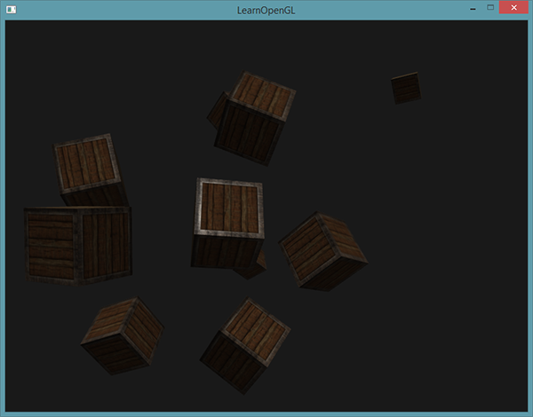

# 投光物

我们目前使用的光照都来自于空间中的一个点。它能给我们不错的效果，但现实世界中，我们有很多种类的光照，每种的表现都不同。将光**投射**(Cast)到物体的光源叫做投光物(Light Caster)。在这一节中，我们将会讨论几种不同类型的投光物。学会模拟不同种类的光源是又一个能够进一步丰富场景的工具。

我们首先将会讨论定向光(Directional Light)，接下来是点光源(Point Light)，它是我们之前学习的光源的拓展，最后我们将会讨论聚光(Spotlight)。在[下一节](https://learnopengl-cn.github.io/02%20Lighting/06%20Multiple%20lights/)中我们将讨论如何将这些不同种类的光照类型整合到一个场景之中。

## 平行光

当一个光源处于很远的地方时，来自光源的每条光线就会近似于互相平行。不论物体和/或者观察者的位置，看起来好像所有的光都来自于同一个方向。当我们使用一个假设光源处于**无限**远处的模型时，它就被称为定向光，因为它的所有光线都有着相同的方向，它与光源的位置是没有关系的。

定向光非常好的一个例子就是太阳。太阳距离我们并不是无限远，但它已经远到在光照计算中可以把它视为无限远了。所以来自太阳的所有光线将被模拟为平行光线，我们可以在下图看到：


因为所有的光线都是平行的，所以物体与光源的相对位置是不重要的，因为对场景中每一个物体光的方向都是一致的。由于光的位置向量保持一致，场景中每个物体的光照计算将会是类似的。

我们可以定义一个光线方向向量而不是位置向量来模拟一个定向光。着色器的计算基本保持不变，但这次我们将直接使用光的`direction`向量而不是通过`position`来计算`lightDir`向量。

```c++
struct Light {
    // vec3 position; // 使用定向光就不再需要了
    vec3 direction;

    vec3 ambient;
    vec3 diffuse;
    vec3 specular;
};
...
void main()
{
  vec3 lightDir = normalize(-light.direction);
  ...
}
```

注意我们首先对`light.direction`向量取反。我们目前使用的光照计算需求一个从片段**至**光源的光线方向，但人们更习惯定义定向光为一个**从**光源出发的全局方向。所以我们需要对全局光照方向向量取反来改变它的方向，它现在是一个指向光源的方向向量了。而且，记得对向量进行标准化，假设输入向量为一个单位向量是很不明智的。

最终的`lightDir`向量将和以前一样用在漫反射和镜面光计算中。

为了清楚地展示定向光对多个物体具有相同的影响，我们将会再次使用[坐标系统](https://learnopengl-cn.github.io/01%20Getting%20started/08%20Coordinate%20Systems/)章节最后的那个箱子派对的场景。如果你错过了派对，我们先定义了十个不同的[箱子位置](https://learnopengl.com/code_viewer.php?code=lighting/light_casters_container_positions)，并对每个箱子都生成了一个不同的模型矩阵，每个模型矩阵都包含了对应的局部-世界坐标变换：

```c++
for(unsigned int i = 0; i < 10; i++)
{
    glm::mat4 model;
    model = glm::translate(model, cubePositions[i]);
    float angle = 20.0f * i;
    model = glm::rotate(model, glm::radians(angle), glm::vec3(1.0f, 0.3f, 0.5f));
    lightingShader.setMat4("model", model);

    glDrawArrays(GL_TRIANGLES, 0, 36);
}
```

同时，不要忘记定义光源的方向（注意我们将方向定义为**从**光源出发的方向，你可以很容易看到光的方向朝下）。

```c++
lightingShader.setVec3("light.direction", -0.2f, -1.0f, -0.3f);
```


我们一直将光的位置和位置向量定义为`vec3`，但一些人会喜欢将所有的向量都定义为`vec4`。当我们将位置向量定义为一个`vec4`时，很重要的一点是要将w分量设置为1.0，这样变换和投影才能正确应用。然而，当我们定义一个方向向量为`vec4`的时候，我们不想让位移有任何的效果（因为它仅仅代表的是方向），所以我们将w分量设置为0.0。

方向向量就会像这样来表示：`vec4(0.2f, 1.0f, 0.3f, 0.0f)`。这也可以作为一个快速检测光照类型的工具：你可以检测w分量是否等于1.0，来检测它是否是光的位置向量；w分量等于0.0，则它是光的方向向量，这样就能根据这个来调整光照计算了：

```
if(lightVector.w == 0.0) // 注意浮点数据类型的误差
  // 执行定向光照计算
else if(lightVector.w == 1.0)
  // 根据光源的位置做光照计算（与上一节一样）
```

你知道吗：这正是旧OpenGL（固定函数式）决定光源是定向光还是位置光源(Positional Light Source)的方法，并根据它来调整光照。

如果你现在编译程序，在场景中自由移动，你就可以看到好像有一个太阳一样的光源对所有的物体投光。你能注意到漫反射和镜面光分量的反应都好像在天空中有一个光源的感觉吗？它会看起来像这样：



## 点光源

定向光对于照亮整个场景的全局光源是非常棒的，但除了定向光之外我们也需要一些分散在场景中的点光源(Point Light)。点光源是处于世界中某一个位置的光源，它会朝着所有方向发光，但光线会随着距离逐渐衰减。想象作为投光物的灯泡和火把，它们都是点光源。


在之前的教程中，我们一直都在使用一个（简化的）点光源。我们在给定位置有一个光源，它会从它的光源位置开始朝着所有方向散射光线。然而，我们定义的光源模拟的是永远不会衰减的光线，这看起来像是光源亮度非常的强。在大部分的3D模拟中，我们都希望模拟的光源仅照亮光源附近的区域而不是整个场景。

如果你将10个箱子加入到上一节光照场景中，你会注意到在最后面的箱子和在灯面前的箱子都以相同的强度被照亮，并没有定义一个公式来将光随距离衰减。我们希望在后排的箱子与前排的箱子相比仅仅是被轻微地照亮。

### 衰减

随着光线传播距离的增长逐渐削减光的强度通常叫做衰减(Attenuation)。随距离减少光强度的一种方式是使用一个线性方程。这样的方程能够随着距离的增长线性地减少光的强度，从而让远处的物体更暗。然而，这样的线性方程通常会看起来比较假。在现实世界中，灯在近处通常会非常亮，但随着距离的增加光源的亮度一开始会下降非常快，但在远处时剩余的光强度就会下降的非常缓慢了。所以，我们需要一个不同的公式来减少光的强度。

幸运的是一些聪明的人已经帮我们解决了这个问题。下面这个公式根据片段距光源的距离计算了衰减值，之后我们会将它乘以光的强度向量：


$$F_{att} = \frac{1.0}{K_c + K_l * d + K_q * d^2}$$

在这里d代表了片段距光源的距离。接下来为了计算衰减值，我们定义3个（可配置的）项：常数项Kc、一次项Kl和二次项Kq。
* 常数项通常保持为1.0，它的主要作用是保证分母永远不会比1小，否则的话在某些距离上它反而会增加强度，这肯定不是我们想要的效果。
* 一次项会与距离值相乘，以线性的方式减少强度。
* 二次项会与距离的平方相乘，让光源以二次递减的方式减少强度。二次项在距离比较小的时候影响会比一次项小很多，但当距离值比较大的时候它就会比一次项更大了。

由于二次项的存在，光线会在大部分时候以线性的方式衰退，直到距离变得足够大，让二次项超过一次项，光的强度会以更快的速度下降。这样的结果就是，光在近距离时亮度很高，但随着距离变远亮度迅速降低，最后会以更慢的速度减少亮度。下面这张图显示了在100的距离内衰减的效果：


你可以看到光在近距离的时候有着最高的强度，但随着距离增长，它的强度明显减弱，并缓慢地在距离大约100的时候强度接近0。这正是我们想要的。

### 选择正确的值

但是，该对这三个项设置什么值呢？正确地设定它们的值取决于很多因素：环境、希望光覆盖的距离、光的类型等。在大多数情况下，这都是经验的问题，以及适量的调整。下面这个表格显示了模拟一个（大概）真实的，覆盖特定半径（距离）的光源时，这些项可能取的一些值。第一列指定的是在给定的三项时光所能覆盖的距离。这些值是大多数光源很好的起始点，它们由[Ogre3D的Wiki](http://www.ogre3d.org/tikiwiki/tiki-index.php?page=-Point+Light+Attenuation)所提供：

| 距离 |	常数项 |	一次项  |	二次项 |
|---|---|---|---|
| 7 |	1.0 | 	0.7 | 	1.8 |
| 13 |	1.0 |	0.35 |	0.44 |
| 20 |	1.0 |	0.22 |	0.20 |
| 32 |	1.0 |	0.14 |	0.07 |
| 50 |	1.0 |	0.09 |	0.032 |
| 65 |	1.0 |	0.07 |	0.017 |
| 100 |	1.0 |	0.045 |	0.0075 |
| 160 |	1.0 |	0.027 |	0.0028 |
| 200 |	1.0 |	0.022 |	0.0019 |
| 325 |	1.0 |	0.014 |	0.0007 |
| 600 |	1.0 |	0.007 |	0.0002 |
| 3250 |	1.0 |	0.0014 |	0.000007 |

你可以看到，常数项Kc在所有的情况下都是1.0。一次项Kl为了覆盖更远的距离通常都很小，二次项Kq甚至更小。尝试对这些值进行实验，看看它们在你的实现中有什么效果。在我们的环境中，32到100的距离对大多数的光源都足够了。

### 实现衰减

为了实现衰减，在片段着色器中我们还需要三个额外的值：也就是公式中的常数项、一次项和二次项。它们最好储存在之前定义的Light结构体中。注意我们使用上一节中计算`lightDir`的方法，而不是上面**定向光**部分的。

```c++
struct Light {
    vec3 position;  

    vec3 ambient;
    vec3 diffuse;
    vec3 specular;

    float constant;
    float linear;
    float quadratic;
};
```

然后我们将在OpenGL中设置这些项：我们希望光源能够覆盖50的距离，所以我们会使用表格中对应的常数项、一次项和二次项：

```c++
lightingShader.setFloat("light.constant",  1.0f);
lightingShader.setFloat("light.linear",    0.09f);
lightingShader.setFloat("light.quadratic", 0.032f);
```


