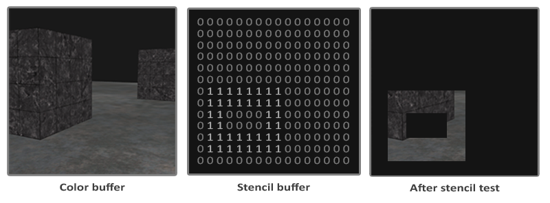

# 模板测试

当片段着色器处理完一个片段之后，模板测试(Stencil Test)会开始执行，和深度测试一样，它也可能会丢弃片段。接下来，被保留的片段会进入深度测试，它可能会丢弃更多的片段。模板测试是根据又一个缓冲来进行的，它叫做模板缓冲(Stencil Buffer)，我们可以在渲染的时候更新它来获得一些很有意思的效果。

一个模板缓冲中，（通常）每个模板值(Stencil Value)是8位的。所以每个像素/片段一共能有256种不同的模板值。我们可以将这些模板值设置为我们想要的值，然后当某一个片段有某一个模板值的时候，我们就可以选择丢弃或是保留这个片段了。

>每个窗口库都需要为你配置一个模板缓冲。GLFW自动做了这件事，所以我们不需要告诉GLFW来创建一个，但其它的窗口库可能不会默认给你创建一个模板库，所以记得要查看库的文档。

模板缓冲的一个简单的例子如下：

