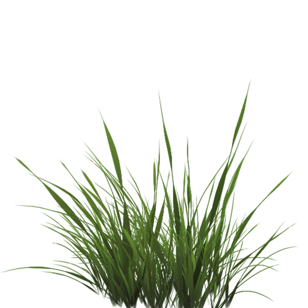

# 混合

OpenGL中，混合(Blending)通常是实现物体透明度(Transparency)的一种技术。透明就是说一个物体（或者其中的一部分）不是纯色(Solid Color)的，它的颜色是物体本身的颜色和它背后其它物体的颜色的不同强度结合。一个有色玻璃窗是一个透明的物体，玻璃有它自己的颜色，但它最终的颜色还包含了玻璃之后所有物体的颜色。这也是混合这一名字的出处，我们混合(Blend)（不同物体的）多种颜色为一种颜色。所以透明度能让我们看穿物体。


透明的物体可以是完全透明的（让所有的颜色穿过），或者是半透明的（它让颜色通过，同时也会显示自身的颜色）。一个物体的透明度是通过它颜色的alpha值来决定的。Alpha颜色值是颜色向量的第四个分量，你可能已经看到过它很多遍了。在这个教程之前我们都将这个第四个分量设置为1.0，让这个物体的透明度为0.0，而当alpha值为0.0时物体将会是完全透明的。当alpha值为0.5时，物体的颜色有50%是来自物体自身的颜色，50%来自背后物体的颜色。

我们目前一直使用的纹理有三个颜色分量：红、绿、蓝。但一些材质会有一个内嵌的alpha通道，对每个纹素(Texel)都包含了一个alpha值。这个alpha值精确地告诉我们纹理各个部分的透明度。比如说，下面这个窗户纹理中的玻璃部分的alpha值为0.25（它在一般情况下是完全的红色，但由于它有75%的透明度，能让很大一部分的网站背景颜色穿过，让它看起来不那么红了），角落的alpha值是0.0。


我们很快就会将这个窗户纹理添加到场景中，但是首先我们需要讨论一个更简单的技术，来实现只有完全透明和完全不透明的纹理的透明度。

## 丢弃片段

有些图片并不需要半透明，只需要根据纹理颜色值，显示一部分，或者不显示一部分，没有中间情况。比如说草，如果想不太费劲地创建草这种东西，你需要将一个草的纹理贴在一个2D四边形(Quad)上，然后将这个四边形放到场景中。然而，草的形状和2D四边形的形状并不完全相同，所以你只想显示草纹理的某些部分，而忽略剩下的部分。

下面这个纹理正是这样的，它要么是完全不透明的（alpha值为1.0），要么是完全透明的（alpha值为0.0），没有中间情况。你可以看到，只要不是草的部分，这个图片显示的都是网站的背景颜色而不是它本身的颜色。



所以当添加像草这样的植被到场景中时，我们不希望看到草的方形图像，而是只显示草的部分，并能看透图像其余的部分。我们想要丢弃(Discard)显示纹理中透明部分的片段，不将这些片段存储到颜色缓冲中

在此之前，我们还要学习如何加载一个透明的纹理。要想加载有alpha值的纹理，我们并不需要改很多东西，stb_image在纹理有alpha通道的时候会自动加载，但我们仍要在纹理生成过程中告诉OpenGL，我们的纹理现在使用alpha通道了：

```c++
glTexImage2D(GL_TEXTURE_2D, 0, GL_RGBA, width, height, 0, GL_RGBA, GL_UNSIGNED_BYTE, data);
```

同样，保证你在片段着色器中获取了纹理的全部4个颜色分量，而不仅仅是RGB分量：

```c++
void main()
{
    // FragColor = vec4(vec3(texture(texture1, TexCoords)), 1.0);
    FragColor = texture(texture1, TexCoords);
}
```

既然我们已经知道该如何加载透明的纹理了，是时候将它带入实战了，我们将会在深度测试小节的场景中加入几棵草。

我们会创建一个vector，向里面添加几个glm::vec3变量来代表草的位置：

```c++
vector<glm::vec3> vegetation;
vegetation.push_back(glm::vec3(-1.5f,  0.0f, -0.48f));
vegetation.push_back(glm::vec3( 1.5f,  0.0f,  0.51f));
vegetation.push_back(glm::vec3( 0.0f,  0.0f,  0.7f));
vegetation.push_back(glm::vec3(-0.3f,  0.0f, -2.3f));
vegetation.push_back(glm::vec3( 0.5f,  0.0f, -0.6f));
```

每个草都被渲染到了一个四边形上，贴上草的纹理。这并不能完美地表示3D的草，但这比加载复杂的模型要快多了。使用一些小技巧，比如在同一个位置加入一些旋转后的草四边形，你仍然能获得比较好的结果的。

因为草的纹理是添加到四边形对象上的，我们还需要创建另外一个VAO，填充VBO，设置正确的顶点属性指针。接下来，在绘制完地板和两个立方体后，我们将会绘制草：

```c++
glBindVertexArray(vegetationVAO);
glBindTexture(GL_TEXTURE_2D, grassTexture);  
for(unsigned int i = 0; i < vegetation.size(); i++) 
{
    model = glm::mat4(1.0f);
    model = glm::translate(model, vegetation[i]);               
    shader.setMat4("model", model);
    glDrawArrays(GL_TRIANGLES, 0, 6);
}
```

运行程序你将看到：


出现这种情况是因为OpenGL默认是不知道怎么处理alpha值的，更不知道什么时候应该丢弃片段。我们需要自己手动来弄。幸运的是，有了着色器，这还是非常容易的。GLSL给了我们discard命令，一旦被调用，它就会保证片段不会被进一步处理，所以就不会进入颜色缓冲。有了这个指令，我们就能够在片段着色器中检测一个片段的alpha值是否低于某个阈值，如果是的话，则丢弃这个片段，就好像它不存在一样：

```c++
#version 330 core
out vec4 FragColor;

in vec2 TexCoords;

uniform sampler2D texture1;

void main()
{             
    vec4 texColor = texture(texture1, TexCoords);
    if(texColor.a < 0.1)
        discard;
    FragColor = texColor;
}
```

这里，我们检测被采样的纹理颜色的alpha值是否低于0.1的阈值，如果是的话，则丢弃这个片段。片段着色器保证了它只会渲染不是（几乎）完全透明的片段。现在它看起来就正常了：


注意，当采样纹理的边缘的时候，OpenGL会对边缘的值和纹理下一个重复的值进行插值（因为我们将它的环绕方式设置为了GL_REPEAT。这通常是没问题的，但是由于我们使用了透明值，纹理图像的顶部将会与底部边缘的纯色值进行插值。这样的结果是一个半透明的有色边框，你可能会看见它环绕着你的纹理四边形。要想避免这个，每当你alpha纹理的时候，请将纹理的环绕方式设置为GL_CLAMP_TO_EDGE：

```c++
glTexParameteri( GL_TEXTURE_2D, GL_TEXTURE_WRAP_S, GL_CLAMP_TO_EDGE);
glTexParameteri( GL_TEXTURE_2D, GL_TEXTURE_WRAP_T, GL_CLAMP_TO_EDGE);
```

## 混合

虽然直接丢弃片段很好，但它不能让我们渲染半透明的图像。我们要么渲染一个片段，要么完全丢弃它。要想渲染有多个透明度级别的图像，我们需要启用混合(Blending)。和OpenGL大多数的功能一样，我们可以启用GL_BLEND来启用混合：

```c++
glEnable(GL_BLEND);
```

启用了混合之后，我们需要告诉OpenGL它该如何混合。

OpenGL中的混合是通过下面这个方程来实现的：

