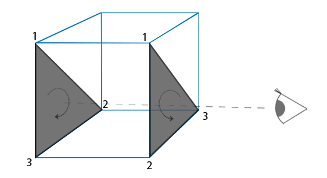
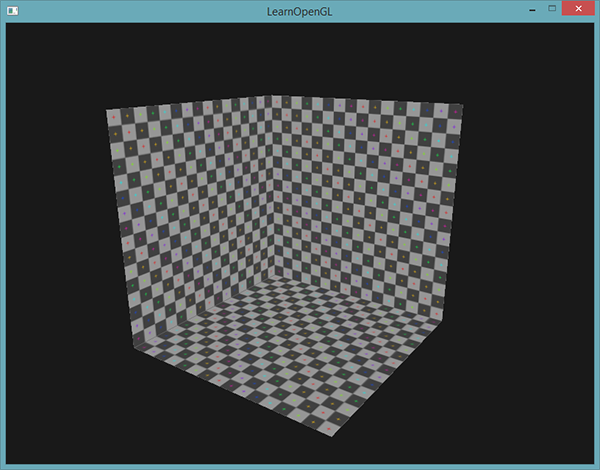

# 面剔除

尝试在脑子中想象一个3D立方体，数数你从任意方向最多能同时看到几个面。如果你的想象力不是过于丰富了，你应该能得出最大的面数是3。你可以从任意位置和任意方向看向这个球体，但你永远不能看到3个以上的面。所以我们为什么要浪费时间绘制我们不能看见的那3个面呢？如果我们能够以某种方式丢弃这几个看不见的面，我们能省下超过50%的片段着色器执行数！

>我说的是超过50%而不是50%，因为从特定角度来看的话只能看见2个甚至是1个面。在这种情况下，我们就能省下超过50%了。

这是一个很好的主意，但我们仍有一个问题需要解决：我们如何知道一个物体的某一个面不能从观察者视角看到呢？
如果我们想象任何一个闭合形状，它的每一个面都有两侧，每一侧要么面向用户，要么背对用户。如果我们能够只绘制面向观察者的面呢？

这正是面剔除(Face Culling)所做的。OpenGL能够检查所有面向(Front Facing)观察者的面，并渲染它们，而丢弃那些背向(Back Facing)的面，节省我们很多的片段着色器调用（它们的开销很大！）。但我们仍要告诉OpenGL哪些面是正向面(Front Face)，哪些面是背向面(Back Face)。OpenGL使用了一个很聪明的技巧，分析顶点数据的环绕顺序(Winding Order)。

## 环绕顺序

当我们定义一组三角形顶点时，我们会以特定的环绕顺序来定义它们，可能是顺时针(Clockwise)的，也可能是逆时针(Counter-clockwise)的。每个三角形由3个顶点所组成，我们会从三角形中间来看，为这3个顶点设定一个环绕顺序。


可以看到，我们首先定义了顶点1，之后我们可以选择定义顶点2或者顶点3，这个选择将定义了这个三角形的环绕顺序。下面的代码展示了这点：

```c++
float vertices[] = {
    // 顺时针
    vertices[0], // 顶点1
    vertices[1], // 顶点2
    vertices[2], // 顶点3
    // 逆时针
    vertices[0], // 顶点1
    vertices[2], // 顶点3
    vertices[1]  // 顶点2  
};
```

每组组成三角形图元的三个顶点就包含了一个环绕顺序。OpenGL在渲染图元的时候将使用这个信息来决定一个三角形是一个正向三角形还是背向三角形。默认情况下，逆时针顶点所定义的三角形将会被处理为正向三角形。

当你定义顶点顺序的时候，你应该想象对应的三角形是面向你的，所以你定义的三角形从正面看去应该是逆时针的。这样定义顶点很棒的一点是，实际的环绕顺序是在光栅化阶段进行的，也就是顶点着色器运行之后。这些顶点就是从观察者视角所见的了。

观察者所面向的所有三角形顶点就是我们所指定的正确环绕顺序了，而立方体另一面的三角形顶点则是以相反的环绕顺序所渲染的。这样的结果就是，我们所面向的三角形将会是正向三角形，而背面的三角形则是背向三角形。下面这张图显示了这个效果：



在顶点数据中，我们将两个三角形都以逆时针顺序定义（正面的三角形是1、2、3，背面的三角形也是1、2、3（如果我们从正面看这个三角形的话））。然而，如果从观察者当前视角使用1、2、3的顺序来绘制的话，从观察者的方向来看，背面的三角形将会是以顺时针顺序渲染的。虽然背面的三角形是以逆时针定义的，它现在是以顺时针顺序渲染的了。这正是我们想要剔除（Cull，丢弃）的不可见面了！

## 面剔除

在本节的开头我们就说过，OpenGL能够丢弃那些渲染为背向三角形的三角形图元。既然已经知道如何设置顶点的环绕顺序了，我们就可以使用OpenGL的面剔除选项了，它默认是禁用状态的。

在之前教程中使用的立方体顶点数据并不是按照逆时针环绕顺序定义的，所以我更新了顶点数据，来反映逆时针的环绕顺序，你可以从这里复制它们。尝试想象这些顶点，确认在每个三角形中它们都是以逆时针定义的，这是一个很好的习惯。

要想启用面剔除，我们只需要启用OpenGL的GL_CULL_FACE选项：

```c++
glEnable(GL_CULL_FACE);
```

从这一句代码之后，所有背向面都将被丢弃（尝试飞进立方体内部，看看所有的内面是不是都被丢弃了）。目前我们在渲染片段的时候能够节省50%以上的性能，但注意这只对像立方体这样的封闭形状有效。当我们想要绘制上一节中的草时，我们必须要再次禁用面剔除，因为它们的正向面和背向面都应该是可见的。

OpenGL允许我们改变需要剔除的面的类型。如果我们只想剔除正向面而不是背向面会怎么样？我们可以调用glCullFace来定义这一行为：

```c++
glCullFace(GL_FRONT);
```

glCullFace函数有三个可用的选项：
* GL_BACK：只剔除背向面。
* GL_FRONT：只剔除正向面。
* GL_FRONT_AND_BACK：剔除正向面和背向面。


glCullFace的初始值是GL_BACK。除了需要剔除的面之外，我们也可以通过调用glFrontFace，告诉OpenGL我们希望将顺时针的面（而不是逆时针的面）定义为正向面：

```c++
glFrontFace(GL_CCW);
```

默认值是GL_CCW，它代表的是逆时针的环绕顺序，另一个选项是GL_CW，它（显然）代表的是顺时针顺序。

我们可以来做一个实验，告诉OpenGL现在顺时针顺序代表的是正向面：

```c++
glEnable(GL_CULL_FACE);
glCullFace(GL_BACK);
glFrontFace(GL_CW);
```

这样的结果是只有背向面被渲染了：



注意你可以仍使用默认的逆时针环绕顺序，但剔除正向面，来达到相同的效果：

```c++
glEnable(GL_CULL_FACE);
glCullFace(GL_FRONT);
```

可以看到，面剔除是一个提高OpenGL程序性能的很棒的工具。但你需要记住哪些物体能够从面剔除中获益，而哪些物体不应该被剔除。