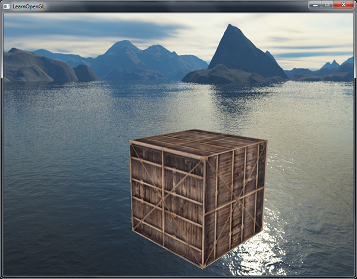

# 立方体贴图

我们已经使用2D纹理很长时间了，但除此之外仍有更多的纹理类型等着我们探索。在本节中，我们将讨论的是将多个纹理组合起来映射到一张纹理上的一种纹理类型：立方体贴图(Cube Map)。

简单来说，立方体贴图就是一个包含了6个2D纹理的纹理，每个2D纹理都组成了立方体的一个面：一个有纹理的立方体。你可能会奇怪，这样一个立方体有什么用途呢？为什么要把6张纹理合并到一张纹理中，而不是直接使用6个单独的纹理呢？立方体贴图有一个非常有用的特性，它可以通过一个方向向量来进行索引/采样。假设我们有一个1x1x1的单位立方体，方向向量的原点位于它的中心。使用一个橘黄色的方向向量来从立方体贴图上采样一个纹理值会像是这样：


>方向向量的大小并不重要，只要提供了方向，OpenGL就会获取方向向量（最终）所击中的纹素，并返回对应的采样纹理值。

如果我们假设将这样的立方体贴图应用到一个立方体上，采样立方体贴图所使用的方向向量将和立方体（插值的）顶点位置非常相像。这样子，只要立方体的中心位于原点，我们就能使用立方体的实际位置向量来对立方体贴图进行采样了。接下来，我们可以将所有顶点的纹理坐标当做是立方体的顶点位置。最终得到的结果就是可以访问立方体贴图上正确面(Face)纹理的一个纹理坐标。

## 创建立方体贴图

立方体贴图是和其它纹理一样的，所以如果想创建一个立方体贴图的话，我们需要生成一个纹理，并将其绑定到纹理目标上，之后再做其它的纹理操作。这次要绑定到GL_TEXTURE_CUBE_MAP：

```c++
unsigned int textureID;
glGenTextures(1, &textureID);
glBindTexture(GL_TEXTURE_CUBE_MAP, textureID);
```

因为立方体贴图包含有6个纹理，每个面一个，我们需要调用glTexImage2D函数6次，参数和之前教程中很类似。但这一次我们将纹理目标(target)参数设置为立方体贴图的一个特定的面，告诉OpenGL我们在对立方体贴图的哪一个面创建纹理。这就意味着我们需要对立方体贴图的每一个面都调用一次glTexImage2D。

由于我们有6个面，OpenGL给我们提供了6个特殊的纹理目标，专门对应立方体贴图的一个面。

| 纹理目标 | 方位 |
|:---:|:---:|
| GL_TEXTURE_CUBE_MAP_POSITIVE_X | 右 |
| GL_TEXTURE_CUBE_MAP_NEGATIVE_X | 左 |
| GL_TEXTURE_CUBE_MAP_POSITIVE_Y | 上 |
| GL_TEXTURE_CUBE_MAP_NEGATIVE_Y | 下 |
| GL_TEXTURE_CUBE_MAP_POSITIVE_Z | 后 |
| GL_TEXTURE_CUBE_MAP_NEGATIVE_Z | 前 |

和OpenGL的很多枚举(Enum)一样，它们背后的int值是线性递增的，所以如果我们有一个纹理位置的数组或者vector，我们就可以从GL_TEXTURE_CUBE_MAP_POSITIVE_X开始遍历它们，在每个迭代中对枚举值加1，遍历了整个纹理目标：

```c++
int width, height, nrChannels;
unsigned char *data;  
for(unsigned int i = 0; i < textures_faces.size(); i++)
{
    data = stbi_load(textures_faces[i].c_str(), &width, &height, &nrChannels, 0);
    glTexImage2D(
        GL_TEXTURE_CUBE_MAP_POSITIVE_X + i, 
        0, GL_RGB, width, height, 0, GL_RGB, GL_UNSIGNED_BYTE, data
    );
}
```

这里我们有一个叫做textures_faces的vector，它包含了立方体贴图所需的所有纹理路径，并以表中的顺序排列。这将为当前绑定的立方体贴图中的每个面生成一个纹理。

因为立方体贴图和其它纹理没什么不同，我们也需要设定它的环绕和过滤方式：

```c++
glTexParameteri(GL_TEXTURE_CUBE_MAP, GL_TEXTURE_MAG_FILTER, GL_LINEAR);
glTexParameteri(GL_TEXTURE_CUBE_MAP, GL_TEXTURE_MIN_FILTER, GL_LINEAR);
glTexParameteri(GL_TEXTURE_CUBE_MAP, GL_TEXTURE_WRAP_S, GL_CLAMP_TO_EDGE);
glTexParameteri(GL_TEXTURE_CUBE_MAP, GL_TEXTURE_WRAP_T, GL_CLAMP_TO_EDGE);
glTexParameteri(GL_TEXTURE_CUBE_MAP, GL_TEXTURE_WRAP_R, GL_CLAMP_TO_EDGE);
```

不要被GL_TEXTURE_WRAP_R吓到，它仅仅是为纹理的R坐标设置了环绕方式，它对应的是纹理的第三个维度（和位置的z一样）。我们将环绕方式设置为GL_CLAMP_TO_EDGE，这是因为正好处于两个面之间的纹理坐标可能不能击中一个面（由于一些硬件限制），所以通过使用GL_CLAMP_TO_EDGE，OpenGL将在我们对两个面之间采样的时候，永远返回它们的边界值。

在绘制使用立方体贴图的物体之前，我们要先激活对应的纹理单元，并绑定立方体贴图，这和普通的2D纹理没什么区别。

在片段着色器中，我们使用了一个不同类型的采样器，samplerCube，我们将使用texture函数使用它进行采样，但这次我们将使用一个vec3的方向向量而不是vec2。使用立方体贴图的片段着色器会像是这样的：

```c++
in vec3 textureDir; // 代表3D纹理坐标的方向向量
uniform samplerCube cubemap; // 立方体贴图的纹理采样器

void main()
{             
    FragColor = texture(cubemap, textureDir);
}
```

看起来很棒，但为什么要用它呢？恰巧有一些很有意思的技术，使用立方体贴图来实现的话会简单多了。其中一个技术就是创建一个天空盒(Skybox)。

## 天空盒

天空盒是一个包含了整个场景的（大）立方体，它包含周围环境的6个图像，让玩家以为他处在一个比实际大得多的环境当中。游戏中使用天空盒的例子有群山、白云或星空。下面这张截图中展示的是星空的天空盒，它来自于『上古卷轴3』：


你可能现在已经猜到了，立方体贴图能完美满足天空盒的需求：我们有一个6面的立方体，每个面都需要一个纹理。在上面的图片中，他们使用了夜空的几张图片，让玩家产生其位于广袤宇宙中的错觉，但实际上他只是在一个小小的盒子当中。

你可以在网上找到很多像这样的天空盒资源。比如说这个网站就提供了很多天空盒。天空盒图像通常有以下的形式：


如果你将这六个面折成一个立方体，你就会得到一个完全贴图的立方体，模拟一个巨大的场景。一些资源可能会提供了这样格式的天空盒，你必须手动提取六个面的图像，但在大部分情况下它们都是6张单独的纹理图像。

之后我们将在场景中使用这个（高质量的）天空盒，它可以在这里下载到。

### 加载天空盒

因为天空盒本身就是一个立方体贴图，加载天空盒和之前加载立方体贴图时并没有什么不同。为了加载天空盒，我们将使用下面的函数，它接受一个包含6个纹理路径的vector：

```c++
unsigned int loadCubemap(vector<std::string> faces)
{
    unsigned int textureID;
    glGenTextures(1, &textureID);
    glBindTexture(GL_TEXTURE_CUBE_MAP, textureID);

    int width, height, nrChannels;
    for (unsigned int i = 0; i < faces.size(); i++)
    {
        unsigned char *data = stbi_load(faces[i].c_str(), &width, &height, &nrChannels, 0);
        if (data)
        {
            glTexImage2D(GL_TEXTURE_CUBE_MAP_POSITIVE_X + i, 
                         0, GL_RGB, width, height, 0, GL_RGB, GL_UNSIGNED_BYTE, data
            );
            stbi_image_free(data);
        }
        else
        {
            std::cout << "Cubemap texture failed to load at path: " << faces[i] << std::endl;
            stbi_image_free(data);
        }
    }
    glTexParameteri(GL_TEXTURE_CUBE_MAP, GL_TEXTURE_MIN_FILTER, GL_LINEAR);
    glTexParameteri(GL_TEXTURE_CUBE_MAP, GL_TEXTURE_MAG_FILTER, GL_LINEAR);
    glTexParameteri(GL_TEXTURE_CUBE_MAP, GL_TEXTURE_WRAP_S, GL_CLAMP_TO_EDGE);
    glTexParameteri(GL_TEXTURE_CUBE_MAP, GL_TEXTURE_WRAP_T, GL_CLAMP_TO_EDGE);
    glTexParameteri(GL_TEXTURE_CUBE_MAP, GL_TEXTURE_WRAP_R, GL_CLAMP_TO_EDGE);

    return textureID;
}
```

函数本身应该很熟悉了。它基本就是上一部分中立方体贴图的代码，只不过合并到了一个便于管理的函数中。

之后，在调用这个函数之前，我们需要将合适的纹理路径按照立方体贴图枚举指定的顺序加载到一个vector中。

```c++
vector<std::string> faces
{
    "right.jpg",
    "left.jpg",
    "top.jpg",
    "bottom.jpg",
    "front.jpg",
    "back.jpg"
};
unsigned int cubemapTexture = loadCubemap(faces);
```

现在我们就将这个天空盒加载为一个立方体贴图了，它的id是cubemapTexture。我们可以将它绑定到一个立方体中，替换掉用了很长时间的难看的纯色背景。


### 显示天空盒

由于天空盒是绘制在一个立方体上的，和其它物体一样，我们需要另一个VAO、VBO以及新的一组顶点。你可以在这里找到它的顶点数据。

用于贴图3D立方体的立方体贴图可以使用立方体的位置作为纹理坐标来采样。当立方体处于原点(0, 0, 0)时，它的每一个位置向量都是从原点出发的方向向量。这个方向向量正是获取立方体上特定位置的纹理值所需要的。正是因为这个，我们只需要提供位置向量而不用纹理坐标了。

要渲染天空盒的话，我们需要一组新的着色器，它们都不是很复杂。因为我们只有一个顶点属性，顶点着色器非常简单：

```c++
#version 330 core
layout (location = 0) in vec3 aPos;

out vec3 TexCoords;

uniform mat4 projection;
uniform mat4 view;

void main()
{
    TexCoords = aPos;
    gl_Position = projection * view * vec4(aPos, 1.0);
}
```

注意，顶点着色器中很有意思的部分是，我们将输入的位置向量作为输出给片段着色器的纹理坐标。片段着色器会将它作为输入来采样samplerCube：

```c++
#version 330 core
out vec4 FragColor;

in vec3 TexCoords;

uniform samplerCube skybox;

void main()
{    
    FragColor = texture(skybox, TexCoords);
}
```

片段着色器非常直观。我们将顶点属性的位置向量作为纹理的方向向量，并使用它从立方体贴图中采样纹理值。

有了立方体贴图纹理，渲染天空盒现在就非常简单了，我们只需要绑定立方体贴图纹理，skybox采样器就会自动填充上天空盒立方体贴图了。绘制天空盒时，我们需要将它变为场景中的第一个渲染的物体，并且禁用深度写入。这样子天空盒就会永远被绘制在其它物体的背后了。

```c++
glDepthMask(GL_FALSE);
skyboxShader.use();
// ... 设置观察和投影矩阵
glBindVertexArray(skyboxVAO);
glBindTexture(GL_TEXTURE_CUBE_MAP, cubemapTexture);
glDrawArrays(GL_TRIANGLES, 0, 36);
glDepthMask(GL_TRUE);
// ... 绘制剩下的场景
```

如果你运行一下的话你就会发现出现了一些问题。我们希望天空盒是以玩家为中心的，这样不论玩家移动了多远，天空盒都不会变近，让玩家产生周围环境非常大的印象。然而，当前的观察矩阵会旋转、缩放和位移来变换天空盒的所有位置，所以当玩家移动的时候，立方体贴图也会移动！我们希望移除观察矩阵中的位移部分，让移动不会影响天空盒的位置向量。

你可能还记得在基础光照小节中，我们通过取4x4矩阵左上角的3x3矩阵来移除变换矩阵的位移部分。我们可以将观察矩阵转换为3x3矩阵（移除位移），再将其转换回4x4矩阵，来达到类似的效果。

```c++
glm::mat4 view = glm::mat4(glm::mat3(camera.GetViewMatrix()));
```

这将移除任何的位移，但保留旋转变换，让玩家仍然能够环顾场景。

有了天空盒，最终的效果就是一个看起来巨大的场景了。如果你在箱子周围转一转，你就能立刻感受到距离感，极大地提升了场景的真实度。最终的结果看起来是这样的：



试一试不同的天空盒，看看它们是怎样对场景的观感产生巨大影响的。

### 优化

目前我们是首先渲染天空盒，之后再渲染场景中的其它物体。这样子能够工作，但不是非常高效。如果我们先渲染天空盒，我们就会对屏幕上的每一个像素运行一遍片段着色器，即便只有一小部分的天空盒最终是可见的。可以使用提前深度测试(Early Depth Testing)轻松丢弃掉的片段能够节省我们很多宝贵的带宽。

所以，我们将会最后渲染天空盒，以获得轻微的性能提升。这样子的话，深度缓冲就会填充满所有物体的深度值了，我们只需要在提前深度测试通过的地方渲染天空盒的片段就可以了，很大程度上减少了片段着色器的调用。问题是，天空盒很可能会渲染在所有其他对象之上，因为它只是一个1x1x1的立方体（译注：意味着距离摄像机的距离也只有1），会通过大部分的深度测试。不用深度测试来进行渲染不是解决方案，因为天空盒将会复写场景中的其它物体。我们需要欺骗深度缓冲，让它认为天空盒有着最大的深度值1.0，只要它前面有一个物体，深度测试就会失败。

在坐标系统小节中我们说过，透视除法是在顶点着色器运行之后执行的，将gl_Position的xyz坐标除以w分量。我们又从深度测试小节中知道，相除结果的z分量等于顶点的深度值。使用这些信息，我们可以将输出位置的z分量等于它的w分量，让z分量永远等于1.0，这样子的话，当透视除法执行之后，z分量会变为w / w = 1.0。

```c++
void main()
{
    TexCoords = aPos;
    vec4 pos = projection * view * vec4(aPos, 1.0);
    gl_Position = pos.xyww;
}
```

最终的标准化设备坐标将永远会有一个等于1.0的z值：最大的深度值。结果就是天空盒只会在没有可见物体的地方渲染了（只有这样才能通过深度测试，其它所有的东西都在天空盒前面）。

我们还要改变一下深度函数，将它从默认的GL_LESS改为GL_LEQUAL。深度缓冲将会填充上天空盒的1.0值，所以我们需要保证天空盒在值小于或等于深度缓冲而不是小于时通过深度测试。

你可以在这里找到优化后的源代码。

## 环境映射

我们现在将整个环境映射到了一个纹理对象上了，能利用这个信息的不仅仅只有天空盒。通过使用环境的立方体贴图，我们可以给物体反射和折射的属性。这样使用环境立方体贴图的技术叫做环境映射(Environment Mapping)，其中最流行的两个是反射(Reflection)和折射(Refraction)。

### 反射

反射这个属性表现为物体（或物体的一部分）反射它周围环境，即根据观察者的视角，物体的颜色或多或少等于它的环境。镜子就是一个反射性物体：它会根据观察者的视角反射它周围的环境。

反射的原理并不难。下面这张图展示了我们如何计算反射向量，并如何使用这个向量来从立方体贴图中采样：


我们根据观察方向向量$\overline{I}$和物体的法向量$\overline{N}$，来计算反射向量$\overline{R}$。我们可以使用GLSL内建的reflect函数来计算这个反射向量。最终的$\overline{R}$

向量将会作为索引/采样立方体贴图的方向向量，返回环境的颜色值。最终的结果是物体看起来反射了天空盒。

因为我们已经在场景中配置好天空盒了，创建反射效果并不会很难。我们将会改变箱子的片段着色器，让箱子有反射性：

```c++
#version 330 core
out vec4 FragColor;

in vec3 Normal;
in vec3 Position;

uniform vec3 cameraPos;
uniform samplerCube skybox;

void main()
{             
    vec3 I = normalize(Position - cameraPos);
    vec3 R = reflect(I, normalize(Normal));
    FragColor = vec4(texture(skybox, R).rgb, 1.0);
}
```