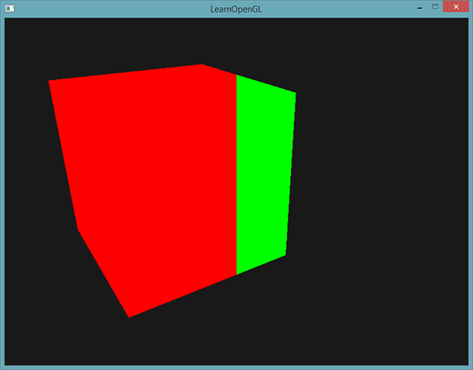
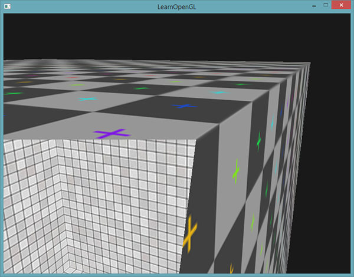

# 高级GLSL

这一小节并不会向你展示非常先进非常酷的新特性，也不会对场景的视觉质量有显著的提高。但是，这一节会或多或少涉及GLSL的一些有趣的地方以及一些很棒的技巧，它们可能在今后会帮助到你。简单来说，它们就是在组合使用OpenGL和GLSL创建程序时的一些最好要知道的东西，和一些会让你生活更加轻松的特性。

我们将会讨论一些有趣的内建变量(Built-in Variable)，管理着色器输入和输出的新方式以及一个叫做Uniform缓冲对象(Uniform Buffer Object)的有用工具。

## GLSL的内建变量

着色器都是最简化的，如果需要当前着色器以外地方的数据的话，我们必须要将数据传进来。我们已经学会使用顶点属性、uniform和采样器来完成这一任务了。然而，除此之外，GLSL还定义了另外几个以gl_为前缀的变量，它们能提供给我们更多的方式来读取/写入数据。我们已经在前面教程中接触过其中的两个了：顶点着色器的输出向量gl_Position，和片段着色器的gl_FragCoord。

我们将会讨论几个有趣的GLSL内建输入和输出变量，并会解释它们能够怎样帮助你。注意，我们将不会讨论GLSL中存在的所有内建变量，如果你想知道所有的内建变量的话，请查看OpenGL的wiki。

### 顶点着色器变量

我们已经见过gl_Position了，它是顶点着色器的裁剪空间输出位置向量。如果你想在屏幕上显示任何东西，在顶点着色器中设置gl_Position是必须的步骤。这已经是它的全部功能了。

gl_PointSize

我们能够选用的其中一个图元是GL_POINTS，如果使用它的话，每一个顶点都是一个图元，都会被渲染为一个点。我们可以通过OpenGL的glPointSize函数来设置渲染出来的点的大小，但我们也可以在顶点着色器中修改这个值。

GLSL定义了一个叫做gl_PointSize输出变量，它是一个float变量，你可以使用它来设置点的宽高（像素）。在顶点着色器中修改点的大小的话，你就能对每个顶点设置不同的值了。

在顶点着色器中修改点大小的功能默认是禁用的，如果你需要启用它的话，你需要启用OpenGL的GL_PROGRAM_POINT_SIZE：

```c++
glEnable(GL_PROGRAM_POINT_SIZE);
```

一个简单的例子就是将点的大小设置为裁剪空间位置的z值，也就是顶点距观察者的距离。点的大小会随着观察者距顶点距离变远而增大。

```c++
void main()
{
    gl_Position = projection * view * model * vec4(aPos, 1.0);    
    gl_PointSize = gl_Position.z;    
}
```

结果就是，当我们远离这些点的时候，它们会变得更大：


你可以想到，对每个顶点使用不同的点大小，会在粒子生成之类的技术中很有意思。

#### gl_VertexID

gl_Position和gl_PointSize都是输出变量，因为它们的值是作为顶点着色器的输出被读取的。我们可以对它们进行写入，来改变结果。顶点着色器还为我们提供了一个有趣的输入变量，我们只能对它进行读取，它叫做gl_VertexID。

整型变量gl_VertexID储存了正在绘制顶点的当前ID。当（使用glDrawElements）进行索引渲染的时候，这个变量会存储正在绘制顶点的当前索引。当（使用glDrawArrays）不使用索引进行绘制的时候，这个变量会储存从渲染调用开始的已处理顶点数量。

### 片段着色器变量

在片段着色器中，我们也能访问到一些有趣的变量。GLSL提供给我们两个有趣的输入变量：gl_FragCoord和gl_FrontFacing。

#### gl_FragCoord

在讨论深度测试的时候，我们已经见过gl_FragCoord很多次了，因为gl_FragCoord的z分量等于对应片段的深度值。然而，我们也能使用它的x和y分量来实现一些有趣的效果。

gl_FragCoord的x和y分量是片段的窗口空间(Window-space)坐标，其原点为窗口的左下角。我们已经使用glViewport设定了一个800x600的窗口了，所以片段窗口空间坐标的x分量将在0到800之间，y分量在0到600之间。

通过利用片段着色器，我们可以根据片段的窗口坐标，计算出不同的颜色。gl_FragCoord的一个常见用处是用于对比不同片段计算的视觉输出效果，这在技术演示中可以经常看到。比如说，我们能够将屏幕分成两部分，在窗口的左侧渲染一种输出，在窗口的右侧渲染另一种输出。下面这个例子片段着色器会根据窗口坐标输出不同的颜色：

```c++
void main()
{             
    if(gl_FragCoord.x < 400)
        FragColor = vec4(1.0, 0.0, 0.0, 1.0);
    else
        FragColor = vec4(0.0, 1.0, 0.0, 1.0);        
}
```

因为窗口的宽度是800。当一个像素的x坐标小于400时，它一定在窗口的左侧，所以我们给它一个不同的颜色。




#### gl_FrontFacing

片段着色器另外一个很有意思的输入变量是gl_FrontFacing。在面剔除教程中，我们提到OpenGL能够根据顶点的环绕顺序来决定一个面是正向还是背向面。如果我们不（启用GL_FACE_CULL来）使用面剔除，那么gl_FrontFacing将会告诉我们当前片段是属于正向面的一部分还是背向面的一部分。举例来说，我们能够对正向面计算出不同的颜色。

gl_FrontFacing变量是一个bool，如果当前片段是正向面的一部分那么就是true，否则就是false。比如说，我们可以这样子创建一个立方体，在内部和外部使用不同的纹理：

```c++
#version 330 core
out vec4 FragColor;

in vec2 TexCoords;

uniform sampler2D frontTexture;
uniform sampler2D backTexture;

void main()
{             
    if(gl_FrontFacing)
        FragColor = texture(frontTexture, TexCoords);
    else
        FragColor = texture(backTexture, TexCoords);
}
```




注意，如果你开启了面剔除，你就看不到箱子内部的面了，所以现在再使用gl_FrontFacing就没有意义了。