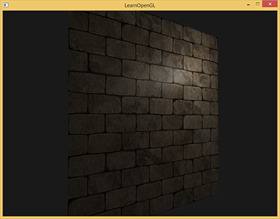
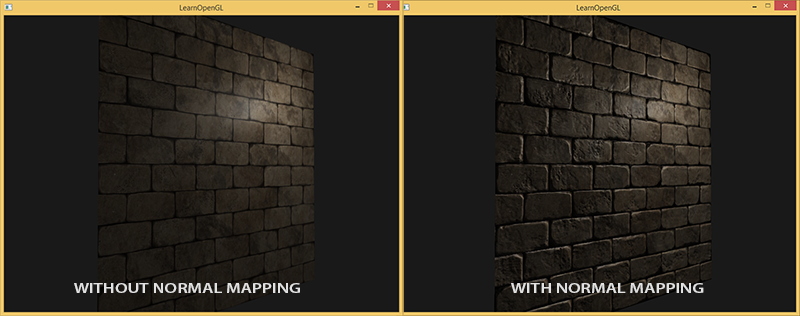
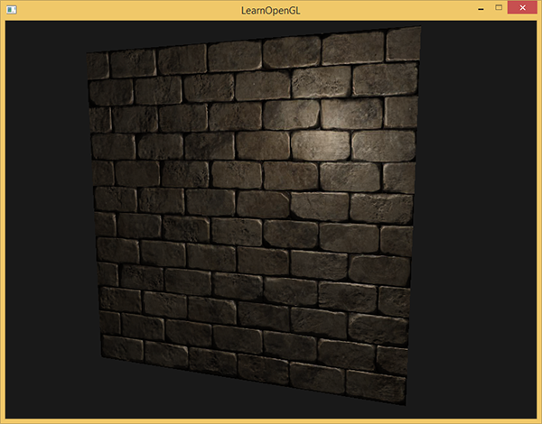
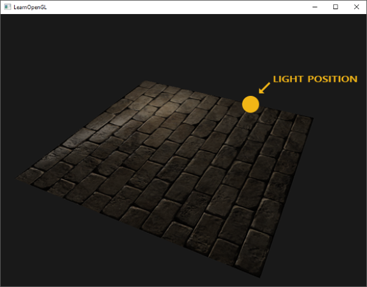
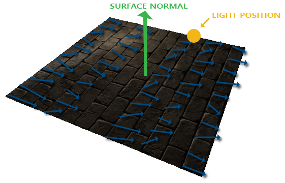
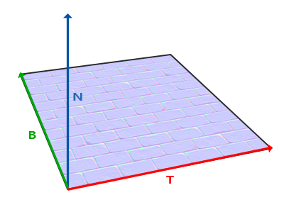

## 法线贴图

我们的场景中已经充满了多边形物体，其中每个都可能由成百上千平坦的三角形组成。我们以向三角形上附加纹理的方式来增加额外细节，提升真实感，隐藏多边形几何体是由无数三角形组成的事实。纹理确有助益，然而当你近看它们时，这个事实便隐藏不住了。现实中的物体表面并非是平坦的，而是表现出无数（凹凸不平的）细节。

例如，砖块的表面。砖块的表面非常粗糙，显然不是完全平坦的：它包含着接缝处水泥凹痕，以及非常多的细小的空洞。如果我们在一个有光的场景中看这样一个砖块的表面，问题就出来了。下图中我们可以看到砖块纹理应用到了平坦的表面，并被一个点光源照亮。



光照并没有呈现出任何裂痕和孔洞，完全忽略了砖块之间凹进去的线条；表面看起来完全就是平的。我们可以使用specular贴图根据深度或其他细节阻止部分表面被照的更亮，以此部分地解决问题，但这并不是一个好方案。我们需要的是某种可以告知光照系统给所有有关物体表面类似深度这样的细节的方式。

如果我们以光的视角来看这个问题：是什么使表面被视为完全平坦的表面来照亮？答案会是表面的法线向量。以光照算法的视角考虑的话，只有一件事决定物体的形状，这就是垂直于它的法线向量。砖块表面只有一个法线向量，表面完全根据这个法线向量被以一致的方式照亮。如果每个fragment都是用自己的不同的法线会怎样？这样我们就可以根据表面细微的细节对法线向量进行改变；这样就会获得一种表面看起来要复杂得多的幻觉：


每个fragment使用了自己的法线，我们就可以让光照相信一个表面由很多微小的（垂直于法线向量的）平面所组成，物体表面的细节将会得到极大提升。这种每个fragment使用各自的法线，替代一个面上所有fragment使用同一个法线的技术叫做法线贴图（normal mapping）或凹凸贴图（bump mapping）。应用到砖墙上，效果像这样：



你可以看到细节获得了极大提升，开销却不大。因为我们只需要改变每个fragment的法线向量，并不需要改变所有光照公式。现在我们是为每个fragment传递一个法线，不再使用插值表面法线。这样光照使表面拥有了自己的细节。

### 法线贴图

为使法线贴图工作，我们需要为每个fragment提供一个法线。像diffuse贴图和specular贴图一样，我们可以使用一个2D纹理来储存法线数据。2D纹理不仅可以储存颜色和光照数据，还可以储存法线向量。这样我们可以从2D纹理中采样得到特定纹理的法线向量。

由于法线向量是个几何工具，而纹理通常只用于储存颜色信息，用纹理储存法线向量不是非常直接。如果你想一想，就会知道纹理中的颜色向量用r、g、b元素代表一个3D向量。类似的我们也可以将法线向量的x、y、z元素储存到纹理中，代替颜色的r、g、b元素。法线向量的范围在-1到1之间，所以我们先要将其映射到0到1的范围：

```glsl
vec3 rgb_normal = normal * 0.5 + 0.5; // 从 [-1,1] 转换至 [0,1]
```

将法线向量变换为像这样的RGB颜色元素，我们就能把根据表面的形状的fragment的法线保存在2D纹理中。教程开头展示的那个砖块的例子的法线贴图如下所示：


这会是一种偏蓝色调的纹理（你在网上找到的几乎所有法线贴图都是这样的）。这是因为所有法线的指向都偏向z轴（0, 0, 1）这是一种偏蓝的颜色。法线向量从z轴方向也向其他方向轻微偏移，颜色也就发生了轻微变化，这样看起来便有了一种深度。例如，你可以看到在每个砖块的顶部，颜色倾向于偏绿，这是因为砖块的顶部的法线偏向于指向正y轴方向（0, 1, 0），这样它就是绿色的了。

在一个简单的朝向正z轴的平面上，我们可以用这个diffuse纹理和这个法线贴图来渲染前面部分的图片。要注意的是这个链接里的法线贴图和上面展示的那个不一样。原因是OpenGL读取的纹理的y（或V）坐标和纹理通常被创建的方式相反。链接里的法线贴图的y（或绿色）元素是相反的（你可以看到绿色现在在下边）；如果你没考虑这个，光照就不正确了（译注：如果你现在不再使用SOIL了，那就不要用链接里的那个法线贴图，这个问题是SOIL载入纹理上下颠倒所致，它也会把法线在y方向上颠倒）。加载纹理，把它们绑定到合适的纹理单元，然后使用下面的改变了的像素着色器来渲染一个平面：


```glsl
uniform sampler2D normalMap;  

void main()
{           
    // 从法线贴图范围[0,1]获取法线
    normal = texture(normalMap, fs_in.TexCoords).rgb;
    // 将法线向量转换为范围[-1,1]
    normal = normalize(normal * 2.0 - 1.0);   

    [...]
    // 像往常那样处理光照
}
```

这里我们将被采样的法线颜色从0到1重新映射回-1到1，便能将RGB颜色重新处理成法线，然后使用采样出的法线向量应用于光照的计算。在例子中我们使用的是Blinn-Phong着色器。

通过慢慢随着时间慢慢移动光源，你就能明白法线贴图是什么意思了。运行这个例子你就能得到本教程开始的那个效果：




然而有个问题限制了刚才讲的那种法线贴图的使用。我们使用的那个法线贴图里面的所有法线向量都是指向正z方向的。上面的例子能用，是因为那个平面的表面法线也是指向正z方向的。可是，如果我们在表面法线指向正y方向的平面上使用同一个法线贴图会发生什么？




光照看起来完全不对！发生这种情况是平面的表面法线现在指向了y，而采样得到的法线仍然指向的是z。结果就是光照仍然认为表面法线和之前朝向正z方向时一样；这样光照就不对了。下面的图片展示了这个表面上采样的法线的近似情况：



你可以看到所有法线都指向z方向，它们本该朝着表面法线指向y方向的。一个可行方案是为每个表面制作一个单独的法线贴图。如果是一个立方体的话我们就需要6个法线贴图，但是如果模型上有无数的朝向不同方向的表面，这就不可行了（译注：实际上对于复杂模型可以把朝向各个方向的法线储存在同一张贴图上，你可能看到过不只是蓝色的法线贴图，不过用那样的法线贴图有个问题是你必须记住模型的起始朝向，如果模型运动了还要记录模型的变换，这是非常不方便的；此外就像作者所说的，如果把一个diffuse纹理应用在同一个物体的不同表面上，就像立方体那样的，就需要做6个法线贴图，这也不可取）。

另一个稍微有点难的解决方案是，在一个不同的坐标空间中进行光照，这个坐标空间里，法线贴图向量总是指向这个坐标空间的正z方向；所有的光照向量都相对与这个正z方向进行变换。这样我们就能始终使用同样的法线贴图，不管朝向问题。这个坐标空间叫做切线空间（tangent space）。

### 切线空间

法线贴图中的法线向量在切线空间中，法线永远指着正z方向。切线空间是位于三角形表面之上的空间：法线相对于单个三角形的本地参考框架。它就像法线贴图向量的本地空间；它们都被定义为指向正z方向，无论最终变换到什么方向。使用一个特定的矩阵我们就能将本地/切线空寂中的法线向量转成世界或视图坐标，使它们转向到最终的贴图表面的方向。

我们可以说，上个部分那个朝向正y的法线贴图错误的贴到了表面上。法线贴图被定义在切线空间中，所以一种解决问题的方式是计算出一种矩阵，把法线从切线空间变换到一个不同的空间，这样它们就能和表面法线方向对齐了：法线向量都会指向正y方向。切线空间的一大好处是我们可以为任何类型的表面计算出一个这样的矩阵，由此我们可以把切线空间的z方向和表面的法线方向对齐。

这种矩阵叫做TBN矩阵这三个字母分别代表tangent、bitangent和normal向量。这是建构这个矩阵所需的向量。要建构这样一个把切线空间转变为不同空间的变异矩阵，我们需要三个相互垂直的向量，它们沿一个表面的法线贴图对齐于：上、右、前；这和我们在摄像机教程中做的类似。

已知上向量是表面的法线向量。右和前向量是切线(Tagent)和副切线(Bitangent)向量。下面的图片展示了一个表面的三个向量：



计算出切线和副切线并不像法线向量那么容易。从图中可以看到法线贴图的切线和副切线与纹理坐标的两个方向对齐。我们就是用到这个特性计算每个表面的切线和副切线的。需要用到一些数学才能得到它们；请看下图：


上图中我们可以看到边E2纹理坐标的不同，E2是一个三角形的边，这个三角形的另外两条边是ΔU2和ΔV2，它们与切线向量T和副切线向量B方向相同。这样我们可以把边E1和E2用切线向量T和副切线向量B的线性组合表示出来（译注：注意T和B都是单位长度，在TB平面中所有点的T、B坐标都在0到1之间，因此可以进行这样的组合）：

$$ E_1 = ΔU_1 T + ΔV_1 B $$

$$ E_2 = ΔU_2 T + ΔV_2 B $$

我们也可以写成这样：

$$ (E_{1x},E_{1y},E_{1z}) = ΔU_1(T_x, T_y, T_z)  + ΔV_1(B_x, B_y, B_z) $$

$$ (E_{2x},E_{2y},E_{2z}) = ΔU_2(T_x, T_y, T_z)  + ΔV_2(B_x, B_y, B_z) $$

E是两个向量位置的差，ΔU和ΔV是纹理坐标的差。然后我们得到两个未知数（切线T和副切线B）和两个等式。你可能想起你的代数课了，这是让我们去接T和B。

上面的方程允许我们把它们写成另一种格式：矩阵乘法

$$\begin{bmatrix} E_{1x} & E_{1y} & E_{1z} \\ E_{2x} & E_{2y} & E_{2z} \end{bmatrix} = \begin{bmatrix} ΔU_1 & ΔV_1 \\ ΔU_2 & ΔV_2 \end{bmatrix} \begin{bmatrix} T_x & T_y & T_z \\ B_x & B_y & B_z \end{bmatrix}$$

尝试会意一下矩阵乘法，它们确实是同一种等式。把等式写成矩阵形式的好处是，解T和B会因此变得很容易。两边都乘以ΔUΔV的逆矩阵等于：

$$\begin{bmatrix} ΔU_1 & ΔV_1 \\ ΔU_2 & ΔV_2 \end{bmatrix}^{-1} \begin{bmatrix} E_{1x} & E_{1y} & E_{1z} \\ E_{2x} & E_{2y} & E_{2z} \end{bmatrix} =  \begin{bmatrix} T_x & T_y & T_z \\ B_x & B_y & B_z \end{bmatrix}$$

这样我们就可以解出T和B了。这需要我们计算出delta纹理坐标矩阵的拟阵。我不打算讲解计算逆矩阵的细节，但大致是把它变化为，1除以矩阵的行列式，再乘以它的共轭矩阵。

$$\begin{bmatrix} T_x & T_y & T_z \\ B_x & B_y & B_z \end{bmatrix} = 1 $$