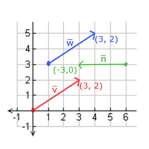

尽管我们现在已经知道了如何创建一个物体、着色、加入纹理，给它们一些细节的表现，但因为它们都还是静态的物体，仍是不够有趣。我们可以尝试着在每一帧改变物体的顶点并且重配置缓冲区从而使它们移动，但这太繁琐了，而且会消耗很多的处理时间。我们现在有一个更好的解决方案，使用（多个）矩阵(Matrix)对象可以更好的变换(Transform)一个物体。当然，这并不是说我们会去讨论武术和数字虚拟世界（译注：Matrix同样也是电影「黑客帝国」的英文名，电影中人类生活在数字虚拟世界，主角会武术）。

矩阵是一种非常有用的数学工具，尽管听起来可能有些吓人，不过一旦你理解了它们后，它们会变得非常有用。在讨论矩阵的过程中，我们需要使用到一些数学知识。对于一些愿意多了解这些知识的读者，我会附加一些资源给你们阅读。

为了深入了解变换，我们首先要在讨论矩阵之前进一步了解一下向量。这一节的目标是让你拥有将来需要的最基础的数学背景知识。如果你发现这节十分困难，尽量尝试去理解它们，当你以后需要它们的时候回过头来复习这些概念。

### 向量

向量最基本的定义就是一个方向。或者更正式的说，向量有一个方向(Direction)和大小(Magnitude，也叫做强度或长度)。你可以把向量想像成一个藏宝图上的指示：“向左走10步，向北走3步，然后向右走5步”；“左”就是方向，“10步”就是向量的长度。那么这个藏宝图的指示一共有3个向量。向量可以在任意维度(Dimension)上，但是我们通常只使用2至4维。如果一个向量有2个维度，它表示一个平面的方向(想象一下2D的图像)，当它有3个维度的时候它可以表达一个3D世界的方向。

下面你会看到3个向量，每个向量在2D图像中都用一个箭头(x, y)表示。我们在2D图片中展示这些向量，因为这样子会更直观一点。你可以把这些2D向量当做z坐标为0的3D向量。由于向量表示的是方向，起始于何处并不会改变它的值。下图我们可以看到向量$\overline{v}$和$\overline{w}$是相等的，尽管他们的起始点不同：

数学家喜欢在字母上面加一横表示向量，比如说$\overline{v}$。当用在公式中时它们通常是这样的：

$$\bar{v} = \begin{pmatrix} x \\ y \\ z \end{pmatrix}$$

由于向量是一个方向，所以有些时候会很难形象地将它们用位置(Position)表示出来。为了让其更为直观，我们通常设定这个方向的原点为(0, 0, 0)，然后指向一个方向，对应一个点，使其变为位置向量(Position Vector)（你也可以把起点设置为其他的点，然后说：这个向量从这个点起始指向另一个点）。比如说位置向量(3, 5)在图像中的起点会是(0, 0)，并会指向(3, 5)。我们可以使用向量在2D或3D空间中表示方向与位置.

和普通数字一样，我们也可以用向量进行多种运算（其中一些你可能已经看到过了）。

### 向量与标量运算

标量(Scalar)只是一个数字（或者说是仅有一个分量的向量）。当把一个向量加/减/乘/除一个标量，我们可以简单的把向量的每个分量分别进行该运算。对于加法来说会像这样:

$$\begin{pmatrix} 1 \\ 2 \\ 3 \end{pmatrix} + \mathbf{x} = \begin{pmatrix} 1+x \\ 2+x \\ 3+x \end{pmatrix}$$

其中的+可以是+，-，·或÷，其中·是乘号。注意－和÷运算时不能颠倒（标量-/÷向量），因为颠倒的运算是没有定义的。

译注：
注意，数学上是没有向量与标量相加这个运算的，但是很多线性代数的库都对它有支持（比如说我们用的GLM）。如果你使用过numpy的话，可以把它理解为[Broadcasting](https://numpy.org/doc/1.18/user/basics.broadcasting.html)。

#### 向量取反

对一个向量取反(Negate)会将其方向逆转。一个指向东北的向量取反后就指向西南方向了。我们在一个向量的每个分量前加负号就可以实现取反了（或者说用-1数乘该向量）:

$$-\bar{v} = -\begin{pmatrix} v_x \\ v_y \\ v_z \end{pmatrix} = \begin{pmatrix} -v_x \\ -v_y \\ -v_z \end{pmatrix}$$

#### 向量加减

向量的加法可以被定义为是分量的(Component-wise)相加，即将一个向量中的每一个分量加上另一个向量的对应分量：

$$\bar{v} = \begin{pmatrix} 1 \\ 2 \\ 3 \end{pmatrix}, \bar{k} = \begin{pmatrix} 4 \\ 5 \\ 6 \end{pmatrix} \rightarrow \bar{v} + \bar{k} = \begin{pmatrix} 1+4 \\ 2+5 \\ 3+6 \end{pmatrix} = \begin{pmatrix} 5 \\ 7 \\ 9 \end{pmatrix}$$

向量v = (4, 2)和k = (1, 2)可以直观地表示为：

就像普通数字的加减一样，向量的减法等于加上第二个向量的相反向量：

$$\bar{v} = \begin{pmatrix} 1 \\ 2 \\ 3 \end{pmatrix}, \bar{k} = \begin{pmatrix} 4 \\ 5 \\ 6 \end{pmatrix} \rightarrow \bar{v} + -\bar{k} = \begin{pmatrix} 1+(-4) \\ 2+(-5) \\ 3+(-6) \end{pmatrix} = \begin{pmatrix} -3 \\ -3 \\ -3 \end{pmatrix}$$

两个向量的相减会得到这两个向量指向位置的差。这在我们想要获取两点的差会非常有用。

#### 长度

我们使用勾股定理(Pythagoras Theorem)来获取向量的长度(Length)/大小(Magnitude)。如果你把向量的x与y分量画出来，该向量会和x与y分量为边形成一个三角形:

因为两条边（x和y）是已知的，如果希望知道斜边v¯的长度，我们可以直接通过勾股定理来计算：

$$\|\bar{v}\| = \sqrt{x^2 + y^2}$$

$\|\bar{v}\|$表示向量$|\bar{v}|$的长度，我们也可以加上$z^2$

把这个公式拓展到三维空间。

例子中向量(4, 2)的长度等于：

$$\|\bar{v}\| = \sqrt{4^2 + 2^2} = \sqrt{16 + 4} = \sqrt{20} \approx 4.47$$

结果是4.47。

有一个特殊类型的向量叫做单位向量(Unit Vector)。单位向量有一个特别的性质——它的长度是1。我们可以用任意向量的每个分量除以向量的长度得到它的单位向量n^：

$$\hat{n} = \frac{\bar{v}}{\|\bar{v}\|}$$

我们把这种方法叫做一个向量的标准化(Normalizing)。单位向量头上有一个^样子的记号。通常单位向量会变得很有用，特别是在我们只关心方向不关心长度的时候（如果改变向量的长度，它的方向并不会改变）。

#### 向量相乘

两个向量相乘是一种很奇怪的情况。普通的乘法在向量上是没有定义的，因为它在视觉上是没有意义的。但是在相乘的时候我们有两种特定情况可以选择：一个是点乘(Dot Product)，记作$\bar{v} \cdot \bar{k}$，另一个是叉乘(Cross Product)，记作$\bar{v} \times \bar{k}$。

##### 点乘

两个向量的点乘等于它们的数乘结果乘以两个向量之间夹角的余弦值。可能听起来有点费解，我们来看一下公式：

$$\bar{v} \cdot \bar{k} = \|\bar{v}\| \cdot \|\bar{k}\| \cdot \cos{\theta}$$

它们之间的夹角记作θ。为什么这很有用？想象如果v¯和k¯都是单位向量，它们的长度会等于1。这样公式会有效简化成：

$$\bar{v} \cdot \bar{k} = 1 \cdot 1 \cdot \cos{\theta} = \cos{\theta}$$

现在点积只定义了两个向量的夹角。你也许记得90度的余弦值是0，0度的余弦值是1。使用点乘可以很容易测试两个向量是否正交(Orthogonal)或平行（正交意味着两个向量互为直角）。如果你想要了解更多关于正弦或余弦函数的知识，我推荐你看[可汗学院](https://www.khanacademy.org/math/trigonometry/basic-trigonometry/basic_trig_ratios/v/basic-trigonometry)的基础三角学视频。

>你也可以通过点乘的结果计算两个非单位向量的夹角，点乘的结果除以两个向量的长度之积，得到的结果就是夹角的余弦值，即cosθ。
译注：通过上面点乘定义式可推出：
$$\cos{\theta} = \frac{\bar{v} \cdot \bar{k}}{\|\bar{v}\| \cdot \|\bar{k}\|}$$

所以，我们该如何计算点乘呢？点乘是通过将对应分量逐个相乘，然后再把所得积相加来计算的。两个单位向量的（你可以验证它们的长度都为1）点乘会像是这样:

$$\begin{pmatrix} 0.6 \\ -0.8 \\ 0 \end{pmatrix} \cdot \begin{pmatrix} 0 \\ 1 \\ 0 \end{pmatrix} = (0.6 * 0) + (-0.8 * 1) + (0 * 0) = -0.8$$

要计算两个单位向量间的夹角，我们可以使用反余弦函数$\cos^{-1}$ ，可得结果是143.1度。现在我们很快就计算出了这两个向量的夹角。点乘会在计算光照的时候非常有用。

##### 叉乘

叉乘只在3D空间中有定义，它需要两个不平行向量作为输入，生成一个正交于两个输入向量的第三个向量。如果输入的两个向量也是正交的，那么叉乘之后将会产生3个互相正交的向量。接下来的教程中这会非常有用。下面的图片展示了3D空间中叉乘的样子：

不同于其他运算，如果你没有钻研过线性代数，可能会觉得叉乘很反直觉，所以只记住公式就没问题啦（记不住也没问题）。下面你会看到两个正交向量A和B叉积：

$$\begin{pmatrix} A_x \\ A_y \\ A_z \end{pmatrix} \times \begin{pmatrix} B_x \\ B_y \\ B_z \end{pmatrix} = \begin{pmatrix} A_y \cdot B_z - A_z \cdot B_y \\ A_z \cdot B_x - A_x \cdot B_z \\ A_x \cdot B_y - A_y \cdot B_x \end{pmatrix}$$

是不是看起来毫无头绪？不过只要你按照步骤来了，你就能得到一个正交于两个输入向量的第三个向量。

#### 矩阵

现在我们已经讨论了向量的全部内容，是时候看看矩阵了！简单来说矩阵就是一个矩形的数字、符号或表达式数组。矩阵中每一项叫做矩阵的元素(Element)。下面是一个2×3矩阵的例子：

$$\begin{bmatrix} 1 & 2 & 3 \\ 4 & 5 & 6 \ \end{bmatrix}$$

矩阵可以通过(i, j)进行索引，i是行，j是列，这就是上面的矩阵叫做2×3矩阵的原因（3列2行，也叫做矩阵的维度(Dimension)）。这与你在索引2D图像时的(x, y)相反，获取4的索引是(2, 1)（第二行，第一列）（译注：如果是图像索引应该是(1, 2)，先算列，再算行）。

矩阵基本也就是这些了，它就是一个矩形的数学表达式阵列。和向量一样，矩阵也有非常漂亮的数学属性。矩阵有几个运算，分别是：矩阵加法、减法和乘法。

#### 矩阵的加减

矩阵与标量之间的加减定义如下：

$$\begin{bmatrix} 1 & 2  \\ 3 & 4 \ \end{bmatrix} + 3 = \begin{bmatrix} 1 + 3 &  2 + 3 \\ 3 + 3 & 4 + 3\ \end{bmatrix} = \begin{bmatrix} 4 & 5  \\ 6 & 7 \ \end{bmatrix}$$

标量值要加到矩阵的每一个元素上。矩阵与标量的减法也相似：

$$\begin{bmatrix} 1 & 2  \\ 3 & 4 \ \end{bmatrix} - 3 = \begin{bmatrix} 1 - 3 &  2 - 3 \\ 3 - 3 & 4 - 3\ \end{bmatrix} = \begin{bmatrix} -2 & -1  \\ 0 & 1 \ \end{bmatrix}$$

>注意：数学上是没有矩阵与标量相加减的运算的，但是很多线性代数的库都对它有支持（比如说我们用的GLM）。如果你使用过numpy的话，可以把它理解为[Broadcasting](https://numpy.org/doc/1.18/user/basics.broadcasting.html)。

矩阵与矩阵之间的加减就是两个矩阵对应元素的加减运算，所以总体的规则和与标量运算是差不多的，只不过在相同索引下的元素才能进行运算。这也就是说加法和减法只对同维度的矩阵才是有定义的。一个3×2矩阵和一个2×3矩阵（或一个3×3矩阵与4×4矩阵）是不能进行加减的。我们看看两个2×2矩阵是怎样相加的：

$$\begin{bmatrix} 1 & 2  \\ 3 & 4 \ \end{bmatrix} + \begin{bmatrix} 5 & 6  \\ 7 & 8 \ \end{bmatrix} = \begin{bmatrix} 1 + 5 &  2 + 6 \\ 3 + 7 & 4 + 8\ \end{bmatrix} = \begin{bmatrix} 6 & 8  \\ 10 & 12 \ \end{bmatrix}$$

同样的法则也适用于减法：

$$\begin{bmatrix} 4 & 2  \\ 1 & 6 \ \end{bmatrix} - \begin{bmatrix} 2 & 4  \\ 0 & 1 \ \end{bmatrix} = \begin{bmatrix} 4 - 2 &  2 - 4 \\ 1 - 0 & 6 - 1\ \end{bmatrix} = \begin{bmatrix} 2 & -2  \\ 1 & 5 \ \end{bmatrix}$$

#### 矩阵的数乘

和矩阵与标量的加减一样，矩阵与标量之间的乘法也是矩阵的每一个元素分别乘以该标量。下面的例子展示了乘法的过程：

$$ 2 \cdot \begin{bmatrix} 1 & 2  \\ 3 & 4 \ \end{bmatrix} =  \begin{bmatrix} 2 \cdot 1 & 2 \cdot 2  \\ 2 \cdot 3 & 2 \cdot 4 \end{bmatrix} = \begin{bmatrix} 2 & 4  \\ 6 & 8 \ \end{bmatrix}$$

现在我们也就能明白为什么这些单独的数字要叫做标量(Scalar)了。简单来说，标量就是用它的值缩放(Scale)矩阵的所有元素（译注：注意Scalar是由Scale + -ar演变过来的）。前面那个例子中，所有的元素都被放大了2倍。

到目前为止都还好，我们的例子都不复杂。不过矩阵与矩阵的乘法就不一样了。

#### 矩阵相乘

矩阵之间的乘法不见得有多复杂，但的确很难让人适应。矩阵乘法基本上意味着遵照规定好的法则进行相乘。当然，相乘还有一些限制：

1. 只有当左侧矩阵的列数与右侧矩阵的行数相等，两个矩阵才能相乘。
2. 矩阵相乘不遵守交换律(Commutative)，也就是说A⋅B≠B⋅A。

我们先看一个两个2×2矩阵相乘的例子：

$$\begin{bmatrix} 1 & 2  \\ 3 & 4 \ \end{bmatrix} \cdot \begin{bmatrix} 5 & 6  \\ 7 & 8 \ \end{bmatrix} = \begin{bmatrix} 1 \cdot 5 + 2 \cdot 7 &  1 \cdot 6 + 2 \cdot 8 \\ 3 \cdot 5 + 4 \cdot 7 & 3 \cdot 6 + 4 \cdot 8\ \end{bmatrix} = \begin{bmatrix} 19 & 22  \\ 43 & 50 \ \end{bmatrix}$$

现在你可能会在想了：天哪，刚刚到底发生了什么? 矩阵的乘法是一系列乘法和加法组合的结果，它使用到了左侧矩阵的行和右侧矩阵的列。我们可以看下面的图片：

我们首先把左侧矩阵的行和右侧矩阵的列拿出来。这些挑出来行和列将决定我们该计算结果2x2矩阵的哪个输出值。如果取的是左矩阵的第一行，输出值就会出现在结果矩阵的第一行。接下来再取一列，如果我们取的是右矩阵的第一列，最终值则会出现在结果矩阵的第一列。这正是红框里的情况。如果想计算结果矩阵右下角的值，我们要用第一个矩阵的第二行和第二个矩阵的第二列（译注：简单来说就是结果矩阵的元素的行取决于第一个矩阵，列取决于第二个矩阵）。

计算一项的结果值的方式是先计算左侧矩阵对应行和右侧矩阵对应列的第一个元素之积，然后是第二个，第三个，第四个等等，然后把所有的乘积相加，这就是结果了。现在我们就能解释为什么左侧矩阵的列数必须和右侧矩阵的行数相等了，如果不相等这一步的运算就无法完成了！

结果矩阵的维度是(n, m)，n等于左侧矩阵的行数，m等于右侧矩阵的列数。

如果在脑子里想象出这一乘法有些困难，别担心。不断地动手计算，如果遇到困难再回头看这页的内容。随着时间流逝，矩阵乘法对你来说会变成很自然的事。

我们用一个更大的例子来结束对矩阵相乘的讨论。试着使用颜色来寻找规律。作为一个有用的练习，你可以试着自己解答一下这个乘法问题，再将你的结果和图中的这个进行对比（如果用笔计算，你很快就能掌握它们）。

$$\begin{bmatrix} 4 & 2 & 0 \\ 0 & 8 & 1 \\ 0 & 1 & 0 \end{bmatrix} \cdot \begin{bmatrix} 4 & 2 & 1 \\ 2 & 0 & 4 \\ 9 & 4 & 2 \\ \end{bmatrix} = \begin{bmatrix} 4 \cdot 4 + 2 \cdot 2 + 0 \cdot 9 & 4 \cdot 2 + 2 \cdot 0 + 0 \cdot 4 & 4 \cdot 1 + 2 \cdot 4 + 0 \cdot 2 \\ 0 \cdot 4 + 8 \cdot 2 + 1 \cdot 9 & 0 \cdot 2 + 8 \cdot 0 + 1 \cdot 4 & 0 \cdot 1 + 8 \cdot 4 + 1 \cdot 2 \\ 0 \cdot 4 + 1 \cdot 2 + 0 \cdot 9 & 0 \cdot 2 + 1 \cdot 0 + 0 \cdot 4 & 0 \cdot 1 + 1 \cdot 4 + 0 \cdot 2 \\ \end{bmatrix} = \begin{bmatrix} 20 & 8 & 12 \\ 25 & 4 & 34 \\ 2 & 0 & 4 \end{bmatrix}$$

可以看到，矩阵相乘非常繁琐而容易出错（这也是我们通常让计算机做这件事的原因），而且当矩阵变大以后很快就会出现问题。如果你仍然希望了解更多，或对矩阵的数学性质感到好奇，我强烈推荐你看看[可汗学院](https://www.khanacademy.org/math/algebra2/algebra-matrices)的矩阵教程。

不管怎样，现在我们知道如何进行矩阵相乘了，我们可以开始学习好东西了。

#### 矩阵与向量相乘

目前为止，通过这些教程我们已经相当了解向量了。我们用向量来表示位置，表示颜色，甚至是纹理坐标。让我们更深入了解一下向量，它其实就是一个N×1矩阵，N表示向量分量的个数（也叫N维(N-dimensional)向量）。如果你仔细思考一下就会明白。向量和矩阵一样都是一个数字序列，但它只有1列。那么，这个新的定义对我们有什么帮助呢？如果我们有一个M×N矩阵，我们可以用这个矩阵乘以我们的N×1向量，因为这个矩阵的列数等于向量的行数，所以它们就能相乘。

但是为什么我们会关心矩阵能否乘以一个向量？好吧，正巧，很多有趣的2D/3D变换都可以放在一个矩阵中，用这个矩阵乘以我们的向量将变换(Transform)这个向量。如果你仍然有些困惑，我们来看一些例子，你很快就能明白了。

#### 单位矩阵

在OpenGL中，由于某些原因我们通常使用4×4的变换矩阵，而其中最重要的原因就是大部分的向量都是4分量的。我们能想到的最简单的变换矩阵就是单位矩阵(Identity Matrix)。单位矩阵是一个除了对角线以外都是0的N×N矩阵。在下式中可以看到，这种变换矩阵使一个向量完全不变：

$$\begin{bmatrix}1 & 0 & 0 & 0 \\ 0 & 1 & 0 & 0 \\ 0 & 0 & 1 & 0 \\ 0 & 0 & 0 & 1 \\ \end{bmatrix} \cdot \begin{bmatrix}1 \\ 2 \\ 3 \\ 4\\ \end{bmatrix} = \begin{bmatrix}1 \cdot 1 \\ 1 \cdot 2 \\ 1 \cdot 3 \\ 1 \cdot 4 \end{bmatrix} = \begin{bmatrix} 1 \\ 2 \\ 3 \\ 4 \end{bmatrix}$$

向量看起来完全没变。从乘法法则来看就很容易理解来：第一个结果元素是矩阵的第一行的每个元素乘以向量的每个对应元素。因为每行的元素除了第一个都是0，可得：1⋅1+0⋅2+0⋅3+0⋅4=1，向量的其他3个元素同理。

>你可能会奇怪一个没变换的变换矩阵有什么用？单位矩阵通常是生成其他变换矩阵的起点，如果我们深挖线性代数，这还是一个对证明定理、解线性方程非常有用的矩阵。

#### 缩放

对一个向量进行缩放(Scaling)就是对向量的长度进行缩放，而保持它的方向不变。由于我们进行的是2维或3维操作，我们可以分别定义一个有2或3个缩放变量的向量，每个变量缩放一个轴(x、y或z)。

我们先来尝试缩放向量$\bar{v}=(3,2)$。我们可以把向量沿着x轴缩放0.5，使它的宽度缩小为原来的二分之一；我们将沿着y轴把向量的高度缩放为原来的两倍。我们看看把向量缩放(0.5, 2)倍所获得的$\bar{s}$是什么样的：

