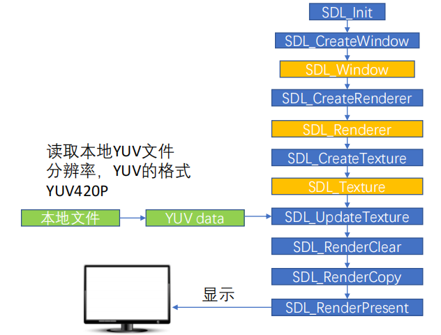

## 简介

[官网：https://www.libsdl.org/](https://www.libsdl.org/)
[文档：http://wiki.libsdl.org/Introduction](http://wiki.libsdl.org/Introduction)

SDL（Simple DirectMedia Layer）是一套开放源代码的跨平台多媒体开发库，使用C语言写成。SDL提供了数种控制图像、声音、输出入的函数，让开发者只要用相同或是相似的代码就可以开发出跨多个平台（Linux、Windows、Mac OS X等）的应用软件。目前SDL多用于开发游戏、模拟器、媒体播放器等多媒体应用领域。

### SDL子系统

SDL将功能分成下列数个子系统(subsystem):
* SDL_INIT_TIMER：定时器
* SDL_INIT_AUDIO：音频
* SDL_INIT_VIDEO：视频
* SDL_INIT_JOYSTICK：摇杆
* SDL_INIT_HAPTIC：触摸屏
* SDL_INIT_GAMECONTROLLER：游戏控制器
* SDL_INIT_EVENTS：事件
* SDL_INIT_EVERYTHING：包含上述所有选项

### SDL Window显示

#### SDL视频显示函数简介

1. 初始化SDL系统
    * ```SDL_Init();```
2. 创建窗口SDL_Window
    * ```SDL_CreateWindow();```
3. 创建渲染器SDL_Renderer
    * ```SDL_CreateRenderer();```
4. 创建纹理SDL_Texture
    * ```SDL_CreateTexture();```
5. 设置纹理的数据
    * ```SDL_UpdateTexture();```
6. 将纹理的数据拷贝给渲染器
    * ```SDL_RenderCopy();```
7. 显示
    * ```SDL_RenderPresent();```
8. 工具函数，用于延时
    * ```SDL_Delay();```
9. 退出SDL系统
    * ```SDL_Quit();```

#### SDL数据结构简介

* SDL_Window 代表了一个“窗口”
* SDL_Renderer 代表了一个“渲染器”
* SDL_Texture 代表了一个“纹理”
* SDL_Rect 一个简单的矩形结构

存储RGB和存储纹理的区别：
比如一个从左到右由红色渐变到蓝色的矩形，用存储RGB的话就需要把矩形中每个点的具体颜色值存储下来；而纹理只是一些描述信息，比如记
录了矩形的大小、起始颜色、终止颜色等信息，显卡可以通过这些信息推算出矩形块的详细信息。所以相对于存储RGB而已，存储纹理占用的内存
要少的多。

### SDL事件

* 函数
    * SDL_WaitEvent()：等待一个事件
    * SDL_PushEvent()：发送一个事件
    * SDL_PumpEvents()：将硬件设备产生的事件放入事件队列，用于读取事件，在调用该函数之前，必须调用SDL_PumpEvents搜集键盘等事件
    * SDL_PeepEvents()：从事件队列提取一个事件
* 数据结构
    * SDL_Event：代表一个事件

### SDL线程

* SDL线程创建：SDL_CreateThread
* SDL线程等待：SDL_WaitThead
* SDL互斥锁：SDL_CreateMutex/SDL_DestroyMutex
* SDL锁定互斥：SDL_LockMutex/SDL_UnlockMutex
* SDL条件变量(信号量)：SDL_CreateCond/SDL_DestoryCond
* SDL条件变量(信号量)等待/通知：SDL_CondWait/SDL_CondSingal

### SDL YUV显示：SDL视频显示的流程



### SDL播放音频PCM-打开音频设备

#### 打开音频设备

```C++
int SDLCALL SDL_OpenAudio(SDL_AudioSpec * desired, 
SDL_AudioSpec * obtained); 
// desired：期望的参数。
// obtained：实际音频设备的参数，一般情况下设置为NULL即可。
```

#### SDL_AudioSpec

```C++
typedef struct SDL_AudioSpec {
int freq; // 音频采样率
SDL_AudioFormat format; // 音频数据格式
Uint8 channels; // 声道数: 1 单声道, 2 立体声
Uint8 silence; // 设置静音的值，因为声音采样是有符号的，所以0当然就是这个值
Uint16 samples; // 音频缓冲区中的采样个数，要求必须是2的n次
Uint16 padding; // 考虑到兼容性的一个参数
Uint32 size; // 音频缓冲区的大小，以字节为单位
SDL_AudioCallback callback; // 填充音频缓冲区的回调函数
void *userdata; // 用户自定义的数据
} SDL_AudioSpec;
```