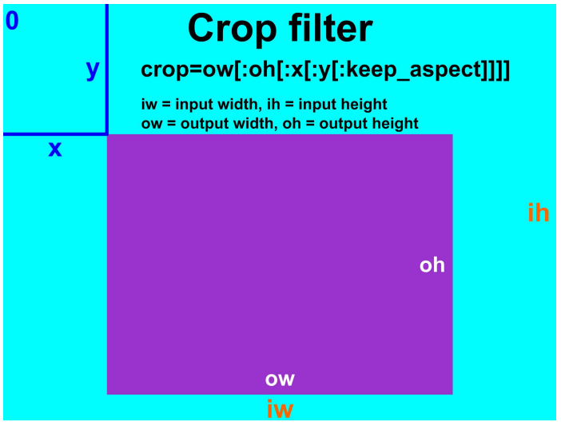
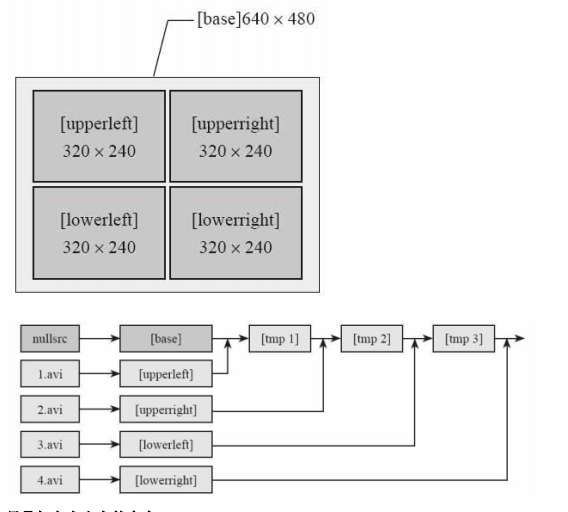

### ffmpeg/ffplay/ffprobe区别

* ffmpeg
	* Hyper fast Audio and Video encoder超快音视频编码器（类似爱剪辑）
* ffplay
	* Simple media player简单媒体播放器
* ffprobe
	* Simple multimedia streams analyzer简单多媒体流分析器

#### ffmpeg 命令查看帮助文档

基本信息：ffmpeg -h
高级信息：ffmpeg -h long
所有信息：ffmpeg -h full

```
// 可使用该命令
ffmepg -h full > ffmpeg_h_full.log
```

usage：
```
ffmpeg [options] [[infile options] -i infile]... {[outfile options] outfile}...
```


#### ffplay命令查看帮助文档

所有信息：ffplay -h

usage: 

```
ffplay [options] input_file
```

#### ffprobe -h

usage:

```
ffprobe [OPTIONS] [INPUT_FILE]
```


### ffmpeg音视频处理流程

```
ffmpeg -i test_1920x1080.mp4 -acodec copy -vcodec libx264 -s 1280x720 test_1280x720.flv

ffmpeg -i test_1920x1080.mp4 -acodec copy -vcodec libx265 -s 1280x720 test_1280x720.mkv
```


### ffmpeg命令分类查询

| 命令参数 | 内容 | 命令参数 | 内容 |
| ---- | ---- | ---- | ---- |
| -version | 显示版本 | -bsfs | 显示可用比特流filter |
| -buildconf | 显示编译配置 | -protocols | 显示可用的协议 |
| -formats | 显示可用格式(muxers+demuxers) | -filters | 显示可用的过滤器 |
| -muxers | 显示可用复用器 | -pix_fmts | 显示可用的像素格式 |
| -demuxers | 显示可用解复用器 | -layouts | 显示标准声道名称 |
| -codecs | 显示可用编解码器(devoders+encoders) | -sample_fmts | 显示可用的音频采样格式 |
| -decoders | 显示可用解码器 | -colors | 显示可用的颜色名称 |
| -encoders | 显示可用编码器 |  |  |


#### 查看具体分类所支持的参数

语法：ffmpeg -h type=name

比如：

```
ffmpeg -h muxer=flv
ffmpeg -h filter=atempo (atempo调整音频播放速率)
ffmpeg -h encoder=libx264
```

ffmpeg -codecs

```
 D..... = Decoding supported(支持的解码器)
 .E.... = Encoding supported(支持的编码器)
 ..V... = Video codec(视频编解码器)
 ..A... = Audio codec(音频编解码器)
 ..S... = Subtitle codec(字幕编解码器)
 ..D... = Data codec(表示支持处理数据的编解码器。数据编解码器通常用于处理非音视频数据，比如字节流、图像序列、元数据等。)
 ..T... = Attachment codec
 ...I.. = Intra frame-only codec(帧内编解码器)
 ....L. = Lossy compression(有损压缩)
 .....S = Lossless compression(无损压缩)
```

#### ffmpeg 命令参数

##### 主要参数: 

* -i 设定输入流
* -f 设定输出格式(format)
* -ss 开始时间
* -t 时间长度

##### 音频参数:

* -aframes 设置要输出的音频帧数
* -b:a 音频码率
* -ar 设定采样率
* -ac 设定声音的Channel数
* -acodec 设定声音编解码器，如果用copy表示原始编解码数据必须被拷贝。
* -an 不处理音频
* -af 音频过滤器

##### 视频参数:

* -vframes 设置要输出的视频帧数
* -b 设定视频码率
* -b:v 视频码率
* -r 设定帧速率
* -s 设定画面的宽与高
* -vn 不处理视频
* -aspect aspect 设置横纵比4:3 16:9 或1.3333 1.7777
* -vcodec 设定视频编解码器，如果用copy表示原始编解码数据必须被拷贝。
* -vf 视频过滤器

```
// 查找可用的编解码器
// windows
ffmpeg.exe -codecs | findstr mp3
// linux
ffmpeg.exe -codecs | grep mp3

ffmpeg.exe -i .\tuzi.mp4 -b:a 192k -ar 48000 -ac 2 -acodec libmp3lame -aframes 200 out2.mp3

ffmpeg.exe -i .\tuzi.mp4 -vframes 300 -b:v 300k -r 30 -s 640*480 -aspect 16:9 -vcodec libx265 out3.h265

// 保留封装格式
// 提取音频不要视频
ffmpeg.exe -i .\tuzi.mp4 -acodec copy -vn audio.mp4
// 提取视频不要音频
ffmpeg.exe -i .\tuzi.mp4 -vcodec copy -an video.mp4

// 提取视频
ffmpeg.exe -i .\tuzi.mp4 -vcodec copy -an test_copy.h264
ffmpeg.exe -i .\tuzi.mp4 -vcodec libx264 -an test.h264

// 提取音频
ffmpeg.exe -i .\tuzi.mp4 -acodec copy -vn test.aac
ffmpeg.exe -i .\tuzi.mp4 -acodec libmp3lame -vn test.mp3

//提取YUV
ffmpeg.exe -i .\tuzi.mp4 -t 3 -pix_fmt yuv420p -s 320x240 yuv420p_orig.yuv
ffplay.exe -f rawvideo -pixel_format yuv420p -video_size 320x240 .\yuv420p_orig.yuv

//提取RGB
ffmpeg -i .\tuzi.mp4 -t 10 -pix_fmt rgb24 -s 320*240 rgb24_320x240.rgb
ffplay.exe -pixel_format rgb24 -video_size 320*240 .\rgb24_320x240.rgb

// RGB和YUV之间的转换
ffmpeg -s 320x240 -pix_fmt yuv420p -i .\yuv420p_orig.yuv -pix_fmt rgb24 .\rgb24_320x240_2.rgb
 ffplay.exe -pixel_format rgb24 -video_size 320*240 .\rgb24_320x240_2.rgb

// 提取PCM
ffmpeg.exe -i .\out2.mp3 -ar 48000 -ac 2 -f s16le 48000_2_s16le.pcm
ffplay.exe -ar 48000 -ac 2 -f s16le .\48000_2_s16le.pcm

// -sample_fmt 选项可以用来指定以下常见音频样本格式之一
// 1. u8：无符号 8 位整数
// 2. s16：有符号 16 位整数
// 3. s32：有符号 32 位整数
// 4. f32：32 位浮点数
// 5. f64：64 位浮点数
ffmpeg.exe -i .\69906708177.mp3 -ar 48000 -ac -2 -sample_fmt s16 tout_s16.wav
ffplay.exe .\tout_s16.wav

ffmpeg.exe -i .\69906708177.mp3 -ar 48000 -ac 2 -codec:a pcm_s16le tout2_s16le.wav
ffplay.exe .\tout_s16.wav

ffmpeg.exe -i .\69906708177.mp3 -ar 48000 -ac 2 -f f32le 48000_2_f32le.pcm
ffplay.exe -ar 48000 -ac 2 -f f32le .\48000_2_f32le.pcm

ffmpeg.exe -i .\tuzi.mp4 -t 10 -vn -ar 48000 -ac 2 -f f32le 48000_2_f32le_2.pcm
ffplay.exe -ar 48000 -ac 2 -f f32le .\48000_2_f32le_2.pcm

```

##### 音视频转封装

```
// 保持编码格式
ffmpeg -i .\tuzi.mp4 -vcodec copy -acodec copy test_copy.ts
ffmpeg -i .\tuzi.mp4 -codec copy test_copy2.ts
ffplay.exe .\test_copy.ts

// 改变编码格式
ffmpeg -i .\tuzi.mp4 -vcodec libx265 -acodec libmp3lame out_h265_mp3.mkv
ffplay.exe .\out_h265_mp3.mkv

// 修改帧率
ffmpeg.exe -i .\tuzi.mp4 -r 15 output2.mp4
ffplay.exe .\output2.mp4

// 修改音视频码率
ffmpeg.exe -i .\tuzi.mp4 -b 400k output_b.mkv
ffplay.exe .\output_b.mkv

// 修改视频码率
ffmpeg.exe -i .\tuzi.mp4 -b:v 400k output_bv.mkv
ffplay.exe .\output_bv.mkv

// 修改音频码率
ffmpeg.exe -i .\tuzi.mp4 -b:a 192k .\output_ba.mp4
//如果不想重新编码video需要加上-vcodec copy
ffmpeg.exe -i .\tuzi.mp4 -b:a 192k -vcodec copy .\output_ba.mp4
ffplay.exe .\output_ba.mp4

// 修改音视频码率
ffmpeg.exe -i .\tuzi.mp4 -b:v 400k -b:a 192k output_bva.mp4
ffplay.exe .\output_bva.mp4

// 修改视频分辨率
ffmpeg.exe -i .\tuzi.mp4 -s 480x270 output_480x270.mp4
ffplay.exe .\output_480x270.mp4

// 修改音频采样率
ffmpeg.exe -i .\tuzi.mp4 -ar 44100 output_44100hz.mp4
ffplay.exe .\output_44100hz.mp4

```

#### ffmpeg命令过滤器

##### 生成测试文件

```

// 找三个不同的视频每个视频截取10秒内容
ffmpeg -i test1.mp4 -ss 00:05:00 -t 10 -codec copy 1.mp4
ffmpeg -i test2.mp4 -ss 00:05:00 -t 10 -codec copy 2.mp4
ffmpeg -i test3.mp4 -ss 00:05:00 -t 10 -codec copy 3.mp4

// 如果音视频格式不统一则强制统一：-vcodec libx264 -acodec aac
ffmpeg -i test1.mp4 -ss 00:05:00 -t 10 -vcodec libx264 -acodec aac 1.mp4
ffmpeg -i test2.mp4 -ss 00:05:00 -t 10 -vcodec libx264 -acodec aac 2.mp4
ffmpeg -i test3.mp4 -ss 00:05:00 -t 10 -vcodec libx264 -acodec aac 3.mp4

// 将上述文件转成ts格式
ffmpeg -i .\1.mp4 -codec copy -vbsf h264_mp4toannexb 1.ts
ffmpeg -i .\2.mp4 -codec copy -vbsf h264_mp4toannexb 2.ts
ffmpeg -i .\3.mp4 -codec copy -vbsf h264_mp4toannexb 3.ts

// 转成flv格式
ffmpeg -i .\1.mp4 -codec copy 1.flv
ffmpeg -i .\2.mp4 -codec copy 2.flv
ffmpeg -i .\3.mp4 -codec copy 3.flv


```

分离某些封装格式（例如MP4/FLV/MKV等）中的H.264的时候，需要首先写入SPS和PPS，否则会导致分离出来的数据没有SPS、PPS而无法播放。H.264码流的SPS和PPS信息存储在AVCodecContext结构体的extradata中。需要使用ffmpeg中名称为“h264_mp4toannexb”的bitstream filter处理。

##### 拼接文件

```shell

# 以MP4格式进行拼接
ffmpeg -f concat -i .\mp4list.txt -codec copy out_mp4list.mp4
# 文件
<<mp4list.txt
file'1.mp4'
file'2.mp4'
file'3.mp4'
mp4list.txt

# 以ts格式进行拼接
ffmpeg -i "concat:1.ts|2.ts|3.ts" -codec copy out_ts.mp4 # 只适用部分封装格式，比如TS
ffmpeg -f concat -i tslist.txt -codec copy out_ts2.mp4
# 文件
<< tslist.txt
file'1.ts'
file'2.ts'
file'3.ts'
tslist.txt

# 以FLV格式进行拼接
ffmpeg -f concat -i flvlist.txt -codec copy out_flv2.mp4

# 文件
<< flvlist.txt
file'1.flv'
file'2.flv'
file'3.flv'
flvlist.txt

```

注意:
1. 把每个视频封装格式统一为ts，拼接输出的时候再输出你需要的封装格式，比如MP4
2. 视频分辨率可以不同，但是编码格式需要统一
3. 音频编码格式需要统一,音频参数(采样率/声道等)也需要统一

#### ffmpeg命令图片与视频互转

##### 图片与视频转换

```shell

# 截取一张图片
ffmpeg -i .\1.mp4 -y -f image2 -ss 00:00:02 -vframes 1 -s 640x360 test.jpg
ffmpeg -i .\1.mp4 -y -f image2 -ss 00:00:02 -vframes 1 -s 640x360 test.bmp

<< 说明
-i 输入
-y 覆盖
-f 格式

image2 一种格式

-ss 时间起始值

-vframes 帧 如果大于1那么输出加%03d 如 test%03d.jpg

-s 格式大小szie

说明

# 转换视频为图片(每帧一张图):
ffmpeg -i .\1.mp4 -t 5 -s 640x360 -r 15 frame%03d.jpg

# 图片转换为视频:
ffmpeg -f image2 -i frame%03d.jpg -r 25 video1.mp4

```

##### gif和视频转换

```shell

# 从视频中生成gif图片
ffmpeg -i .\1.mp4 -t 5 -r 25 image1.gif
ffmpeg -i .\1.mp4 -t 5 -r 25 -s 640x360 image2.gif

# 将gif转化为视频
ffmpeg -f gif -i .\image2.gif image2.mp4

```

#### ffpmeg 命令视频录制

##### 视频录制(windows)

先安装dshow软件：
[on screen capture recorder to video free - Browse Files at SourceForge.net](https://sourceforge.net/projects/screencapturer/files/)
需要根据dshow支持的ffmpeg版本进行音视频录制操作。

```shell

# 查看可用设备名字

ffmpeg -list_devices true -f dshow -i dummy

# 录制视频
ffmpeg -f dshow -i video="screen-capture-recorder" v-out.mp4

# 录制声音
ffmpeg -f dshow -i audio="virtual-audio-capturer" a-out.aac

# 系统+麦克风声音
ffmpeg -f dshow -i audio="麦克风 (Realtek Audio)" -f dshow -i audio="virtual-audio-capturer" -filter_complex amix=inputs=2:duration=first:dropout_transition=2 a-out2.aac

# 同时录制声音和视频(默认参数)
ffmpeg -f dshow -i audio="麦克风 (Realtek Audio)" -f dshow -i audio="virtual-audio-capturer" -filter_complex amix=inputs=2:duration=first:dropout_transition=2 -f dshow -i video="screen-capture-recorder" -y av-out.flv

# 视频录制的可选参数
ffmpeg -f dshow -list_options true -i video="screen-capture-recorder"

# 音频设备可选参数

ffmpeg -f dshow -list_options true -i audio="virtual-audio-capturer"

```


#### ffmpeg 命令直播

```

ffplay.exe rtmp://server/live/streamName

ffmpeg -i rtmp://server/live/streamName -c copy dump.flv

```


##### 可用地址

```shell

HKS: rtmp://live.hkstv.hk.lxdns.com/live/hks2

大熊兔(点播)：rtsp://184.72.239.149/vod/mp4://BigBuckBunny_175k.mov

CCTV1高清：http://ivi.bupt.edu.cn/hls/cctv1hd.m3u8

ffmpeg -i  http://playertest.longtailvideo.com/adaptive/bipbop/gear4/prog_index.m3u8 -c copy cctv1.ts

ffmpeg -i  http://playertest.longtailvideo.com/adaptive/bipbop/gear4/prog_index.m3u8 cctv1.flv

# 这个方式可能会失败
ffmpeg -i  http://playertest.longtailvideo.com/adaptive/bipbop/gear4/prog_index.m3u8 -acodec aac -vcodec libx264 cctv1-2.flv

# -strict -2选项可以让 FFmpeg 以非严格模式启用该编解码器
ffmpeg -i  http://playertest.longtailvideo.com/adaptive/bipbop/gear4/prog_index.m3u8 -acodec aac -vcodec libx264 -strict -2 cctv1-2.flv

```

#### ffmpeg 推流

``` shell
# 1. 需要使用nginx搭建rtmp服务器
# -re表示按时间戳读取文件
ffmpeg -re -i out.mp4 -c copy flv rtmp://server/live/streamName 

```


### ffmpeg 滤镜

##### 按照处理数据的类型，通常多媒体的 filter 分为：
* 音频 filter
* 视频 filter
* 字幕 filter

##### 另外一种按照处于编解码器的位置划分:
* prefilters: used before encoding
* intrafilters: used while encoding(and are thusan integral part of a video codec)
* postfilters: used after decoding

##### ffmpeg 中 filter 分为:

* source filter (只有输出)
* audio filter
* video filter
* Multimedia filter 
* sink filter (只有输入)
除了source和sink filter，其他filter都至少有一个输入，至少一个输出。

##### 视频裁剪

视频过滤器(滤镜)：裁剪



| 描述 | 将输入视频帧的宽度和高度从 x 和 y 值表示的位置裁剪到指定的宽度和高度;x 和 y 是输出的左上角坐标，协调系统的中心是输入视频帧的左上角。如果使用了可选的 keep_aspect 参数，将会改变输出 SAR(样本宽比)以补偿新的 DAR(显示长宽比) |
| ---- | ---- |
| 语法 | crop=ow[:oh[:x[:y[:keep_aspect]]]] |
| 变量 | 用于ow和oh参数的表达式中的可用变量 |
| x,y | 对x的计算值(从左上角水平方向的像素个数)和y(垂直像素的数量),对每个帧进行评估,x的默认值为(iw - ow)/2, y的默认值为(ih - oh)/2 |
| in_w,iw | 输入的宽度 |
| in_h,ih | 输入的高度 |
| out_w,ow | 输出(裁剪)宽度，默认值=iw |
| out_h,oh | 输出(裁剪)高度，默认值=ih |
| a | 纵横比,与iw/ih相同 |
| sar | 输入样本比例 |
| dar | 输入显示宽比,等于表达式(a * sar) |
| hsub, vsub | 水平和垂直的色度子样本值，对于像素格式yuv422p, hsub的值为2，vsub为1 |
| n | 输入帧的数目，从0开始 |
| pos | 位置在输入框的文件中,如果不知道NAN |
| t | 时间戳以秒表示,如果输入时间戳未知 |

ow的值可以从oh得到，反之亦然，但不能从x 和 y 中得到，因为这些值是在 ow 和 oh 之后进行的。x 的值可以从 y 的值中得到，反之亦然。例如，在输入框的左三、中三和右三，我们可以使用命令:

```

ffmpeg -i input -vf crop=iw/3:ih:0:0 output
ffmpeg -i input -vf crop=iw/3:ih:iw/3:0 output
ffmpeg -i input -vf crop=iw/3:ih:iw/3*2:0 output

```

#### ffmpeg 滤镜filter内置变量

在使用filter时，经常会用到根据时间轴进行操作的需求，在使用ffmpeg的filter时可以使用filter的时间相关的内置变量：

| 变量 | 说明 |
| ---- | ---- |
| t | 以秒表示的时间戳，如果输入的时间时未知的则是NAN |
| n | 输入帧的顺序编号，从0开始 |
| pos | 输入帧的位置，如果未知的则是NAN |
| w | 输入视频帧的宽度 |
| h | 输入视频帧的高度 |

#### 添加水印

##### 文字水印

在视频中增加文字水印需要准备的条件比较多，需要有文字字库处理的相关文件，在编译FFmpeg时需要支持FreeType，FontConfig，iconv，系统中需要有相关的字库，在ffmpeg增加纯字母水印可以使用drawtext滤镜进行支持，下面就来看一下drawtext的滤镜参数。

| 参数 | 类型 | 说明 |
| ---- | ---- | ---- |
| text | 字符串 | 文字 |
| textfile | 字符串 | 文字文件 |
| box | 布尔 | 文字区域背景框(缺省false) |
| boxcolor | 色彩 | 展示字体区域块的颜色 |
| font | 字符串 | 字体名称(默认为Sans字体) |
| fontsize | 整数 | 显示字体的大小 |
| x | 字符串 | 缺省为0 |
| y | 字符串 | 缺省为0 |
| alpha | 浮点数 | 透明度(默认为1)，值从0~1 |

```shell

# 将文字的水印加在视频的左上角
ffplay.exe -i .\1.mp4 -vf "drawtext=fontsize=100:fontfile=cambriaz.ttf:text='hello world':fontcolor=green:x=400:y=200"

# 将字体的颜色设置为绿色
ffplay.exe -i .\1.mp4 -vf "drawtext=fontsize=50:fontfile=cambriaz.ttf:text='hello world':fontcolor=green"

ffplay.exe -i .\1.mp4 -vf "drawtext=fontsize=50:fontfile=cambriaz.ttf:text='hello world':fontcolor=green:x=100:y=200"

ffplay.exe -i .\1.mp4 -vf "drawtext=fontsize=50:fontfile=cambriaz.ttf:text='hello world':fontcolor=green:x=100:y=200:alpha=0.5"

ffplay.exe -i .\1.mp4 -vf "drawtext=fontsize=50:fontfile=cambriaz.ttf:text='hello world':fontcolor=green:x=100:y=200:box=1:boxcolor=yellow"

```

至此，文字水印的基础功能已经添加完成。

有些时候文字水印希望以本地时间作为水印内容, 可以在drawtext滤镜中配合一些特殊用法来完成，在text中显示本地当前时间，格式为年月日时分秒的方式:

```shell


# ffmpeg需要使用5版本
ffplay.exe -i .\1.flv -vf "drawtext=fontsize=50:fontfile=cambriaz.ttf:text='%{localtime\:%Y\-%m\-%d %H-%M-%S}':fontcolor=green:box=1:boxcolor=yellow"

# 在使用ffmpeg转码存储到文件时需要加上-re，否则时间不对
ffmpeg.exe -re -i .\1.flv -vf "drawtext=fontsize=50:fontfile=cambriaz.ttf:text='%{localtime\:%Y\-%m\-%d %H-%M-%S}':fontcolor=green:box=1:boxcolor=yellow" text_out.mp4


```

在个别场景中，需要定时显示水印，定时不显示水印，这种方式同样可以配合 drawtext 滤镜进行处理，使用drawtext与enable配合即可，例如每3秒钟显示一次文字水印:

```shell

ffplay -i .\test_1280x720.flv -vf "drawtext=fontsize=60:fontfile=cambriaz.ttf:text='test':fontcolor=green:box=1:boxcolor=yellow:enable=lt(mod(t\,3)\,1)"

ffmpeg.exe -re -i .\test_1280x720.flv -vf "drawtext=fontsize=60:fontfile=cambriaz.ttf:text='test':fontcolor=green:box=1:boxcolor=yellow:enable=lt(mod(t\,3)\,1)" text_outblink.mp4

```

跑马灯效果

```

ffplay.exe -i .\test_1280x720.flv -vf "drawtext=fontsize=100:fontfile=cambriaz.ttf:text='helloworld':x=mod(100*t\,w):y=abs(sin(t))*h*0.7"

```

修改字体透明度，修改字体颜色

```

ffplay.exe -i .\test_1280x720.flv -vf "drawtext=fontsize=40:fontfile=cambriaz.ttf:text='liaoqingfu':x=mod(50*t\,w):y=abs(sin(t))*h*0.7:alpha=0.5:fontcolor=white:enable=lt(mod(t\,3)\,1)"

```

表达式参考: http://www.ffmpeg.org/ffmpeg-utils.html 3 Expression Evaluation

##### 图片水印

FFmpeg 除了可以向视频添加文字水印之外，还可以向视频添加图片水印、视频跑马灯等，本节将重点介绍如何为视频添加图片水印；为视频添加图片水印可以使用 movie 滤镜，下面就来熟悉一下 movie 滤镜的参数

| 参数 | 类型 | 说明 |
| ---- | ---- | ---- |
| filename | 字符串 | 输入的文件名，可以是文件，协议，设备 |
| format_name,f | 字符串 | 输入封装格式 |
| stream_index, si | 整数 | 输入的流索引编号 |
| seek_point, sp | 浮点数 | Seek输入流的时间位置 |
| streams, s | 字符串 | 输入的多个流的流信息 |
| loop | 整数 | 循环次数 |
| discontinuity | 时间差值 | 支持跳动的时间戳差值 |

```shell

ffmpeg -i .\test_1280x720.flv -vf "movie=494d3f929951c8b291a9e5970eefe35c.jpg[watermark];[in][watermark]overlay=x=10:y=10[out]" test_output.mp4

```

| 参数 | 说明 |
| ---- | ---- |
| main_w | 视频单帧图像宽度 |
| main_h | 视频单帧图像高度 |
| overlay_w | 水印图片的宽度 |
| overlay_h | 水印图片的高度 |


#### ffmpeg 生成画中画

在使用 FFmpeg 处理流媒体文件时，有时需要使用画中画的效果。在 FFmpeg 中，可以通过 overlay 将多个视频流、多个多媒体采集设备、多个视频文件合并到一个界面中，生成画中画的效果。在前面的滤镜使用中，以至于以后的滤镜使用中，与视频操作相关的处理，大多数都会与 overlay 滤镜配合使用，尤其是用在图层处理与合并场景中，下面就来了解一下 overlay 的参数：


| 参数 | 类型 | 说明 |
| ---- | ---- | ---- |
| x | 字符串 | x坐标 |
| y | 字符串 | y坐标 |
| eof_action | 整数 | 遇到 eof 表示时的处理方式，默认为重复: <br> 1. repeat(值为 0)：重复前一帧 <br> 2. endcall(值为 1)：停止所有的流 <br> 3. pass(值为 2)：保留主图层 |
| shortest | 布尔 | 终止最短的视频时全部终止（默认 false） |
| format | 整数 | 设置 output 的像素格式，默认为 yuv420 <br> 1. yuv420 (值为 0) <br> 2. yuv422 (值为 1) <br> 3. yuv444 (值为 2)<br> 4. rgb (值为 3) |

从参数列表中可以看到，主要参数并不多，但实际上在 overlay 滤镜使用中，还有很多组合的参数可以使用，可以使用一些内部变量，例如 overlay 图层的宽、高、坐标等。

##### 显示画中画效果

```shell

ffplay.exe -i .\text_out.mp4 -vf "movie=v-out.mp4[sub];[in][sub]overlay=x=20:y=20[out]"

ffplay.exe -i .\text_out.mp4 -vf "movie=v-out.mp4[sub];[in][sub]overlay=x=20:y=20:eof_action=1[out]"

ffplay.exe -i .\text_out.mp4 -vf "movie=v-out.mp4[sub];[in][sub]overlay=x=20:y=20:shortest=1[out]"

# 缩放画面尺寸
ffplay.exe -i .\text_out.mp4 -vf "movie=v-out.mp4,scale=640x480[sub];[in][sub]overlay=x=20:y=20[out]"

# 跑马灯
ffplay.exe -i .\text_out.mp4 -vf "movie=v-out.mp4,scale=640x480[test];[in][test]overlay=x=mod(50*t\,main_w):y=abs(sin(t))*main_h*0.7[out]"


```

##### ffmpeg视频多宫格处理

视频除了画中画显示，还有一种场景为以多宫格的方式呈现出来，除了可以输入视频文件，还可以输入视频流、采集设备等。从前文中可以看出进行视频图像处理时，overlay 滤镜为关键画布，可以通过 FFmpeg建立一个画布，也可以使用默认的画布。如果想以多宫格的方式展现，则可以自己建立一个足够大的画布，下面就来看一下多宫格展示的例子：



```shell

# 4宫格显示
ffmpeg -i 1.mp4 -i 2.mp4 -i 3.mp4 -i 4.mp4 -filter_complex "nullsrc=size=640x480[base];[0:v] setpts=PTS-STARTPTS,scale=320x240[upperleft];[1:v]setpts=PTS-STARTPTS,scale=320x240[upperright];[2:v]setpts=PTS-STARTPTS, scale=320x240[lowerleft];[3:v]setpts=PTS-STARTPTS,scale=320x240[lowerright];[base][upperleft]overlay=shortest=1[tmp1];[tmp1][upperright]overlay=shortest=1:x=320[tmp2];[tmp2][lowerleft]overlay=shortest=1:y=240[tmp3];[tmp3][lowerright]overlay=shortest=1:x=320:y=240" out.mp4

# 4宫格只显示顶部2个
ffmpeg -i 1.mp4 -i 2.mp4 -i 3.mp4 -i 4.mp4 -filter_complex "nullsrc=size=640x480[base];[0:v]setpts=PTS-STARTPTS,scale=320x240[upperleft];[1:v]setpts=PTS-STARTPTS,scale=320x240[upperright];[base][upperleft]overlay=shortest=1[tmp1];[tmp1][upperright]overlay=shortest=1:x=320" out2.mp4  


```

### ffplay 播放控制

| 选项 | 说明 | 选项 | 说明 |
| ---- | ---- | ---- | ---- |
| q,ESC | 退出播放 | t | 循环切换字幕流 |
| f | 全屏切换 | c | 循环切换节目 |
| p,SPC |  暂停 | w | 循环切换过滤器或显示模式 |
| m | 静音切换 | s | 逐帧播放 |
| 9,0 | 9减少音量,0增加音量 | left/right | 向后/向前拖动10秒 |
|  |  | down/up | 向后/向前拖动1分钟 |
| a | 循环切换音频流 | 鼠标右键单击 | 拖动与显示宽度对应百分比的文件进行播放 |
| v | 循环切换视频流 | 鼠标左键双击 | 全屏切换 |

```shell

ffmpeg -i .\test_1280x720.flv -vf "movie=494d3f929951c8b291a9e5970eefe35c.jpg[watermark];[in][watermark]overlay=x=10:y=10[out]" test_output.mp4

```

| 参数 | 说明 |
| ---- | ---- |
| main_w | 视频单帧图像宽度 |
| main_h | 视频单帧图像高度 |
| overlay_w | 水印图片的宽度 |
| overlay_h | 水印图片的高度 |

对应地可以将 overlay 参数设置成如下值来改变水印图片的位置:

| 水印图片位置 | overlay值 |
| ---- | ---- |
| 左上角 | 10:10 |
| 右上角 | main_w-overlay_w-10:10 |
| 左下角 | 10:main_h-overlay_h-10 |
| 右下角 | main_w-overlay_w-10:main_h-overlay_h-10 |

 显示画中画效果 


#### ffplay命令 主要选项

```

ffplay -x 1024 -y 768 1920*1080.mp4

```

| 选项 | 说明 |
| ---- | ---- |
| -x width  | 强制设置显示宽度 |
| -y height  | 强制设置显示高度 |
| -video_size size | 帧的尺寸设置显示帧存储(WxH格式), 仅适用于类似原始YUV等没有包含帧大小(WxH)的视频。 |
| -pixel_format format  | 格式设置像素格式。 |
| -fs | 以全屏模式启动。 |
| -an | 禁用音频(不播放声音) |
| -vn | 禁用视频(不播放视频) |
| -sn | 禁用字幕(不显示字幕) |
| -ss pos | 根据设置的秒进行定位拖动，注意时间单位：比如'55' 55seconds, '12:03:45' ,12 hours, 03 minutes and 45 seconds, '23.189' 23.189second |
| -t duration | 设置播放视频/音频长度，时间单位如-ss选项 |
| -bytes | 按字节进行定位拖动（0=off 1=on -1=auto） |
| -seek_interval interval | 自定义左/右键定位拖动间隔（以秒为单位），默认值为10秒（代码没有看到实现） |
| -nodisp | 关闭图形化显示窗口，视频将不显示 |
| -noborder | 无边框窗口 |
| -volume vol | 设置起始音量。音量范围[0~100] |
| -f fmt | 强制使用设置的格式进行解析。比如-f s16le |
| -window_title title | 设置窗口标题（默认为输入文件名） |
| -loop number | 设置播放循环次数 |
| -showmode mode | 设置显示模式，可用的模式值：0 显示视频，1 显示音频波形，2 显示音频频谱。缺省为0，如果视频不存在则自动选择2 |
| -vf filtergraph | 设置视频滤镜 |
| -af filtergraph | 设置音频滤镜 |
| -framerate | 播放时的帧率 |


#### ffplay命令 高级选项

| 选项 | 说明 |
| ---- | ---- |
| -stats  | 打印多个回放统计信息，包括显示流持续时间，编解码器参数，流中的当前位置，以及音频/视频同步差值。默认情况下处于启用状态，要显式禁用它则需要指定-nostats。 |
| -fast | 非标准化规范的多媒体兼容优化。 |
| -genpts | 生成pts |
| -sync type | 同步类型 将主时钟设置为audi（type=audio），video（type=video）或external（type=ext），默认是audio为主时钟。 |
| -ast audio_stream_specifier | 指定音频流索引，比如-ast 3，播放流索引为3的音频流 |
| -vst video_stream_specifier | 指定视频流索引，比如-vst 4，播放流索引为4的视频流 |
| -sst subtitle_stream_specifier | 指定字幕流索引，比如-sst 5, 播放流索引为5的字幕流 |
| -autoexit | 视频播放完毕后退出。 |
| -exitonkeydown | 键盘按下任何键退出播放 |
| -codec:media_specifier codec_name | 强制使用设置的多媒体解码器，media_specifier可用值为a(音频)，v(视频)和s字幕。比如-codec:v h264_qsv强制视频采用h264——qsv解码 |
| -acodec codec_name | 强制使用设置的音频解码器进行音频解码 |
| -vcodec codec_name | 强制使用设置的视频解码器进行视频解码 |
| -scodec codec_name | 强制使用设置的字幕解码器进行字幕解码 |
| -autorotate | 根据文件元数据自动旋转视频。值为0或1，默认为1。 |
| -framedrop | 如果视频不同步则丢弃视频帧。当主时钟非视频时钟时默认开启。若需禁用则使用-noframedrop |
| -infbuf | 不限制输入缓冲区大小。尽可能快地从输入中读取尽可能多的数据。播放实时流时默认启用，如果未及时读取数据，则可能会丢弃数据。此选项将不限制缓冲区的大小。若需禁用则使用-noinfbuf |


#### ffplay 播放命令

##### 播放本地文件

	1. ffplay -window_title "test time" -ss 2 -t 10 -autoexit test.mp4
	2. ffplay buweishui.mp3

##### 播放网络流

	1. ffplay -window_title "rtmp stream" rtmp://202.69.69.180:443/webcast/bshdlive-pc

##### 强制解码器

	1. mpeg4解码器：ffplay -vcodec mpeg4 test.mp4
	2. h264解码器：ffplay -vcodec h264 test.mp4

##### 禁用音频或视频

	1. 禁用音频：ffplay test.mp4 -an
	2. 禁用视频：ffplay test.mp4 -vn

##### 播放YUV数据

	1. ffplay -pixel_format yuv420p -video_size 320*240 -framerate 5 yuv420p_320*240.yuv

##### 播放RGB数据

	1. ffplay -pixel_format rgb24 -video_size 320*240 -i rgb24_320*240.rgb
	2. ffplay -pixel_format rgb24 -video_size 320*240 -framerate 5 -i rgb24_320*240.rgb

##### 播放PCM数据

	1. ffplay -ar 48000 -ac 2 -f f32le 48000_2_f32le.pcm
		1. -ar set audio sampling rate (in Hz) (from 0 to INT_MAX) (default 0)
		2. -ac set number of audio channels (from 0 to INT_MAX) (default 0)

##### 视频旋转

ffplay -i test.mp4 -vf transpose=1

##### 视频反转

ffplay test.mp4 -vf hflip

ffplay test.mp4 -vf vflip 

##### 视频旋转和反转

ffplay test.mp4 -vf hflip,transpose=1

##### 音频变速播放

ffplay -i test.mp4 -af atempo=2

##### 视频变速播放

ffplay -i test.mp4 -vf setpts=PTS/2

##### 音视频同时变速

ffplay -i test.mp4 -vf setpts=PTS/2 -af atempo=2


