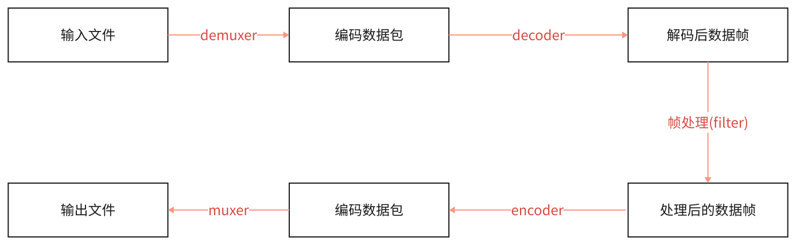

### ffmpeg/ffplay/ffprobe区别

* ffmpeg
	* Hyper fast Audio and Video encoder超快音视频编码器（类似爱剪辑）
* ffplay
	* Simple media player简单媒体播放器
* ffprobe
	* Simple multimedia streams analyzer简单多媒体流分析器

#### ffmpeg 命令查看帮助文档

基本信息：ffmpeg -h
高级信息：ffmpeg -h long
所有信息：ffmpeg -h full

```
// 可使用该命令
ffmepg -h full > ffmpeg_h_full.log
```

usage：
```
ffmpeg [options] [[infile options] -i infile]... {[outfile options] outfile}...
```


#### ffplay命令查看帮助文档

所有信息：ffplay -h

usage: 

```
ffplay [options] input_file
```

#### ffprobe -h

usage:

```
ffprobe [OPTIONS] [INPUT_FILE]
```


### ffmpeg音视频处理流程

```
ffmpeg -i test_1920x1080.mp4 -acodec copy -vcodec libx264 -s 1280x720 test_1280x720.flv

ffmpeg -i test_1920x1080.mp4 -acodec copy -vcodec libx265 -s 1280x720 test_1280x720.mkv
```





### ffmpeg命令分类查询

| 命令参数 | 内容 | 命令参数 | 内容 |
| ---- | ---- | ---- | ---- |
| -version | 显示版本 | -bsfs | 显示可用比特流filter |
| -buildconf | 显示编译配置 | -protocols | 显示可用的协议 |
| -formats | 显示可用格式(muxers+demuxers) | -filters | 显示可用的过滤器 |
| -muxers | 显示可用复用器 | -pix_fmts | 显示可用的像素格式 |
| -demuxers | 显示可用解复用器 | -layouts | 显示标准声道名称 |
| -codecs | 显示可用编解码器(devoders+encoders) | -sample_fmts | 显示可用的音频采样格式 |
| -decoders | 显示可用解码器 | -colors | 显示可用的颜色名称 |
| -encoders | 显示可用编码器 |  |  |


#### 查看具体分类所支持的参数

语法：ffmpeg -h type=name

比如：

```
ffmpeg -h muxer=flv
ffmpeg -h filter=atempo (atempo调整音频播放速率)
ffmpeg -h encoder=libx264
```

ffmpeg -codecs

```
 D..... = Decoding supported(支持的解码器)
 .E.... = Encoding supported(支持的编码器)
 ..V... = Video codec(视频编解码器)
 ..A... = Audio codec(音频编解码器)
 ..S... = Subtitle codec(字幕编解码器)
 ..D... = Data codec(表示支持处理数据的编解码器。数据编解码器通常用于处理非音视频数据，比如字节流、图像序列、元数据等。)
 ..T... = Attachment codec
 ...I.. = Intra frame-only codec(帧内编解码器)
 ....L. = Lossy compression(有损压缩)
 .....S = Lossless compression(无损压缩)
```

#### ffmpeg 命令参数

##### 主要参数: 

* -i 设定输入流
* -f 设定输出格式(format)
* -ss 开始时间
* -t 时间长度

##### 音频参数:

* -aframes 设置要输出的音频帧数
* -b:a 音频码率
* -ar 设定采样率
* -ac 设定声音的Channel数
* -acodec 设定声音编解码器，如果用copy表示原始编解码数据必须被拷贝。
* -an 不处理音频
* -af 音频过滤器

##### 视频参数:

* -vframes 设置要输出的视频帧数
* -b 设定视频码率
* -b:v 视频码率
* -r 设定帧速率
* -s 设定画面的宽与高
* -vn 不处理视频
* -aspect aspect 设置横纵比4:3 16:9 或1.3333 1.7777
* -vcodec 设定视频编解码器，如果用copy表示原始编解码数据必须被拷贝。
* -vf 视频过滤器

```
// 查找可用的编解码器
// windows
ffmpeg.exe -codecs | findstr mp3
// linux
ffmpeg.exe -codecs | grep mp3

ffmpeg.exe -i .\tuzi.mp4 -b:a 192k -ar 48000 -ac 2 -acodec libmp3lame -aframes 200 out2.mp3

ffmpeg.exe -i .\tuzi.mp4 -vframes 300 -b:v 300k -r 30 -s 640*480 -aspect 16:9 -vcodec libx265 out3.h265

// 保留封装格式
// 提取音频不要视频
ffmpeg.exe -i .\tuzi.mp4 -acodec copy -vn audio.mp4
// 提取视频不要音频
ffmpeg.exe -i .\tuzi.mp4 -vcodec copy -an video.mp4

// 提取视频
ffmpeg.exe -i .\tuzi.mp4 -vcodec copy -an test_copy.h264
ffmpeg.exe -i .\tuzi.mp4 -vcodec libx264 -an test.h264

// 提取音频
ffmpeg.exe -i .\tuzi.mp4 -acodec copy -vn test.aac
ffmpeg.exe -i .\tuzi.mp4 -acodec libmp3lame -vn test.mp3

//提取YUV
ffmpeg.exe -i .\tuzi.mp4 -t 3 -pix_fmt yuv420p -s 320x240 yuv420p_orig.yuv
ffplay.exe -f rawvideo -pixel_format yuv420p -video_size 320x240 .\yuv420p_orig.yuv

//提取RGB
ffmpeg -i .\tuzi.mp4 -t 10 -pix_fmt rgb24 -s 320*240 rgb24_320x240.rgb
ffplay.exe -pixel_format rgb24 -video_size 320*240 .\rgb24_320x240.rgb

// RGB和YUV之间的转换
ffmpeg -s 320x240 -pix_fmt yuv420p -i .\yuv420p_orig.yuv -pix_fmt rgb24 .\rgb24_320x240_2.rgb
 ffplay.exe -pixel_format rgb24 -video_size 320*240 .\rgb24_320x240_2.rgb

// 提取PCM
ffmpeg.exe -i .\out2.mp3 -ar 48000 -ac 2 -f s16le 48000_2_s16le.pcm
ffplay.exe -ar 48000 -ac 2 -f s16le .\48000_2_s16le.pcm

// -sample_fmt 选项可以用来指定以下常见音频样本格式之一
// 1. u8：无符号 8 位整数
// 2. s16：有符号 16 位整数
// 3. s32：有符号 32 位整数
// 4. f32：32 位浮点数
// 5. f64：64 位浮点数
ffmpeg.exe -i .\69906708177.mp3 -ar 48000 -ac -2 -sample_fmt s16 tout_s16.wav
ffplay.exe .\tout_s16.wav

ffmpeg.exe -i .\69906708177.mp3 -ar 48000 -ac 2 -codec:a pcm_s16le tout2_s16le.wav
ffplay.exe .\tout_s16.wav

ffmpeg.exe -i .\69906708177.mp3 -ar 48000 -ac 2 -f f32le 48000_2_f32le.pcm
ffplay.exe -ar 48000 -ac 2 -f f32le .\48000_2_f32le.pcm

ffmpeg.exe -i .\tuzi.mp4 -t 10 -vn -ar 48000 -ac 2 -f f32le 48000_2_f32le_2.pcm
ffplay.exe -ar 48000 -ac 2 -f f32le .\48000_2_f32le_2.pcm

```

##### 音视频转封装

```
// 保持编码格式
ffmpeg -i .\tuzi.mp4 -vcodec copy -acodec copy test_copy.ts
ffmpeg -i .\tuzi.mp4 -codec copy test_copy2.ts
ffplay.exe .\test_copy.ts

// 改变编码格式
ffmpeg -i .\tuzi.mp4 -vcodec libx265 -acodec libmp3lame out_h265_mp3.mkv
ffplay.exe .\out_h265_mp3.mkv

// 修改帧率
ffmpeg.exe -i .\tuzi.mp4 -r 15 output2.mp4
ffplay.exe .\output2.mp4

// 修改音视频码率
ffmpeg.exe -i .\tuzi.mp4 -b 400k output_b.mkv
ffplay.exe .\output_b.mkv

// 修改视频码率
ffmpeg.exe -i .\tuzi.mp4 -b:v 400k output_bv.mkv
ffplay.exe .\output_bv.mkv

// 修改音频码率
ffmpeg.exe -i .\tuzi.mp4 -b:a 192k .\output_ba.mp4
//如果不想重新编码video需要加上-vcodec copy
ffmpeg.exe -i .\tuzi.mp4 -b:a 192k -vcodec copy .\output_ba.mp4
ffplay.exe .\output_ba.mp4

// 修改音视频码率
ffmpeg.exe -i .\tuzi.mp4 -b:v 400k -b:a 192k output_bva.mp4
ffplay.exe .\output_bva.mp4

// 修改视频分辨率
ffmpeg.exe -i .\tuzi.mp4 -s 480x270 output_480x270.mp4
ffplay.exe .\output_480x270.mp4

// 修改音频采样率
ffmpeg.exe -i .\tuzi.mp4 -ar 44100 output_44100hz.mp4
ffplay.exe .\output_44100hz.mp4

```

### ffplay 播放控制

| 选项 | 说明 | 选项 | 说明 |
| ---- | ---- | ---- | ---- |
| q,ESC | 退出播放 | t | 循环切换字幕流 |
| f | 全屏切换 | c | 循环切换节目 |
| p,SPC |  暂停 | w | 循环切换过滤器或显示模式 |
| m | 静音切换 | s | 逐帧播放 |
| 9,0 | 9减少音量,0增加音量 | left/right | 向后/向前拖动10秒 |
|  |  | down/up | 向后/向前拖动1分钟 |
| a | 循环切换音频流 | 鼠标右键单击 | 拖动与显示宽度对应百分比的文件进行播放 |
| v | 循环切换视频流 | 鼠标左键双击 | 全屏切换 |

#### ffplay命令 主要选项

```
ffplay -x 1024 -y 768 1920*1080.mp4
```

| 选项 | 说明 |
| ---- | ---- |
| -x width  | 强制设置显示宽度 |
| -y height  | 强制设置显示高度 |
| -video_size size | 帧的尺寸设置显示帧存储(WxH格式), 仅适用于类似原始YUV等没有包含帧大小(WxH)的视频。 |
| -pixel_format format  | 格式设置像素格式。 |
| -fs | 以全屏模式启动。 |
| -an | 禁用音频(不播放声音) |
| -vn | 禁用视频(不播放视频) |
| -sn | 禁用字幕(不显示字幕) |
| -ss pos | 根据设置的秒进行定位拖动，注意时间单位：比如'55' 55seconds, '12:03:45' ,12 hours, 03 minutes and 45 seconds, '23.189' 23.189second |
| -t duration | 设置播放视频/音频长度，时间单位如-ss选项 |
| -bytes | 按字节进行定位拖动（0=off 1=on -1=auto） |
| -seek_interval interval | 自定义左/右键定位拖动间隔（以秒为单位），默认值为10秒（代码没有看到实现） |
| -nodisp | 关闭图形化显示窗口，视频将不显示 |
| -noborder | 无边框窗口 |
| -volume vol | 设置起始音量。音量范围[0~100] |
| -f fmt | 强制使用设置的格式进行解析。比如-f s16le |
| -window_title title | 设置窗口标题（默认为输入文件名） |
| -loop number | 设置播放循环次数 |
| -showmode mode | 设置显示模式，可用的模式值：0 显示视频，1 显示音频波形，2 显示音频频谱。缺省为0，如果视频不存在则自动选择2 |
| -vf filtergraph | 设置视频滤镜 |
| -af filtergraph | 设置音频滤镜 |
| -framerate | 播放时的帧率 |


#### ffplay命令 高级选项

| 选项 | 说明 |
| ---- | ---- |
| -stats  | 打印多个回放统计信息，包括显示流持续时间，编解码器参数，流中的当前位置，以及音频/视频同步差值。默认情况下处于启用状态，要显式禁用它则需要指定-nostats。 |
| -fast | 非标准化规范的多媒体兼容优化。 |
| -genpts | 生成pts |
| -sync type | 同步类型 将主时钟设置为audi（type=audio），video（type=video）或external（type=ext），默认是audio为主时钟。 |
| -ast audio_stream_specifier | 指定音频流索引，比如-ast 3，播放流索引为3的音频流 |
| -vst video_stream_specifier | 指定视频流索引，比如-vst 4，播放流索引为4的视频流 |
| -sst subtitle_stream_specifier | 指定字幕流索引，比如-sst 5, 播放流索引为5的字幕流 |
| -autoexit | 视频播放完毕后退出。 |
| -exitonkeydown | 键盘按下任何键退出播放 |
| -codec:media_specifier codec_name | 强制使用设置的多媒体解码器，media_specifier可用值为a(音频)，v(视频)和s字幕。比如-codec:v h264_qsv强制视频采用h264——qsv解码 |
| -acodec codec_name | 强制使用设置的音频解码器进行音频解码 |
| -vcodec codec_name | 强制使用设置的视频解码器进行视频解码 |
| -scodec codec_name | 强制使用设置的字幕解码器进行字幕解码 |
| -autorotate | 根据文件元数据自动旋转视频。值为0或1，默认为1。 |
| -framedrop | 如果视频不同步则丢弃视频帧。当主时钟非视频时钟时默认开启。若需禁用则使用-noframedrop |
| -infbuf | 不限制输入缓冲区大小。尽可能快地从输入中读取尽可能多的数据。播放实时流时默认启用，如果未及时读取数据，则可能会丢弃数据。此选项将不限制缓冲区的大小。若需禁用则使用-noinfbuf |


#### ffplay 播放命令

##### 播放本地文件

	1. ffplay -window_title "test time" -ss 2 -t 10 -autoexit test.mp4
	2. ffplay buweishui.mp3

##### 播放网络流

	1. ffplay -window_title "rtmp stream" rtmp://202.69.69.180:443/webcast/bshdlive-pc

##### 强制解码器

	1. mpeg4解码器：ffplay -vcodec mpeg4 test.mp4
	2. h264解码器：ffplay -vcodec h264 test.mp4

##### 禁用音频或视频

	1. 禁用音频：ffplay test.mp4 -an
	2. 禁用视频：ffplay test.mp4 -vn

##### 播放YUV数据

	1. ffplay -pixel_format yuv420p -video_size 320*240 -framerate 5 yuv420p_320*240.yuv

##### 播放RGB数据

	1. ffplay -pixel_format rgb24 -video_size 320*240 -i rgb24_320*240.rgb
	2. ffplay -pixel_format rgb24 -video_size 320*240 -framerate 5 -i rgb24_320*240.rgb

##### 播放PCM数据

	1. ffplay -ar 48000 -ac 2 -f f32le 48000_2_f32le.pcm
		1. -ar set audio sampling rate (in Hz) (from 0 to INT_MAX) (default 0)
		2. -ac set number of audio channels (from 0 to INT_MAX) (default 0)

##### 视频旋转

ffplay -i test.mp4 -vf transpose=1

##### 视频反转

ffplay test.mp4 -vf hflip

ffplay test.mp4 -vf vflip 

##### 视频旋转和反转

ffplay test.mp4 -vf hflip,transpose=1

##### 音频变速播放

ffplay -i test.mp4 -af atempo=2

##### 视频变速播放

ffplay -i test.mp4 -vf setpts=PTS/2

##### 音视频同时变速

ffplay -i test.mp4 -vf setpts=PTS/2 -af atempo=2


