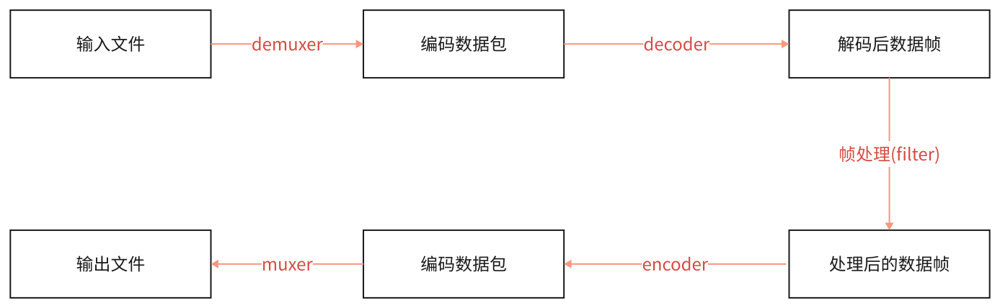

### ffmpeg/ffplay/ffprobe区别

* ffmpeg
	* Hyper fast Audio and Video encoder超快音视频编码器（类似爱剪辑）
* ffplay
	* Simple media player简单媒体播放器
* ffprobe
	* Simple multimedia streams analyzer简单多媒体流分析器

#### ffmpeg 命令查看帮助文档

基本信息：ffmpeg -h
高级信息：ffmpeg -h long
所有信息：ffmpeg -h full

```
// 可使用该命令
ffmepg -h full > ffmpeg_h_full.log
```

usage：
```
ffmpeg [options] [[infile options] -i infile]... {[outfile options] outfile}...
```


#### ffplay命令查看帮助文档

所有信息：ffplay -h

usage: 

```
ffplay [options] input_file
```

#### ffprobe -h

usage:

```
ffprobe [OPTIONS] [INPUT_FILE]
```


### ffmpeg音视频处理流程

```
ffmpeg -i test_1920x1080.mp4 -acodec copy -vcodec libx264 -s 1280x720 test_1280x720.flv

ffmpeg -i test_1920x1080.mp4 -acodec copy -vcodec libx265 -s 1280x720 test_1280x720.mkv
```





### ffmpeg命令分类查询

| 命令参数 | 内容 | 命令参数 | 内容 |
| ---- | ---- | ---- | ---- |
| -version | 显示版本 | -bsfs | 显示可用比特流filter |
| -buildconf | 显示编译配置 | -protocols | 显示可用的协议 |
| -formats | 显示可用格式(muxers+demuxers) | -filters | 显示可用的过滤器 |
| -muxers | 显示可用复用器 | -pix_fmts | 显示可用的像素格式 |
| -demuxers | 显示可用解复用器 | -layouts | 显示标准声道名称 |
| -codecs | 显示可用编解码器(devoders+encoders) | -sample_fmts | 显示可用的音频采样格式 |
| -decoders | 显示可用解码器 | -colors | 显示可用的颜色名称 |
| -encoders | 显示可用编码器 |  |  |


#### 查看具体分类所支持的参数

语法：ffmpeg -h type=name

比如：

```
ffmpeg -h muxer=flv
ffmpeg -h filter=atempo (atempo调整音频播放速率)
ffmpeg -h encoder=libx264
```

ffmpeg -codecs

```
 D..... = Decoding supported(支持的解码器)
 .E.... = Encoding supported(支持的编码器)
 ..V... = Video codec(视频编解码器)
 ..A... = Audio codec(音频编解码器)
 ..S... = Subtitle codec(字幕编解码器)
 ..D... = Data codec(表示支持处理数据的编解码器。数据编解码器通常用于处理非音视频数据，比如字节流、图像序列、元数据等。)
 ..T... = Attachment codec
 ...I.. = Intra frame-only codec(帧内编解码器)
 ....L. = Lossy compression(有损压缩)
 .....S = Lossless compression(无损压缩)
```