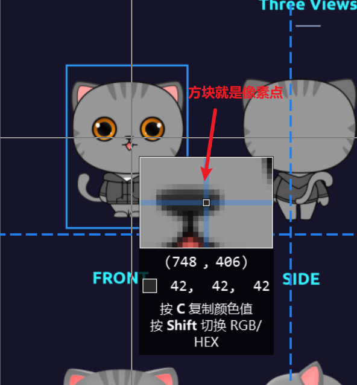
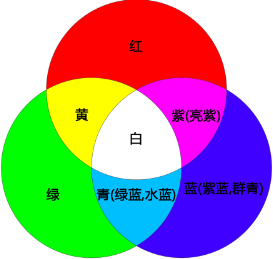
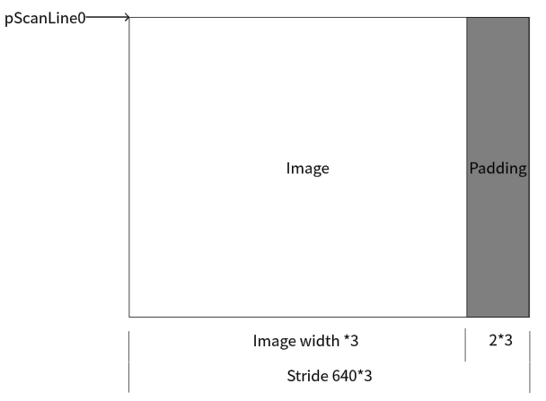

## 图像基础

1. 像素: 像素是一个图片的基本单位，pix是英语单词picture的简写，加上英语单词“元素element”，就得到了“pixel”，简称px，所以“像素”有“图像元素”之意。
2. 分辨率：是指图像的大小或尺寸。比如1920*1880。
3. 位深：是指在记录数字图像的颜色时，计算机实际上是用每个像素需要的位深来表示的。比如红色分量用8bit。
4. 帧率：在1秒钟时间里传输的图片的帧数，也可以理解为图形处理器每秒钟能够刷新几次。比如25fps表示一秒有25张图片。
5. 码率：视频文件在单位时间内使用的数据流量。比如1Mbps。
6. Stride：指在内存中每行像素所占的空间。为了实现内存对齐每行像素在内存中所占的空间并不一定是图像的宽度。

### 像素

1. 例如2500*2000的照片就是指横向有2500个像素点，竖向有2000个像素点，也俗称500万像素照片。

### 分辨率

1. 图像(或视频)的分辨率是指图像的大小或尺寸。我们通常用像素表示图像的尺寸。
2. 例如2500*2000的照片就是指横向(宽)有2500个像素点，竖向(高)有2000个像素点。

3. 常见的分辨率：
	1. 360P(640*360),720P(1280*720),1080P(1920*1080),4K(3840*2160),8K(7680*4320)

4. 不同分辨率之间的区别：
	1. 常说的1080和720其实是指垂直像素数，分辨率除去垂直像素，还需要考虑到水平像素数。按照16:9(宽：高)的比例计算，720P的水平像素数为720/9*16 = 1280，总计像素为921600像素即大约92万像素。1080P具有1920个水平像素，总计2073600像素即约200万像素，是720P的两倍多。
	2. 像素越多视频就越清晰，所以1080P比720P的视频更加清晰。图像的分辨率越高，图像就越清晰。

### 位深

1. 我们 看到的彩色图片，都有三个通道，分别为红(R)，绿(G)，蓝(B)通道。(如果需要透明度则还有alpha分量)
2. 通常每个通道用8bit表示，8bit能表示256种颜色，所以可以组成256*256*256=16777216约等于1677万种颜色。
3. 这里的8bit就是我们讲的位深。
4. 每个通道的位深越大，能够表示的颜色值就越大，比如现在高端电视说的10bit色彩，即是每个通道用10bit表示，每个通道有1024种颜色。1024*1024*1024约为107374万色=10亿色，是8bit的64倍。
5. 常见的颜色还是8bit居多。

### 帧率

1. 帧率即FPS（每秒有多少帧画面），玩游戏时，FPS帧率越高就代表游戏画面越流畅，越低则越卡顿。视频也是如此。
2. 由于视觉图像在视网膜的暂时停留，一般图像帧率能达到24帧，我们就认为图像是连续动态的。
3. 电影帧率一般是24fps（帧每秒）;
4. 电视剧一般是25fps；
5. 监控行业常用25fps；
6. 音视频通话常用15fps；
7. 帧率越高，画面越流畅，需要的设备性能也越高。

### 码率

1. 视频文件在单位时间内使用的数据流量。比如1Mbps。
2. 大多数情况下码率越高分辨率越高，也就越清晰。但模糊的视频文件大小（码率）也可以很大，分辨率小的视频文件可能也比分辨率大的视频文件清晰。
3. 对于同一个原始图像源的时候，同样的编码算法，则码率越高，图像的失真就会越小，视频画面就会越清晰。

### Stride跨距

1. stride：指在内存中每行像素所占的空间。为了实现内存对齐每行像素在内存中所占的空间并不一定是图像的宽度。
2. stride 就是这些扩展内容的名称，stride也被称作Pitch，如果图像的每一行像素末尾拥有扩展内容，stride的值一定大于图像的宽度值，就像下图所示:
3. 比如分辨率638×480的RGB24图像，我们在内存处理的时候如果要以16字节对齐，则638×3/16=119.625不能整除，因此不能16字节对齐，我们需要在每行尾部填充6个字节。就是(638+2->640)，640×3/16=120。此时该图片的stride为1920字节。

