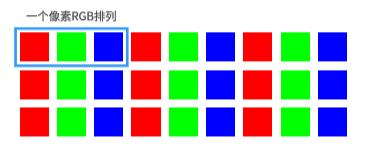
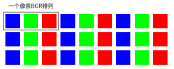
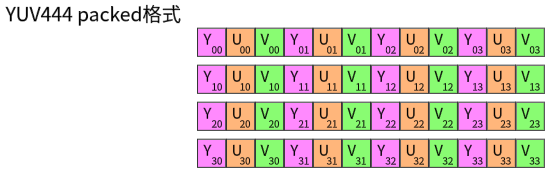
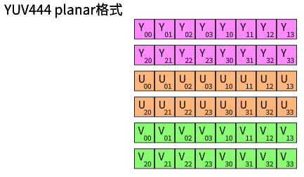
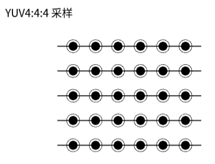
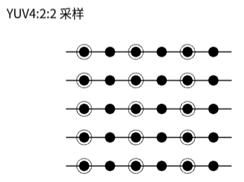
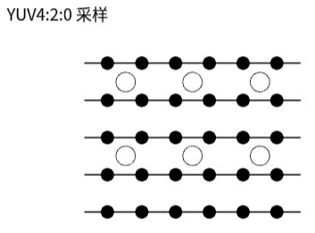
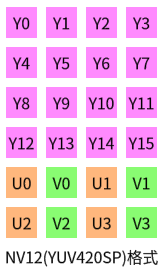

## RGB,YUV深入

RGB：红R，绿G，蓝B三基色。
YUV："Y"表示明亮度（Luminance或Luma），也就灰阶值，"U"和"V"表示的则是色度（Chrominance或Chroma）。


### RGB 排列

通常的图像像素是按RGB顺序进行排列，但有些图像处理要转成其他顺序，比如OpenCV经常转成BGR的排列方式。





```
AV_PIX_FMT_RGB24,  // packed RGB 8:8:8, 24bpp, RGBRGB...
AV_PIX_FMT_BGR24, //  packed BGR 8:8:8, 24bpp, RGBRGB...

AV_PIX_FMT_ARGB, // packed ARGB 8:8:8:8, 32bpp, ARGBARGB...
AV_PIX_FMT_RGBA, // packed RGBA 8:8:8:8, 32bpp, RGBARGBA...
AV_PIX_FMT_ABGR, // packed ABGR 8:8:8:8, 32bpp, ABGRABGR...
AV_PIX_FMT_BGRA, // packed BGRA 8:8:8:8, 32bpp, BGRABGRA...
```

### YUV

yuv数据下载：[https://media.xiph.org/vqeg/TestSeqences/Reference/](https://media.xiph.org/vqeg/TestSeqences/Reference/)

- 与我们熟知RGB类似，YUV也是一种颜色编码方法，它是指将亮度参量（Y：Luminance或Luma）和色度参量（UV：Chrominance或Chroma）分开进行表示的像素编码格式。
- 这样分开的好处就是不但可以避免相互干扰，没有UV信息一样可以显示完整的图像，因而解决了彩色电视与黑白电视的兼容问题；还可以降低色度的采样率而不会对图像质量影响太大，降低了视频信号传输时对频宽（带宽）的要求。
- YY共用一组UV分量
- YUV是一个比较笼统地说法，针对它的具体排列方式，可以分为很多种具体的格式：
	- 打包（packed）格式：将每个像素点的Y，U，V分量交叉排列并以像素点为单元连续的存放在同一数组中，通常几个相邻的像素组成一个宏像素（macro-pixel）
	    
    - 平面（planar）格式：使用三个数组分开连续的存放Y，U，V三个分量，即Y，U，V分别存放在各自的数组中。
        

#### YUV采样表示法

1. YUV采用A:B:C表示法来描述Y,U,V采样频率比例，下图中黑点表示采样像素点Y分量，空心圆表示采样像素点的UV分量。主要分为 YUV 4:4:4,YUV 4:2:2, YUV 4:2:0 这几种常用的类型
2. 4:4:4 表示色度频道没有下采样，即一个Y分量对应着一个U分量和一个V分量。
    
3. 4:2:2 表示2:1 的水平下采样，没有垂直下采样，即每两个Y分量共用一个U分量和一个V分量。
    
4. 4:2:0 表示2:1 的水平下采样，2:1的垂直下采样，即每四个分量共用一个U分量和一个V分量。
    

#### YUV数据存储

1. 下面以每个分量数据存储一个char(或byte)中为例描述YUV的数据存储方式。
	1. 4:4:4格式
	2. 4:2:2格式
	3. 4:2:0格式

2. 1444(YUV444P)格式
	1. 对应FFmpeg像素表示AV_PIX_FMT_YUV444P, ///< planar YUV4:4:4,24bpp, (1 Cr & Cb sample per 1*1 Y samples)
	2. .png)

3. 1422(YUV422P)格式
	1. 对应FFmpeg像素表示AV_PIX_FMT_YUV422P, ///< planar YUV 4:2:2, 16bpp,(1 Cr & Cb sample per 2*1 Y samples)
	2. 该类型为planar格式
	3. .png)

4. 1420(YUV420P)格式
    1. 对应FFmpeg像素表示AV_PIX_FMT_YUV420P, /// planar YUV 4:2:0, 12bpp, (1 Cr & Cb sample per 2*2 Y samples)
    2. 该类型为planar格式
    3. (4+1+1)/4 = 1.5字节
	4. .png)

5. NV12格式
	1. 对应FFmpeg像素表示AV_PIX_FMT_NV12, /// < planar YUV 4:2:0, 12bpp, 1 plane for Y and 1 plane for the UV components, which are interleaved (first byte U and the following byte V)
	2. 
