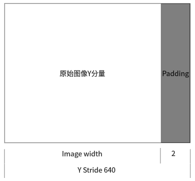

## RGB和YUV的转换

* 通常情况下RGB和YUV直接的相互转换都是调用接口实现，比如FFmpeg的swscale或者libyuv等库。
* 主要转换标准是BT601和BT709.
	* 8bit位深的情况下
		* TV range是16-235(Y), 16-240(UV), 也叫Limited Range
		* PC range是0-255，也就Full Range
		* 而RGB没有range之分，全是0-255
* BT601 TV Range转换公式
	* YUV(256 级别)可以从8位RGB直接计算:
		* Y = 0.299*R + 0.587*G + 0.114*B;
		* U = -0.169*R - 0.331*G + 0.5*B;
		* V = 0.5*R - 0.419*G - 0.081*B; 
	* 反过来，RGB也可以直接从YUV(256级别)计算:
		* R = Y + 1.402(Y - 128)
		* G = Y - 0.34414(U - 128) - 0.71414(U - 128)
		* B = Y + 1.772(V - 128)
* 从YUV转到RGB如果值小于0要取0，如果大于255要取255

### RGB和YUV的转换-为什么解码出错显示绿屏

因为解码失败时YUV分量都填为0值，然后根据公式:

* R = 1.402 * (-128) = -126.598
* G = -0.34414 * (-128) - 0.71414 * (-128) = 44.04992 + 91.40992 = 135.45984
* B = 1.772 * (-128) = -126.228

RGB 值范围为[0, 255], 所以最终的值为：

- R = 0
- G = 135.45984
- B = 0

此时只有G分量有值所以为绿色。

### YUV Stride对齐问题

比如分辨率638*480的YUV420P图像，我们在内存处理的时候如果要以16字节对齐，则638不能被16整除，我们需要在每行尾部填充2个字节。就是640.此时该图片的Y stride为640字节。

