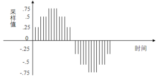
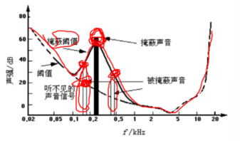

## 声音的物理性质

- 震动
	- 声音是一种由物体振动引发的物理现象，如小提琴的弦声等。物体的振动使其四周空气的压强产生变化，这种忽强忽弱变化以波的形式向四周传播，当被人耳所接收时，我们就听见了声音。

- 波形
	- 声音是由物体的振动产生的，这种振动引起了周围空气压强的振动，我们称这种振动的函数表现形式为波形。

- 频率
	- 声音的频率是周期的倒数，它表示的是声音在1秒钟内的周期数，单位是赫兹(Hz)。千赫兹(kHz),即1000Hz，表示每秒振动1000次。声音按频率可作如下划分：
	- 次声 0~20Hz
	- 人耳能听见的声音 20Hz~20kHz
	- 超声 20KHz~1GHz
	- 特超声 1GHz~10THz

- 振幅
	- 声音有振幅，振幅的主观感觉是声音的大小。声音的振幅大小取决于空气压力波距平均值(也称为平衡态)的最大偏移量。

## 数字音频

为了将模拟信号数字化，本节将分为3个概念进行讲解：采样频率，采样量化，编码

计算机并不直接使用连续平滑的波形来表示声音，它是每隔固定的时间对波形的幅值进行采样，用得到的一系列数字量来表示声音。右图是经过数字采样的波形示意图。

### PCM脉冲编码调制

PCM(Pulse Code Modulation), 脉冲编码调制。人耳听到的是模拟信号，PCM是把声音从模拟信号转化为数字信号的技术。

- 采样频率
	- 根据Nyguist采样定律，要从采样中完全恢复原始信号波形，采样频率必须至少是信号中最高频率的两倍。
	- 前面提到人耳能听到的频率范围是[20Hz~20kHz]，所以采样频率一般为44.1khz,这样就能保证声音到达20khz也能被数字化，从而使得经过数字化处理之后，人耳听到的声音质量不会被降低。
		- 采样频率：每秒钟采样的点的个数。常用的采样频率有：
			- 22000(22kHz): 无线广播。
			- 44100(44.1kHz): CD音质。
			- 48000(48kHz): 数字电视，DVD。
			- 96000(96kHz): 蓝光，高清DVD。
			- 192000(192kHz): 蓝光，高清DVD。

- 采样量化
	- 采样是在离散的时间点上进行的，而采样值本身在计算机中也是离散的。
	- 采样值的精度取决于它用多少位来表示，这就是量化。例如8位量化可以表示256个不同值，而CD质量的16位量化可以表示65536个值，范围为[-32768,32767]。
	- 下图是一个3位量化的示意图，可以看出3位量化只能表示8个值：0.75, 0.5, 0.25, 0, -0.25, -0.5, -0.75和 -1， 因而量化位数越少，波形就越难辨认，还原后的声音质量也就越差(可能除了一片嗡嗡声之外什么都没有)

## 音频常见名词

- 采样精度(采样深度)： 每个“样本点”的大小，常用的大小为8bit，16bit，24bit。
- 通道数：单声道，双声道，四声道，5.1声道。
- 采样频率：每秒钟采样的点的个数。常用的采样频率有：
	- 22000(22kHz): 无线广播。
	- 44100(44.1kHz): CD音质。
	- 48000(48kHz): 数字电视，DVD。
	- 96000(96kHz): 蓝光，高清DVD。
	- 192000(192kHz): 蓝光，高清DVD。

- 比特率：每秒传输的bit数，单位为：bps(Bit Per Second)间接衡量声音质量的一个标准。没有压缩的音频数据的比特率 = 采样频率*采样精度*通道数。
- 码率：压缩后的音频数据的比特率。常见的码率：
	- 96kbps: FM质量。
	- 128-160kbps: 一般质量音频。
	- 192kbps: CD质量。
	- 256-320kbps: 高质量音频。

- 帧： 每次编码的采样单元数，比如MP3通常是1152个采样点作为一个编码单元，AAC通常是1024个采样点作为一个编码单元。
- 帧长：
	- 可以指每帧播放持续的时间
	- 每帧持续时间(秒) = 每帧采样点数/采样频率(HZ)
		- 比如： MP3 48k, 1152个采样点，每帧则为24毫秒，1152/48000 = 0.024秒 = 24毫秒
	- 也可以指压缩后每帧的数据长度。
	- 所以讲到帧的时候要注意他适用的场合

- 交错模式：数字音频信号存储的方式。数据以连续帧的方式存放，即首先记录帧1的左声道样本和右声道样本，在开始帧2的记录
- 非交错模式：首先记录的是一个周期内所有帧的左声道样本，再记录所有右声道样本

码率越大，压缩效率越低，音质越好，压缩后数据越大。
码率 = 音频文件大小/时长

### 采样频率44100，采样精度16bit，2通道(声道)，采集4分钟的数据

- 字节数：
	- 44100*16*2*4*60 = 338688000bit
	- 338688000/8/1024/1024 = 40M字节
- 比特率： 为 44100*16*2 = 1411200bit/s

## 音频编码原理简介

数字音频信号如果不加压缩地直接进行传送，将会占用极大的带宽。例如，一套双声道数字音频若取样频率为44.1KHz，每样值按16bit量化，则其码率为：2*44.1khz*16bit=1.411Mbit/s

如此大的带宽将给信号的传输和处理都带来许多困难和成本(阿里云服务器带宽大于5M后，每M价格是100元/月)，因此必须采取音频压缩技术对音频数据进行处理，才能有效地传输音频数据。

数字音频压缩编码在保证信号在听觉方面不产生失真地前提下，对音频数据信号进行尽可能大的压缩，降低数据量。数字音频压缩编码采取去除声音信号中冗余成分的方法来实现。所谓冗余成分指的是音频中不能被人耳感知到的信号，它们对确定声音的音色，音调等信息没有任何的帮助。

冗余信号包含人耳听觉范围外的音频信号以及被掩屏蔽掉的音频信号等。例如，人耳所能察觉的声音信号的频率范围为20Hz~20Khz，除此之外的其它频率人耳无法察觉，都可视为冗余信号。

此外，根据人耳听觉的生理和心理声学现象，当一个强音信号与一个弱音信号同时存在时，弱音信号将被强音信号所掩蔽而听不见，这样弱音信号就可以视为冗余信号而不用传送。这就是人耳听觉的掩蔽效应，主要表现在频谱掩蔽效应和时域掩蔽效应。

### 音频编码-频谱掩蔽效应

一个频率的声音能量小于某个阈值之后，人耳就会听不到。当有另外能量较大的声音出现的时候，该声音频率附件的阈值会提高很多，即所谓的掩蔽效应。

人耳对2KHz~5KHz的声音最敏感，而对频率太低或太高的声音信号都很迟钝，当有一个频率为0.2KHz，强度为60dB的声音出现时，其附近的阈值提高了很多。由图中我们可以看出在0.1KHz以下，1KHz以上的部分，由于离0.2KHz强信号较远，不受0.2KHz强信号影响，阈值不受影响；而在0.1KHz~1KHz范围，由于0.2KHz强音的出现，阈值有较大的提升，人耳在此范围所能感觉到的最小声音强度大幅提升。如果0.1KHz~1KHz范围内的声音信号的强度在被提升的阈值曲线之下，由于它被0.2KHz强音信号所掩蔽，那么此时我们人耳只能听到0.2KHz的强音信号而根本听不见其它弱信号，这些与0.2KHz强音信号同时存在的弱音信号就可视为冗余信号而不必传送。

### 音频编码-时域掩蔽效应

当强音信号和弱音信号同时出现时，还存在时域掩蔽效应。即两者发生时间很接近的时候，也会发生掩蔽效应。时域掩蔽过程曲线如图所示，分为前掩蔽，同时掩蔽和后掩蔽三部分。

时域掩蔽效应可以分成三种：前掩蔽，同时掩蔽，后掩蔽。前掩蔽是指人耳在听到强信号之前的短暂时间内，已经存在的弱信号会被掩蔽而听不到。同时掩蔽是指当强信号与弱信号同时存在时，弱信号会被强信号所掩蔽而听不到。后掩蔽是指当强信号消失后，需要经过较长的一段时间才能重新听见弱信号，称为后掩蔽。这些被掩蔽的弱信号即可视为冗余信号。

### 音频编码-压缩编码方法

当前数字音频数码领域存在着不同的编码方案方式，但基本的编码思路大同小异：

对每一个音频声道中的音频采样信号：

1. 将它们映射到频域中，这种时域到频域的映射可通过子带滤波器实现。每个声道中的音频采样块首先要根据心理声学模型来计算掩蔽门限值；
2. 由计算出的掩蔽门限值决定从公共比特池中分配给该声道的不同频率域中多少比特数，接着进行量化以及编码工作；
3. 将控制参数及辅助数据加入数据之中，产生编码后的数据流。