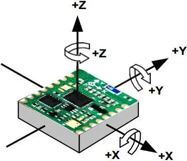

### **简介**

"空中鼠标"通常是指一种通过手势或者运动来控制计算机界面的输入设备，类似于手势识别技术。这种技术通过摄像头或其他传感器来捕捉用户的手势或者运动，然后将其转换成计算机操作命令，实现对计算机界面的控制。空中鼠标在一些智能电视、游戏设备和其他电子设备中被广泛应用，使用户能够在不触摸物理鼠标或触控板的情况下完成操作。

### **空中鼠标核心-姿态传感器**

对于在[三维空间](https://baike.baidu.com/item/%E4%B8%89%E7%BB%B4%E7%A9%BA%E9%97%B4/3180500?fromModule=lemma_inlink)里的一个[参考系](https://baike.baidu.com/item/%E5%8F%82%E8%80%83%E7%B3%BB/823115?fromModule=lemma_inlink)，任何[坐标系](https://baike.baidu.com/item/%E5%9D%90%E6%A0%87%E7%B3%BB/1531516?fromModule=lemma_inlink)的取向，都可以用三个[欧拉角](https://baike.baidu.com/item/%E6%AC%A7%E6%8B%89%E8%A7%92/1626212?fromModule=lemma_inlink)来表现。参考系又称为[实验室参考系](https://baike.baidu.com/item/%E5%AE%9E%E9%AA%8C%E5%AE%A4%E5%8F%82%E8%80%83%E7%B3%BB/53626786?fromModule=lemma_inlink)，是静止不动的。而坐标系则固定于刚体，随着刚体的旋转而旋转。

姿态传感器（E.T-ahrs）是基于[MEMS](https://baike.baidu.com/item/MEMS/686299?fromModule=lemma_inlink)技术的高性能[三维运动](https://baike.baidu.com/item/%E4%B8%89%E7%BB%B4%E8%BF%90%E5%8A%A8/3732371?fromModule=lemma_inlink)[姿态测量系统](https://baike.baidu.com/item/%E5%A7%BF%E6%80%81%E6%B5%8B%E9%87%8F%E7%B3%BB%E7%BB%9F/53418186?fromModule=lemma_inlink)。它包含[三轴陀螺仪](https://baike.baidu.com/item/%E4%B8%89%E8%BD%B4%E9%99%80%E8%9E%BA%E4%BB%AA/3785697?fromModule=lemma_inlink)、[三轴加速度计](https://baike.baidu.com/item/%E4%B8%89%E8%BD%B4%E5%8A%A0%E9%80%9F%E5%BA%A6%E8%AE%A1/20863147?fromModule=lemma_inlink)（即[IMU](https://baike.baidu.com/item/IMU/23629630?fromModule=lemma_inlink)），三轴[电子罗盘](https://baike.baidu.com/item/%E7%94%B5%E5%AD%90%E7%BD%97%E7%9B%98/8973568?fromModule=lemma_inlink)等辅助[运动传感器](https://baike.baidu.com/item/%E8%BF%90%E5%8A%A8%E4%BC%A0%E6%84%9F%E5%99%A8/56515726?fromModule=lemma_inlink)，通过内嵌的[低功耗](https://baike.baidu.com/item/%E4%BD%8E%E5%8A%9F%E8%80%97/712641?fromModule=lemma_inlink)[ARM](https://baike.baidu.com/item/ARM/7518299?fromModule=lemma_inlink)处理器输出校准过的[角速度](https://baike.baidu.com/item/%E8%A7%92%E9%80%9F%E5%BA%A6/1532689?fromModule=lemma_inlink)，[加速度](https://baike.baidu.com/item/%E5%8A%A0%E9%80%9F%E5%BA%A6/3764?fromModule=lemma_inlink)，磁数据等，通过基于[四元数](https://baike.baidu.com/item/%E5%9B%9B%E5%85%83%E6%95%B0/5795379?fromModule=lemma_inlink)的传感器数据算法进行运动姿态测量，[实时输出](https://baike.baidu.com/item/%E5%AE%9E%E6%97%B6%E8%BE%93%E5%87%BA/53627292?fromModule=lemma_inlink)以四元数、欧拉角等表示的零漂移三维姿态数据。

姿态传感器 （E.T-ahrs）可广泛应用于[航模](https://baike.baidu.com/item/%E8%88%AA%E6%A8%A1/10576318?fromModule=lemma_inlink)无人机，机器人，天线云台，[聚光太阳能](https://baike.baidu.com/item/%E8%81%9A%E5%85%89%E5%A4%AA%E9%98%B3%E8%83%BD/10779673?fromModule=lemma_inlink)，地面及[水下设备](https://baike.baidu.com/item/%E6%B0%B4%E4%B8%8B%E8%AE%BE%E5%A4%87/5000088?fromModule=lemma_inlink)，虚拟现实，人体[运动分析](https://baike.baidu.com/item/%E8%BF%90%E5%8A%A8%E5%88%86%E6%9E%90/56515712?fromModule=lemma_inlink)等需要低成本、高动态三维姿态测量的产品设备中。

#### **需要考虑的因素**

##### **抗静态偏移**

鼠标在不移动的时候，光标自然是不能移动的。但廉价的陀螺仪本身会有静态输出，有些甚至能达到20度/s。好在偏移通常不会因为环境而发生变化。所以需要在出厂前进行校正。买到偏移误差小的陀螺仪就可以解决了。

##### **平滑算法**

消费级陀螺仪由于成本所限，精度必然不会很高，数据会出现抖动。通过提高采样速率，即所谓的过采样技术，对同一时刻多个数据进行滤波和平滑，从而尽可能准确地反馈当时的运动状态。

##### **运动平面不匹配**

如果以Z为轴，向Y方向旋转，那么鼠标会划出一条水平的轨迹。但当设备本身发生一定倾斜，如在X轴上有一个旋转角，那么像刚才的移动，就会划出一条斜线。这可能会对用户造成费解。如果拥有加速度计，测量设备的倾斜程度，通过传感器融合算法，就能相对而言避免这类问题，但算法要求较高。

##### **旋转，而不是位移**

通鼠标都是基于位移的，移动多少，光标就移动多少。但空中鼠标是基于旋转的。如果把空中鼠标在不旋转的基础上，移动一定距离，会发现光标完全没有变化（可能会因为一些干扰造成晃动）。

#### 实现方案

根据图片理解传感器的轴向，旋转的方向按右手法则定义，即右手大拇指指向轴向，四指弯曲的方向即为绕该轴旋转的方向。所以下面将基于旋转角度来描述空中鼠标实现，与注意细节。

1. 将模块以+y方向对着自己，-y对着电脑，+z方向朝向上方，以z轴旋转对应二维坐标的x偏移，以x轴旋转对应二维坐标的y轴偏移。
2. x轴旋转根据第一点得出按右手法则定义顺时针旋转为为二维坐标系y的负偏移，逆时针旋转为二维坐标系y的正偏移。
3. y轴旋转根据第一点得出按右手法则定义顺时针旋转为为二维坐标系x的负偏移，逆时针旋转为二维坐标系x的正偏移。
4. 如果是使用欧拉角坐标角度旋转计算方式那么需要注意-π ~ +π之间的算法。
5. 二维中位移多少根据上一个角度与当前角度的差值得出，如果位移的灵敏度在电脑显示中比较缓慢可以加入需要加入一个变量系数作为偏移的放大变量。